#   C++

C++语言是一门广泛被使用的语言，学习C语言，可以使我们更加深入的了解到编程语言的运行方式和底层逻辑，下面，让我们从零开始，学习C++

---

## 1 C++语言入门

### 1.1 第一个C++程序

**我们利用C++输入 hello world**

```cpp   
#include <iostream>
using namespace std;

int main()
{
    cout << "hello world"<< endl;

    system("pause");
    
    return(0);
}
```

---

### 1.2 C++程序的注释

1. 单行注释  
   - 使用`//`来注释一行代码
2. 多行注释  
   - 使用`/* ...... */`来多行注释
3. 例子

```cpp
#include <iostream>     

/* 这是一个头文件
用于给定指定函数名称*/

using namespace std;    
int main()
{
    cout << "hello world"<< endl; //输出hello world

    system("pause");
    
    return(0);
}
```

---

### 1.3 变量

- **作用**：给定一段指定的内存空间取名以方便我们操纵这段内存
- **语法**：`数据类型 变量名 = 初始值`(`int a =10`)
- 实例

```cpp
#include <iostream>     
using namespace std;
int main()
{
    int a = 10;
    cout<<"a="<<a<<endl;
    system("pause");
    return(0);
}
```

此时C++会输出“a=10”

---

### 1.4 常量

**作用**：用于记录程序中不可更改的数据

C++有两种定义常量的方法

1. **#define** 宏常量：`#define 常量名 = 常量值`  
   - <font style=background:#1ff5>通常在代码文件上方定义</font>,表示一个常量

2. **const**修饰的变量：`const 数据类型 常量名 =常量值`
   - <font style=background:#1ff5>通常在变量定义加关键字const</font>,修饰该变量为常量，不可更改

示例1：

```cpp
#include <iostream>     
using namespace std;

#define day 7
int main()
{
    cout<<"一周有"<<day<<"天"<<endl;
    system("pause");
    return(0);
}
```

- 如果我们强加的去修改day的值，C++则会报错,说明我们的改动不合规矩
  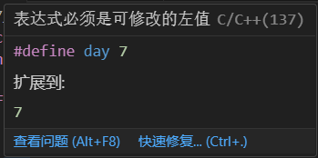

示例2：

```c++
#include <iostream>     
using namespace std;

#define day 7
int main()
{
    const int year = 365;     //这里修饰了year，后面无法修改
    cout<<"一周有"<<day<<"天"<<endl;
    cout<<"一年有"<<year<<"天"<<endl;
    system("pause");
    return(0);
}
```

---

### 1.5 关键字

- 关键字是C++内置的函数或字符名称，我们在创建变量时不用用关键字来给变量来命名

### 1.6 标识符命名规则

C++在对标识符(变量，常量)命名时有一套规则，具体如下：

- 标识符不可以是关键字
- 标识符只能由数字，字母，下划线构成
- 第一个字符必须为字母或下划线
- 标识符大小写敏感

> 建议是标识符名称要通俗易懂，做到见名知意的效果

---

## 2 数据类型

**C++规定在创建一个标识符的时候必须指定其数据类型，否则无法对该标识符分配内存**

### 2.1 整型

`int` **作用**：整型变量表示的是==整数类型==的数据

C++共有4种表示整型的方式，他们的区别在于占用空间的不同

| 数据类型            | 占用空间                                      | 取值范围         |
| ------------------- | --------------------------------------------- | ---------------- |
| short(短整型)       | 2字节                                         | (-2^15^—2^15^-1) |
| int(整型)           | 4字节                                         | (-2^31^—2^31^-1) |
| long(长整型)        | windows为4字节，Linux为4字节(32x)或8字节(64x) | (-2^31^~2^31^-1) |
| long long(长长整型) | 8字节                                         | (-2^63^~2^63^-1) |

### 2.2 sizeof 关键字

**作用：**利用sizeof关键字可以==统计数据所占的内存大小==

**语法：**`sizeof( 数据类型/变量 )`

示例:

```cpp
#include <iostream>     
using namespace std;

int main()
{
    //可以利用sizeof求出数据类型占用多少内存空间
    short num1 =10;
    cout<<"short占用的内存为"<<sizeof(num1)<<endl;
    int num2 = 10;
    cout<<"int占用的内存为"<<sizeof(num2)<<endl;
    long long num3 =10;
    cout<<"long long 占用的内存为"<<sizeof(num3)<<endl;
    system("pause");
    return(0);
}
```

- 此时输出的结果如下

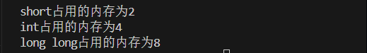

### 2.3实型（浮点型）

**作用：**用于==表示小数==

浮点型变量分为两种：

- 单精度float
- 双精度double

两者的区别在于精度和占用内存不同

| 数据类型 | 占用大小 | 精度                |
| -------- | -------- | ------------------- |
| float    | 4字节    | 7位==有效数字==     |
| double   | 8字节    | 15~16位==有效数字== |

> [!NOTE]
>
> 在使用float时要注意语法`float num1 = 3.14f`,只有带上**f**后才会被认定为float类型，否则会按照默认的doubt类型赋值

- 表示小数时也可以用科学计数法

  > ```cpp
  > float f3 = 3e2;//3*10^2
  > cout<<f3<<endl;
  > float f4 = 3e-2;//3*10^-2
  > cout<<f4<<endl;
  > ```

  此时输出的结果便为：

  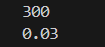

### 2.4 字符型

- **作用：**字符型变量用于显示单个字符

- **语法:** `char ch = 'a'`

> tips1: 显示字符型变量的时候只能用单引号，不能用双引号
>
> tips2:单引号内只能有一个字符，不可以是字符串

- 字符型变量只占用1字节
- 字符型变量将变量以ASCII码的形式储存在内存里

*如何查看字符型变量的ASCII码*

`cout<<(int)[变量名]<<endl`

- 常用ASCII码：a-97  A-65

### 2.5 转义字符

**作用：**表示一些==不能显示出来的ASCII字符==

常用的转义字符有：`\n \\ \t`

| 转义字符 |         作用          | ASCII码 |
| :------: | :-------------------: | :-----: |
|    \n    |        换行符         |   010   |
|   \\\    | 转义一个<kbd>\\</kbd> |   092   |
|    \t    | 水平制表符(占8个位置) |   009   |

###   2.6 字符串型

- **作用：**用于表示一串字符

**两种风格**

1. C语言风格：`char 变量名[]= "字符串值"`
2. C++风格：`string 变量名="字符串值"`

```cpp
int main()
{
    char str/*字符串名*/[] = "hello world"; //tips1:字符串名后要加[]
    cout << str <<endl;
    
    string str2 = "114514";   //要包含一个头文件#include <string> 
    cout<<str2<<endl;
    system("pause");

    return(0);
}
```

> [!IMPORTANT]
>
> C++风格字符串需要在开头加入头文件==#include\<string>==

### 2.7 布尔类型(bool)

**作用：**作用于条件判断，代表真或假

- **bool类型只有两个值**
- True——真(1)
- False——假(0)
- bool 占用1字节的内存空间

**示例：**

```cpp
int main()
{
    bool flag = true ; //true代表真，本质上是"1"
    cout<<flag<<endl;
    bool flag2 = false ;//false代表假，本质是"0"
    cout << flag2<<endl;
    system("pause");

    return(0);
}
```

而这块代码的输出结果

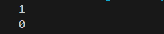

### 2.8 数据的输入

**作用：**从键盘上获取数据

**语法：**`cin >> 变量`

示例：

```cpp
int main()
{
    //整型
    int a = 0;
    cout << "请键入整型变量a的值"<<endl;
    cin >> a;
    cout <<a<<endl;
    //浮点型
    float f =1.14f;
    cout<<"请给浮点型f赋值"<<endl;
    cin >> f;
    cout <<f<<endl;
    //字符串型
    string str = "hello world";
    cout<<"输入你的字符串值"<<endl;
    cin >> str;
    cout<<str<<endl;

     
    system("pause");

    return(0);
}
```

输出结果为:

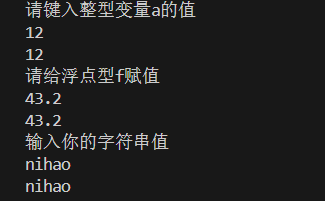

## 3 运算符

**作用：**用于执行代码的计算

主要有一下几种运算符：

| 运算符类型 | 作用                                 |
| ---------- | ------------------------------------ |
| 算术运算符 | 用于处理==四则运算==                 |
| 赋值运算符 | 用于将表达式的值赋给变量             |
| 比较运算符 | 用于表达式的比较，返回一个真值或假值 |
| 逻辑运算符 | 用于根据表达式的值返回真值或假值     |

---

### 3.1 算术运算符

**作用：**用于处理四则运算

包括一下符号：

| 运算符 | 术语       | 示例      | 结果    |
| ------ | ---------- | --------- | ------- |
| +      | 正数       | +3        | +3      |
| -      | 负数       | -4        | -4      |
| +      | 加号       | 4+5       | 9       |
| -      | 减号       | 6-3       | 3       |
| *      | 乘号       | 6*7       | 42      |
| /[^1]  | 除号       | 94/7      | 13      |
| %      | 取模(取余) | 10%3      | 1       |
| ++     | 前置递增   | a=2 b=++a | a=3 b=3 |
| ++     | 后置递增   | a=2 b=a++ | a=3 b=2 |
| --     | 前置递减   | a=2 b=--a | a=1 b=1 |
| --     | 后置递减   | a=2 b=a-- | a=1 b=2 |

示例1*四则运算的示例*

```cpp
int main()
{
    int a1 = 10;
    int b1 = 7;
    cout<<a1 + b1 <<endl;
    cout<<a1 - b1 <<endl;
    cout<<a1 * b1 <<endl;
    cout<<a1 / b1 <<endl; //这里为整除运算，结果也会为整数

    float a2 ;
    float b2 ;
    cout<<"请输入两个浮点数"<<endl;
    cin >> a2;
    cin >> b2;
    cout<< "a2除以b2的值为"<<a2 / b2<<endl; //这里是非整除
    
    system("pause");
    return(0);
}
```

- 取模运算本质就是取余数
- 两个小数之间不能做取模运算

*前置递增与后置递增*

- 前置，后置递增都是使变量进行加一的操作
- 前置递增:==先对变量进行递增，再进行表达式运算==
- 后置递增:==先进行表达式的运算，再对变量递增==

```cpp
int main()
{
    //前置运算
    int a = 10;
    int b = 3;
    int r1 = ++a * b; 
    cout<<"r1="<< r1 <<endl; 

    //后置运算
    int a2 = 10;
    int b2 = 3;
    int r2 = a2++ * b2; 
    cout<<"r2="<< r2 <<endl;
    cout<<"a2="<<a2<<endl; 

    system("pause");
    return(0);
}
```

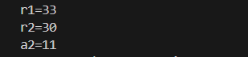

- 我们不难发现，在上述代码运算过程中我们的"a"变量先被加1再参与到了运算之中，而我们的"a2"变量则是再运算结束后才被加1

  ---

### 3.2赋值运算符

**作用：**将表达式的值赋给变量

主要包括以下几个符号：

| 运算符 | 术语     | 示例      | 结果 |
| ------ | -------- | --------- | ---- |
| =      | 赋值     | a=10      | a=10 |
| +=     | 加等于   | a=10 a+=2 | a=12 |
| -=     | 减等于   | a=10 a-=2 | a=8  |
| *=     | 乘等于   | a=10 a*=2 | a=20 |
| /=     | 除等于   | a=10 a/=2 | a=5  |
| %=     | 取模等于 | a=10 a%=2 | a=0  |

### 3.3 比较运算符

**作用：**用于比较表达式的真假，并返回一个真值或假值

主要有以下的符号：

| 运算符 | 术语     | 示例   | 结果 |
| ------ | -------- | ------ | ---- |
| ==     | 相等于   | 4 == 3 | 0    |
| !=     | 不等于   | 4 != 3 | 1    |
| <      | 小于     | 4 < 3  | 0    |
| >      | 大于     | 4 > 3  | 1    |
| <=     | 小于等于 | 4 <= 3 | 0    |
| >=     | 大于等于 | 4 >= 3 | 1    |

 *tips：再代码中由于有优先级的影响，我们可以这么提升运算优先级 `cout << (a == b)<< denl;`*

### 3.4 逻辑运算符

**作用：**用于根据表达式的值返回真值或假值

主要有以下符号:

| 运算符 | 术语 | 示例   | 结果                                                         |
| ------ | ---- | ------ | ------------------------------------------------------------ |
| ！     | 非   | !a     | 如果a为假，则!a为真；如果a为真，则!a为假                     |
| &&     | 与   | a&&b   | 如果a和b都为真，则结果为真，否则为假                         |
| \|\|   | 或   | a\|\|b | 如果a和b中有一个为真，则结果为真，二者都为假的时候，结果为假 |

#### 3.4.1 **逻辑非**

```cpp
int main()
{
    //逻辑非
    int a= 10 ;
    cout << !a << endl;
    //运算结果为 0 (解释:在C++中，只要结果不为0，都视为真，故输出结果为假)
    cout << !!a << endl;
    //结果为1，取了两次反（从真变假再变真）
    system("pause");
    return(0);
}
```

> 总结:真变假，假变真

#### 3.4.2 逻辑与

```cpp
int main()
{
    // 逻辑与
    int a = 10;
    int b =10;
    cout << (a&&b) << endl; //此处也要优先运算
    //运算结果为 1 (真)
    a = 10;
    b = 0;
    cout << (a&&b) << endl;
    //运算结果为 0 (假)
    a = 0;
    b = 0;
    cout << (a&&b)<<endl;
    //运算结果为 0 (假)
    system("pause");
    return(0);
}
```

> 总结: 同真为真，其余为假

#### 3.4.3 逻辑或

```cpp
int main()
{
    //逻辑或
    int a = 10;
    int b = 10;
    cout << (a||b)<<endl;
    //结果为1

    a = 0;
    b = 10;
    cout << (a||b)<<endl;
    //结果仍为1
    a=0;
    b=0;
    cout << (a||b)<<endl;
    //结果为0
    system("pause");
    return(0);
}
```

> 总结: 同假为假，其余为真

---

## 4 程序流程结构

C/C++支持的三种程序运行结构：==顺序结构==，==选择结构==，==循环结构==

- **顺序结构**:类似于Python的运行结构，程序按顺序执行，不发生跳转
- 选择结构:依据条件是否满足，有选择的执行相应功能
- 循环结构:依据条件是否满足，循环多次执行某段代码


### 4.1 选择结构

#### 4.1.1 if语句

**作用：**执行满足条件的语句

其主要有三种形式：

- 单行格式if语句
- 多行格式if语句
- 多条件的if语句


1. 单行格式if语句:`if(条件){ 条件满足执行的语句 }`

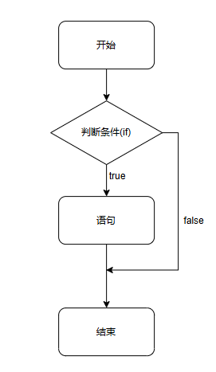

示例:

```cpp
int main()
{
    //单行if结构
    //让用户输入一个分数，如果大于600，则输出"恭喜"
    //1. 用户输入分数
    int score = 0;
    cout << "请输入一个分数"<<endl;
    cin >> score ;
    //2. 打印用户分数
    cout << "您的分数为:"<<score<<endl;
    //3.判断
    if(score > 600) //if条件语法后没有分号！！！
    {
        cout<<"恭喜"<<endl;
    }

    system("pause");
    return(0);
}
```

> [!important]
>
> ==if条件后面不要加分号==

2. 多行格式if语句：`if(条件){ 条件为真执行的语句 }else{ 条件不满足执行的语句 }`

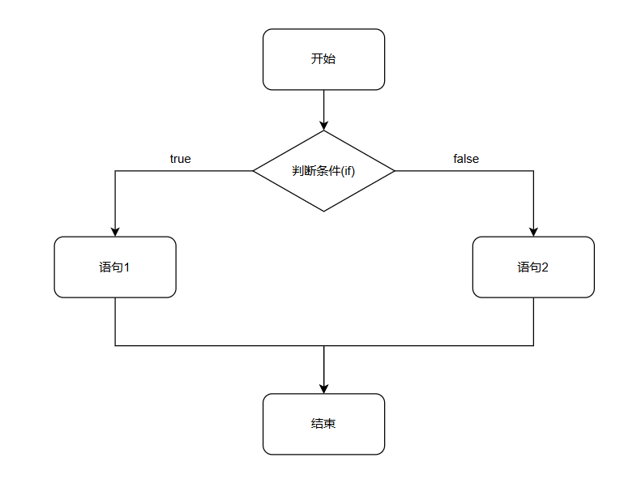

示例:

```cpp
int main()
{
    //多行格式if
    //提示用户输入分数，如果分数大于600，则输出"恭喜"，若没有大于600，则输出"别放弃"
    int score = 0;
    cout <<"请输入一个分数"<<endl;
    cin >> score;
    cout << "您的分数为"<< score <<endl;
    //执行判断
    if(score > 600) //大于600的情况
    {
        cout << "恭喜"<<endl;
    }
    else //小于600的情况
    {
        cout << "别放弃"<<endl;
    }
    system("pause");
    return(0);
}
```

3. 多条件的if语句:`if(条件1){满足条件1执行的语句}else if(条件2){满足条件2执行的语句}... else{都不满足执行的语句}`

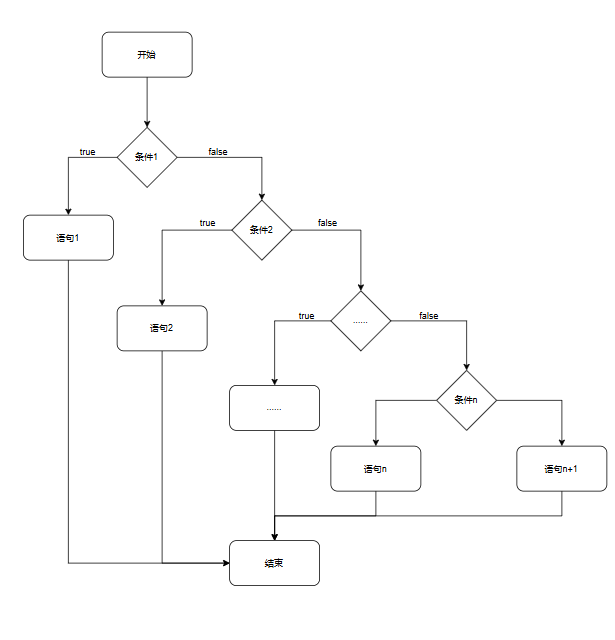

```cpp
int main()
{
    //多条件的if语句
    //1.输入分数
    int score = 0;
    cout << "请输入一个分数"<<endl;
    cin >> score;
    cout << "您的分数是" << score << endl;
    //2.条件判断(大于600)
    if (score >= 600)
    {
        cout << "恭喜"<<endl;
    }
    else if (score >= 500)//这里不能写(500 < score < 600)
    {
        cout << "别放弃"<<endl;
    }
    else if (score >= 400)
    {
        cout << "还可以"<<endl;
    }
    else
    {
        cout << "别摆烂辣！"<<endl;
    }
    
    system("pause");
    return(0);
}
```

**嵌套if语句**：在if语句中再嵌套一个if语句

案例要求:

- 在上个代码的基础上，根据分数再细化
- 大于700为特等，大于650为一等，大于600为优秀

```cpp
int main()
{
    //多条件的if语句
    //1.输入分数
    int score = 0;
    cout << "请输入一个分数"<<endl;
    cin >> score;
    cout << "您的分数是" << score << endl;
    if (score >= 600)
    {
        cout << "恭喜"<<endl;
        if (score >= 700) //嵌套的if语句
        {
            cout << "特等"<<endl;
        }
        else if (score >= 650)
        {
            cout << "一等"<<endl;
        }
        else
        {
            cout << "优秀"<<endl;
        }
    }
    else if (score >= 500)//这里不能写(500 < score < 600)
    {
        cout << "别放弃"<<endl;
    }
    else if (score >= 400)
    {
        cout << "还可以"<<endl;
    }
    else
    {
        cout << "别摆烂辣！"<<endl;
    }
    
    system("pause");
    return(0);
}
```

*练习见[[练习.md]]*

#### 4.1.2 三目运算符

**作用:**通过三目运算符实现简单的判断

**语法：**`表达式1 ? 表达式2 : 表达式3`

**解释：**

如果表达式1的值为真，执行表达式2，并返回表达式2的结果；

如果表达式1的值为假，执行表达式3，并返回表达式3的结果；

示例:

```cpp
int main()
{
    //三目运算符
    int a =30;
    int b =20;
    int c =0;
    c=(a > b ? a : b);
    cout << c <<endl;

    //在C++中，三目运算符返回的是变量，可以继续赋值
    (a > b ? a:b)=100; //a和b做大小比较，较大的变量被赋值为100
    system("pause");

    return(0);
}
```

#### 4.1.3 switch语句

**执行多条件分支语句**

**语法：**

```cpp
switch(表达式)
    
{
    case 结果1 : 执行语句;break;
        
    case 结果2 : 执行语句;break;
        
    ...
        
	default : 执行语句;break;
}    
```

示例:

```cpp
int main()
{
    //给电影评分
    //9-10 经典
    //7-8 非常好
    //5-6 不错
    // <5 不好

    cout << "请给电影打分"<<endl;
    int score = 0;
    cin >> score ;
    cout << "您的打分为"<<score<<endl;
    switch (score)
    {
    case 10 :
        cout << "经典"<<endl;
        break; //退出当前分支
    case 9 :
        cout << "经典"<<endl;
        break;
    case 8 :
        cout << "非常好"<<endl;
        break;
    case 7 :
        cout << "非常好"<<endl;
        break;
    case 6 :
        cout << "一般"<<endl;
        break;
    case 5 :
        cout << "一般"<<endl;
        break;
    default:
        cout << "不好"<<endl;
        break;
    }
    system("pause");

    return(0);
}
```

> ==记得要写break;==

> 缺点:switch判断的时候只能是整型或字符型，不可以是一个区间

> 优点:结构清晰，执行效率高(速度快)

### 4.2 循环结构

#### 4.2.1 while循环语句

**作用:**满足循环条件，执行循环语句

**语法:**`while(循环条件){循环语句}`


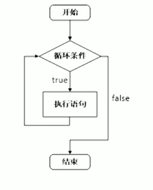

**解释:**==只要循环条件为真，就执行循环语句==

示例:

```cpp
int main()
{
    //在屏幕中打印0-9这10个数字
    
    int num = 0;
    while (num < 10)
    {
        cout << num <<endl;
        num++;
    }
    system("pause");

    return(0);
}
```

> 如果while 后条件为(1)，则为无限循环，要避免死循环的出现

**练习:猜数游戏**

```cpp
int main()
{
    //添加随机数种子
    srand((unsigned int)time(NULL));    
    int num2 = rand()%100 + 1 ; 
    //cout << num22 <<endl;
    int val = 0;
    cout << "请输入一个数开始猜数游戏"<<endl;
    while (val != num2)
    {
        cin >> val ;
        if (val > num2 )
        {
            cout << "猜大辣，再来一次吧"<<endl;
        }
        else if (val < num2)
        {
            cout << "猜小辣，再来一次吧"<<endl;
        }
        
    }
    cout << "厉害，对辣"<<endl;

    system("pause");
    return(0);
}
```

#### 4.2.2 do…while循环

**作用：**满足循环条件，执行循环语句

**语法：**`do{循环语句}while(循环条件);`

> [!note]
>
> 与while不同的是，==do…while会先执行一次循环语句==，再判断循环条件

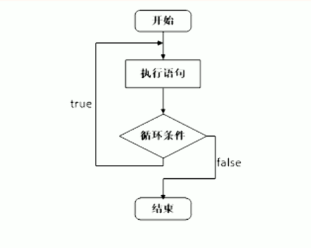

**示例：**

```cpp
int main()
{
    //do while 循环
    int num =0;
    do
    {
        cout << num <<endl;
        num++;
    } while (num < 10);
    system("pause");
    return(0);

}
```

**练习案例：**水仙花数

- 水仙花数是一个三位数，它的每个位上的三次幂之和等于它本身
- 例：1^3^+5^3^+3^3^=153

```cpp
//注意：要有#include<cmath>
int main()
{
    //定义初始值，其中fnum3,2,1分别代表百十个位，这个三位数要和初始值fnum相等
    int fnum1 = 0;
    int fnum2 = 0;
    int fnum3 = 1;
    float fnumt = 0;
    int fnum = 100;
    do
    {
        
        fnum++;
        fnum1++;
        //三位数输出，个十百位分别输出
        if (fnum1 - 1  == 9)
        {
        fnum1 = 0;
        fnum2++;
        }
        if (fnum2 - 1 == 9)
        {
        fnum2 = 0;
        fnum3++;
        }
        if (fnum3 - 1 == 9)
        {
            fnum3 = 0;
        }
        
        fnumt = pow(fnum1,3) + pow(fnum2,3) + pow(fnum3,3);
        if ( fnumt == fnum)
        {
            cout <<"水仙花"<< fnum << endl;
        }
        // cout << fnum << endl;
        // cout << fnumt << endl;
        // cout <<"个位"<< fnum1 << endl;
        // cout <<"十位" <<fnum2 << endl;
        // cout <<"百位" <<fnum3 << endl;
     
    } while (fnum < 1000);
    system("pause");
    return(0);

}
```

>[!important]
>
>**如何获取一个三位数的个十百位？**
>
>- 例:153
>- 个位:153%10 = 3    对数字取模于10可以获得个位
>- 十位:153/10 = 15 $\to$15 % 10 = 5  C++中整除只留整数部分即 `(153/10)%10`
>- 百位:153/100 = 1 

**示例：**

```cpp
int main()
{
    int num = 100;
    do{
        num++;
        if(num == pow(num%10,3)+pow((num/10)%10,3)+pow(num/100,3))
        {
            cout << num <<endl;
        }
    }while(num < 999);

    system("pause");
    return(0);
}
```

#### 4.2.3 for 循环

**作用：**满足循环条件，执行循环语句

**语法：**`for(起始表达式;条件表达式;末尾循环体){循环语句;}`

- 起始表达式不参加循环
- 条件表达式确定循环条件
- 一次循环执行后执行末尾循环体

**示例：**

```cpp
int main()
{
    for (int i = 0; i < 10; i++)
    {
        cout << i <<endl;
    }
    
    system("pause");
    return(0);
}
```

> [!note]
>
> 对for(a;b;c){d}来看，执行顺序如下
>
> 1. 先执行一次 a 
> 2. 判断 b 
> 3. 若b为真，重复2，3，4，5；否则退出循环
> 4. 执行 d
> 5. 执行 c 

> for 循环结构简单，比较常用

 **练习案例：**敲桌子

- 输出1~100，若该数个位含有7，或10位含有7，或该数字是7的倍数，则我们输出敲桌子，其余数字直接打印

```cpp
int main()
{
    for (int i = 0; i < 100; i++)
    {
        if (i%10 == 7)
        {
            cout << "敲桌子" <<endl;
        }
        else if ((i/10)%10 == 7)
        {
            cout << "敲桌子" <<endl;
        }
        else if ( i%7 == 0 )
        {
            cout << "敲桌子" <<endl;
        }
        else
        {
            cout << i <<endl;
        }        
    }
}
```

> [!note]
>
> if比较语句中我们可以用逻辑运算符来提高if语句的精确性
>
> **比如上面的示例中多个if便可以写成**`if(i % 10 == 7 || i%7==0 || (i/10)%10==7 )`

#### 4.2.4 嵌套循环

- 在循环体中再次嵌套循环，用于解决实际问题

**示例**

```cpp
int main()
{
    for (int i = 0; i < 10 ; i++) //外层循环
    {
        for (int j = 0; j < 10; j++) //内层循环
        {
            cout << "*";
        }
        cout << endl;
    }
 // 外层走一次，内层走一周   
    
    system("pause");
    return(0);
}
```

**案例：**乘法口诀表

- 打印九九乘法表

```cpp
int main()
{
    //九九乘法表，实际上就是 行 X 列 = 数字，即将行和列表示出来即可
    for (int i = 0; i < 10; i++) // i 代表 行
    {
        for (int j = 1; j < i+1 ; j++) // j 代表 列 
        {
            cout << j <<"X"<< i <<"="<<i*j<<" ";
        }
        cout << endl;
    }   
    system("pause");
    return(0);
}
```

输出呈现：

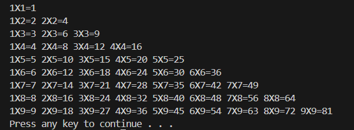


---

### 4.3 跳转语句

#### 4.3.1 break 语句

**作用：**跳出==选择结构==或==循环结构==

break使用的时机：

- 出现在switch语句中，终止case并跳出switch
- 出现在循环语句中，作用是跳出当前循环语句
- 出现在嵌套循环中，作用是跳出最近的内层循环语句

**示例1：**

```cpp
int main()
{
    for (int i = 0; i < 10 ; i++)
    {
        cout << i << endl;
        if (i == 5)
        {
            break;
        }
        
    } 
    system("pause");
    return(0);  
}
```

**示例2**

```cpp
int main()
{
    for (int i = 0; i < 10 ; i++)
    {
        for (int j = 0; j < 10; j++)
        {
            if (j == 5)
            {
                break;
            }
            cout << "*";
        }
        cout<< endl; 
    } 
    system("pause");
    return(0);  
}
```

#### 4.3.2 countinue 语句

**作用:**在==循环语句==中，跳过本次循环中余下的未执行的代码，继续执行下一次循环

**示例：**

```cpp
int main()
{
    for (int i = 0; i <= 100; i++)
    {
        if (i%2 == 0)
        {
            continue;
        }
        
        cout << i << endl;
    }
    system("pause");
    return(0);  
}
```

- 实现了0~100奇数的输出

#### 4.3.3 goto 语句

**作用：**可以无条件跳转语句

**语法：**`goto 标记`

- 标记一般用纯大写英文表示

- goto 语法尽量不要经常使用，以免造成代码逻辑混乱

- 标记定义 `T：`

---

## 5 数组

### 5.1 概述

*数组就是一个集合，里面存放了相同类型的数据元素*

- **特点1：**数组中每个==数据元素都是相同的数据类型==
- **特点2：**数组是==连续的内存==位置组成的

### 5.2 一维数组

#### 5.2.1 一维数组的定义方式：

一维数组有三种定义方式：

1. `数据类型 数组名[ 数组长度 ]`
2. `数据类型 数组名[ 数组长度 ]={ 值1,值2,…}`
3. `数据类型 数组名[]={ 值1,值2,…}`

**示例1：**

```cpp
int main()
{
    // 1. `数据类型 数组名[ 数组长度 ]`
    int arr[5];
    arr[0] = 10;
    arr[1] = 20;
    arr[2] = 30;
    arr[3] = 40;
    arr[4] = 50;
    int a = 3;
    cout << arr[3] << endl;//这个访问的是 40 
    cout << arr[ a ] << endl; //数组的下标可以通过变量来索引
    system("pause");
    return(0);  
}
```

**示例2：**

```cpp
int main()
{
    //2.数据类型 数组名[ 数组长度 ]={ 值1,值2,…}
    int arr2[5] = {10,20,30,40,50};
    for (int i = 0; i < 5; i++) // i < 5 中，5表示数组长度
    {
        cout << arr2[i] << endl;
    }
    //若初始没有补齐数据，会用0来填充空余数据
    system("pause");
    return(0);  
}
```

**示例3：**

```cpp
int main()
{
    //3.数据类型 数组名[]={ 值1,值2,…}
    //定义数组时必须要给定初始长度
    int arr3[] = {1,1,4,5,1,4};
    for (int i = 0; i < 6; i++)
    {
        cout << arr3[i]<<endl;
    }
    system("pause");
    return(0);  
}
```

- 数组中的数据是从0开始标记(索引)下标
- 我们可以通过下标来访问数组中的元素

#### 5.2.2 一维数组数组名

**用途：**

1. 可以统计整个数组在内存中所占的长度
2. 可以获取数组在内存中的首地址

> **对1**：`sizeof(数组名)`
>
> 我们可以用 `sizeof(arr)/sizeof(arr[0])来获取内存的长度

> **对2：**`cout << arr <<endl;`
>
> 一般该地址为16进制地址

```cpp
int main()
{
    //1。查询数组所占内存大小
    int arr[6]={1,1,4,5,1,4};
    cout << "数组大小为"<< sizeof(arr)<<endl;
    cout << "数组长度为"<< sizeof(arr)/sizeof(arr[0])<<endl;
    //2.查看首地址
    cout <<"内存地址"<< arr << endl;//16进制
    cout << (long long)arr <<endl;//强转10进制
    cout << &arr[0]<<endl;//数组中某个元素的内存地址
    cout << (long long)&arr[0] <<endl;//数组中某个元素的10进制内存地址
    //使用 long long 包容16进制精度问题
    cout << &arr[1]<<endl;//第二个元素位置
    cout << (long long)&arr[1] <<endl;//10进制
    //第二个与第一个相差4字节
    //数组名是常量，不能修改赋值
    system("pause");
    return(0);  
}
```

**练习案例1：**

- 在一个数组中记录了5个数据，arr[5] ={10,30,20,70,60}

- 找出这个数组中最大数

```cpp
int main()
{
    int arr[5]= {10,30,60,40,20};
    int max = 0; //假设某一最大值
    for (int i = 0; i < 5; i++)//访问数组中的每一个数
    {
        if (arr[i] > arr[max]) //比较假设值和访问值大小
        {
            max = i ; //若大于，则替换假设最大值
        }
    }
    //循环结束时，最大值以确定
    cout << "最大的数是" << arr[max]<<endl; //输出
    
    system("pause");
    return(0);  
}
```

> [!note]
>
> **在上面代码中，for循环内部也可以使用三目运算来找最大值**
>
> `max = (arr[max] > arr[i] ? max : i ); //使用三目运算符`

---


**练习案例2：**数组元素逆置

- 声明一个5个元素的数组，并将其逆置
- 示例 : 原数组 {1,3,4,2,3}  ==> 输出{3,2,4,3,1}
- 输出逆置

```cpp
int main()
{
    int arr[5] = {1,3,4,2,3};
    for (int i = 0; i < 5; i++)
    {
        cout << arr[4-i] ; 
    }
    cout << endl;

    system("pause");
    return(0);  
}
```

- 创立逆置数组

```cpp
int main()
{
    int arr[5] = {1,3,4,2,3};
    int arrt[5];
    int t; //建立逆置变量
    for (int i = 0; i < 5; i++) 
    {
        t = (sizeof(arr)/sizeof(arr[0]))-1-i; //实现逆置变量
        arrt[i] = arr[t]; //实现原数组向逆置数组的赋值
    }
    //逆置数组建立完成，以下为检查
    for (int i2 = 0; i2 < 5; i2++)
    {
        cout << arrt[i2] <<endl;
    }
    
    system("pause");
    return(0);
}
```

- 原数组的逆置

```cpp
int main()
{
    int arr[5] = {1,3,4,2,3};
    int sta = 0;
    int end = sizeof(arr)/sizeof(arr[0])-1;
    int temp = 0;
    //核心
    for ( ; sta < end ; )       //当起始值位置大于末尾值位置时停止
    {
        temp = arr[sta];        //初始值赋值至临时内存
        arr[sta] = arr[end];    //末尾值赋值至初始值
        arr[end] = temp;        //初始值(临时)赋值至末尾值
        sta++;                  //初始值后移一位
        end--;                  //末尾值前移一位
    }
    //数组倒置结束
    for (int i2 = 0; i2 < 5; i2++)
    {
        cout << arr[i2]<<endl;
    }
    
    system("pause");
    return(0);
}
```

---

#### 5.2.3 冒泡排序

**作用：**最常用的排序算法，对数组内的元素进行排序

1. 比较相邻的元素，如果第一个比第二个大，就交换他们
2. 对每一对相邻元素做同样工作，执行完毕后，找到第一个最大值
3. 重复以上步骤，每次比较次数-1，直到不需要比较


**示例：**将数组{4,2,3,0,5,7,1,3,9}升序排列

```cpp
int main()
{
    int arr[9] = {4,2,3,0,5,7,1,3,9};
    for (int i = 0; i < (sizeof(arr)/sizeof(arr[0])-1); i++)//排序的总轮数=元素个数-1
    {  
        for (int j = 0; j <(sizeof(arr)/sizeof(arr[0])-1)-i ; j++) //每轮排序的次数 = 元素个数 -1 -当前轮数
        {
            if (arr[j] > arr[j+1] ) //判断相邻的两个数的大小
            {
                //实现交换
                int temp = arr[j];
                arr[j] = arr[j+1];
                arr[j+1] = temp;
            }
        }
    }
    //输出验证
    for (int i2 = 0; i2 < 9; i2++)
    {
        cout << arr[i2]<<endl;
    }
    
    system("pause");
    return(0);
}
```

- 利用遍历实现数据筛查
- 题目来源[洛谷P1085 [NOIP2004 普及组] 不高兴的津津](https://www.luogu.com.cn/problem/P1085)

```cpp
#include<bits/stdc++.h>
using namespace std;

int main()
{
	int a,b,t;
    int m =0; 
    int arr[7];
    for (int i = 0; i < 7; i++)
    {
        cin >> a >> b;
        int k =a +b;
        arr[i] = k; //将获得的数据记入数组
    }
     //对数组遍历，找出最大的那个数
    for (int j = 0; j < 7; j++) //假设一个最大值 arr[0]，让arr[0]和下一个数比较，若大于，则将m赋值为j
    {
        if (arr[m] < arr[j]) 
        {
            m = j; 
            t = arr[j];
        }
    }
    if ( t > 8)
    {
        cout << m+1 <<endl;
    }
    else
    {
        cout << 0 <<endl;
    }
    
    system("pause");
    return(0);
}
```


### 5.3 二维数组

#### 5.3.1 **二维数组的定义方式：**

- `数据类型 + 数组名[行数][列数];`
- `数据类型 + 数组名[行数][列数] = {数据1，数据2}，{数据3，数据4};`[^2]
- `数据类型 + 数组名[行数][列数] = {数据1，数据2，数据3，数据4};`
- `数据类型 + 数组名[][列数] = {数据1，数据2，数据3，数据4};`
- 第三和第四组会自动区分行列数(即从**第一个数据**开始计数，记到列数自动换行)

---

#### 5.3.2 二维数组的赋值方式

- arr\[0]\[0] = 元素;
- arr\[0]\[1] = 元素;
- ……

*如何输出一个二维数组？*

> 写一个嵌套循环，外层打印行数，内层打印列数

```cpp
for (int i = 0;i < count ; i++)
{
    for(int j = 0;j < count ; j++)
    {
        cout << arr[i][j];
    }
    cout << endl;
}
```

> [!note]
>
> - 直观表示一个二维数组 ：`int arr[3][3];`
>
> |  列\行  |    0列     |    1列     | 2列        |
> | :-----: | :--------: | :--------: | ---------- |
> | **0行** | arr\[0][0] | arr\[0][1] | arr\[0][2] |
> | **1行** | arr\[1][0] | arr\[1][1] | arr\[1][2] |
> | **2行** | arr\[2][0] | arr\[2][1] | arr\[2][2] |
>
> **行列式行列式，先行后列**

#### 5.3.3 二维数组数组名

- 查看二维数组所占内存空间
- 获取二维数组首地址

- 具体如下

```cpp
int main()
{
    int arr[3][3] =
    {
        {1,1,4},
        {5,1,4}
    };
    //1.查看占用内存空间大小
    cout << sizeof(arr) <<endl; // out : 36 (6*6)
    cout << sizeof(arr[0][0]) <<" "<<sizeof(arr[0])<<endl; //out : 4 12(单个元素 第一行)
    //我们可以通过以上数据获得行数与列数
    sizeof(arr)/sizeof(arr[0]); //列数
    sizeof(arr[0])/sizeof(arr[0][0]); //列数
    
    //2.查看首地址
    cout << (long long)arr <<endl;  //out : 6422000
    cout << (long long)arr[0] <<endl; //二维数组地址与arr[0][0]首地址重合
    cout << (long long)arr[1] <<endl; //out : 6422012 差12(3*4)
    cout << (long long)&arr[0][0] <<endl; //二维数组地址与arr[0][0]首地址重合
    cout << (long long)&arr[0][1] <<endl; //out : 6422004 与[0][0]差4

    system("pause");
    return(0);
}
```

#### 5.3.3 二维数组应用案例

**考试成绩统计**

- 有三名同学(A,B,C)，在一次考试中成绩分别如下，**请输出三名同学的总成绩**

|      | 语文 | 数学 | 英语 |
| ---- | ---- | ---- | ---- |
| A    | 100  | 100  | 100  |
| B    | 90   | 50   | 100  |
| C    | 60   | 70   | 80   |

```cpp
int main()
{
    
    int arr[3][3] =
    {
        {100,100,100},
        {90,50,100},
        {60,70,80}
    };
    
    for (int i = 0; i < 3; i++)
    {
        int temp = 0;
        for (int j = 0; j < 3; j++)
        {
            temp += arr[i][j];
        }
        cout << temp <<endl;
    }
    
    system("pause");
    return(0);
}
```

#### 5.3.4 二维数组排序

- **核心思路**：冒泡排序

```cpp
int main()
{
    int l,m;
    cin >> l >> m;
    int arr[m][2];
    for (size_t i = 0; i < m; i++)
    {
        for (size_t j= 0; j < 2; j++)
        {
          cin >> arr[i][j];
        } 
    }

    for (size_t i2 = 0; i2 < m-1; i2++)
    {
        for (size_t j = 0; j < m-i2-1; j++)
        {
            if (arr[j][0] > arr[j+1][0])
            {
                int temp1 = arr[j][0];
                int temp2 = arr[j][1];
                arr[j][0] = arr[j+1][0];
                arr[j][1] = arr[j+1][1];
                arr[j+1][0] = temp1;
                arr[j+1][1] = temp2;
            }
        }
    }

    for (size_t i = 0; i < m; i++)
    {
        for (size_t ij = 0; ij < 2; ij++)
        {
            cout << arr[i][ij]<<" ";
        }
        cout <<endl;
    }
       
    
    return 0;
}
```


---

## 6 函数

### 6.1 概述

**作用：**将经常使用的一段代码封装起来，减少重复代码

> 一个较大的程序，一般分为若干个程序块，每个模块实现特定的功能

### 6.2 函数的定义

==一般函数定义有5个主要步骤==

1. 返回值类型
2. 函数名
3. 参数列表
4. 函数体语句
5. return表达式

**语法**

```cpp
//返回值类型 函数名(参数列表)
int isprime(int n)
{
    //函数体语句
    
    //return表达式
    return 0;
}

```

- 实例1

```cpp
#include<bits/stdc++.h>
using namespace std;

int add(int a , int b) 
{
    int sum = a+b;
    return sum;
}

int main()
{
    int num1,num2;
    scanf("%d %d",&num1,&num2);
    printf("%d",add(num1,num2));

    system("pause");
    return(0);
}
```

> a,b 我们可以称为形参，num1,num2 我们可以称为实参，函数调用本质是将实参传递给形参并进行函数运算，返回return值

### 6.3 函数的调用

**功能：**使用定义好的函数

**语法：**`函数名(参数)`

### 6.4 值传递

- 值传递就是函数调用时实参将数值转递给形参
- 值传递时，==形参发生变化，并不会影响实参==

```cpp
#include<bits/stdc++.h>
using namespace std;

void swap(int a,int b) //在无需返回值时，可以输入viod类型
{
    int temp = a;
    a = b;
    b =temp;
    cout << "交换后:"<<a <<" "<<b <<endl;
    return;
}

int main()
{
    int i1 = 4;
    int i2 = 5;
    cout <<"交换前:"<<i1<<" "<<i2<<endl;
    swap(4,5);
}
```

> [!note]
>
> 在值传递的时候，为实参和形参分别分配内存空间，将实参的内存传递给形参，进而使用形参的内存去执行函数，实参的内存不会发生改变

### 6.5 函数的常见样式

1. 无参无返
2. 有参无返
3. 无参有返
4. 有参有返

- **实例**

```cpp
#include<bits/stdc++.h>
using namespace std;

//1.无参无返
void test_01()
{
    cout << "跟你爆了"<<endl;
    return;
}

//2.有参无返
void test_02(int a)
{
    cout << a*a <<endl;
    return;
}

//3.无参有返
int test_03()
{
    return 1000;
}

//4.有参有返
int test_04(int k)
{
    return (k*2)+k;
}

int main()
{
    test_01();
    test_02(4);
    int num1 = test_03();
    cout<<num1<<endl;
    int m = test_04(4);
    cout <<m <<endl;
    system("pause");
    return(0);
}
```

### 6.6 函数的声明

**作用：**告诉编译器函数名称及如何调用函数，函数的实际主体可以单独定义

- 函数可以声明多次，但函数的定义只能有一次

**示例：**

```cpp
#include<bits/stdc++.h>
using namespace std;

//声明
int max01(int a,int b);

int main()
{
    int t = max01(5,6);
    cout << t << endl;
    system("pause");
    return(0);
}

//定义
int max01(int a,int b)
{
    return a>b ? a : b;
}
```

### 6.7 函数的分文件填写

**作用：**让代码结构更加清晰

函数分文件编写一般有4个步骤

1. 创建后缀名为.h的头文件
2. 创建后缀名为.cpp的源文件
3. 在头文件中书写函数的声明
4. 在源文件中书写函数的定义

**示例**

```cpp
//head.h
#include<bits/stdc++.h>
using namespace std;

void swap(int a,int b);
```

```cpp
//fun.cpp
#include<bits/stdc++.h>
#include "head.h"
using namespace std;

void swap(int a,int b)
{
    int temp = a;
    a = b;
    b = temp;
    cout << a <<" "<<b << endl;
}
```

```cpp
//test.cpp
#include<bits/stdc++.h>
using namespace std;
#include "head.h"

int main()
{
    swap(4,5);
    return(0);
}
```

> [!important]
>
> 在VScode中，C++编译只对test.cpp中的main函数进行编译，无法连接到我们的fun.cpp文件
>
> - **==解决方法:将头文件的文件目录复制到 *.vscode*目录下的*tasks.json*的"args": 的"${file}"下面即可==**
> - 注意复制的单斜杠要改为多斜杠

---

## 7 指针

### 7.1 指针的基本概念

**指针的作用：**用于间接访问内存

- 指针的编号是从0开始计数的，一般用16进制表示
- 可以利用指针变量保存地址


### 7.2 指针的定义和操控

- ==定义==：`数据类型 * 指针变量名`
- `int *p;`(定义了个指针)
- `p = &a`(调用了指针)
- ==使用==：可以使用解引用的方式来找到指针指向的内存
- `*p`(表示解引用)

```cpp
int main()
{
    int a = 10;
    //创立指针
    int *p;
    //记录变量a的地址
    p = &a;
    //解引用
    cout << *p<<endl;
    *p = 1000; //指针也可以修改内存
    cout << a;
    
    return 0;
}
```

### 7.3 指针所占的内存空间

- 在32位操作系统下，指针占用**4**字节

 ```cpp
int main()
{
    //指针的第二种写法
    int a = 10;
    int *p = &a;

    cout << "*p所占的内存为"<<sizeof(int *); //我这里似乎是64位系统，所以输出结果是8
    
    return 0;
}
 ```

### 7.4 空指针与野指针

- **空指针 ：**指向内存中位0位的指针
- **野指针：**初始化指针
- **空指针指向的的内存是无法被访问的**

- **野指针：**指针指向非法的内存空间
  - 在没有申请内存的情况使用指针访问这串内存

### 7.5 const修饰指针

有三种情况：

1. const修饰指针$\to$ **常量指针**
   1. 指针的指向可以更改，但指针指向的值不可以改
2. 


## 8 结构体

**自定义的数据类型**，允许用户储存不同的数据类型


### 8.1 结构体的定义

**语法：**`struct 结构体名{结构体成员列表};`

- 有三种创建变量的方式:

  - struct 结构体名 变量名
  - struct 结构体名 变量名 = {成员1 ， 成员2 ， ……}
  - 定义结构体时顺便创建变量

  例：

  ```cpp
  #include <bits/stdc++.h>
  #define endl '\n'
  using namespace std;
  // 创建数据类型
  struct QAQ {
      string s1;
      int n1;
      int n2;
      // 下面是定义时候定义
  } k3;
  
  int main()
  {
      // 定义结构体数据 1
      QAQ k1;
      k1.s1 = "aaa";
      // 定义结构体数据 2
      QAQ k2 = { "114", 5, 1 };
      k3.s1 = "1919";
      k3.n1 = 810;
      return 0;
  }
  ```

### 8.2 结构体数组

**定义结构体放入数组方便维护**

- **语法：**`struct 结构体名 数组名[元素个数] = {}`

```cpp
#include <bits/stdc++.h>
#define endl '\n'
using namespace std;
// 创建数据类型
struct QAQ {
    string s1;
    int n1;
    int n2;
} s[10];

int main()
{
    s[1] = { "QAQ", 1, 2 };
    cout << s[1].s1;
    // 或者
    QAQ kk[5]; //第二种方法构建
    cin >> kk[3].s1;
    cout << kk[3].s1;
    return 0;
}
```

### 8.3 


