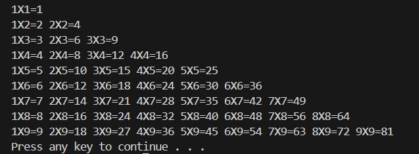
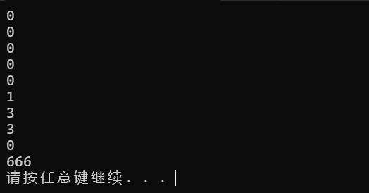
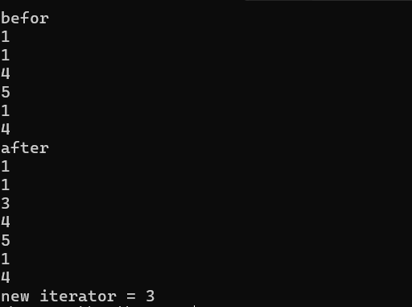
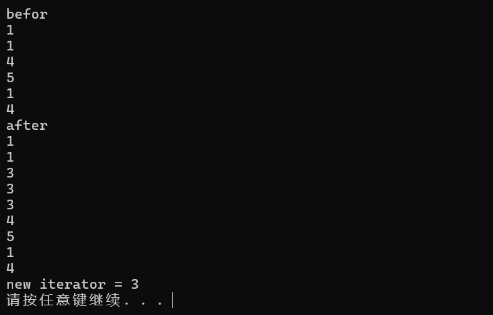
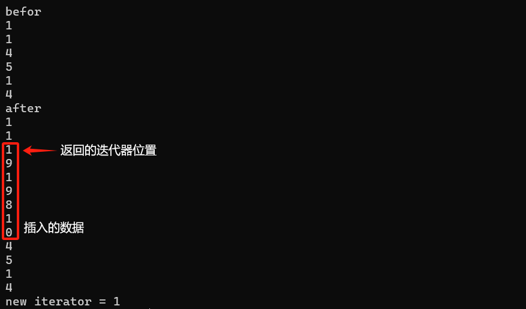
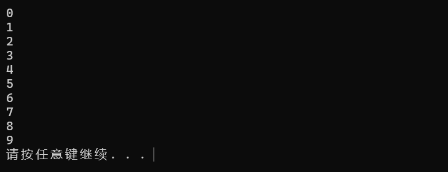

#   C++

C++语言是一门广泛被使用的语言，学习C语言，可以使我们更加深入的了解到编程语言的运行方式和底层逻辑，下面，让我们从零开始，学习C++

---

## 1 C++语言入门

### 1.1 第一个C++程序

**我们利用C++输入 hello world**

```cpp   
#include <iostream>
using namespace std;

int main()
{
    cout << "hello world"<< endl;

    system("pause");
    
    return(0);
}
```

---

### 1.2 C++程序的注释

1. 单行注释  
   - 使用`//`来注释一行代码
2. 多行注释  
   - 使用`/* ...... */`来多行注释
3. 例子

```cpp
#include <iostream>     

/* 这是一个头文件
用于给定指定函数名称*/

using namespace std;    
int main()
{
    cout << "hello world"<< endl; //输出hello world

    system("pause");
    
    return(0);
}
```

---

### 1.3 变量

- **作用**：给定一段指定的内存空间取名以方便我们操纵这段内存
- **语法**：`数据类型 变量名 = 初始值`(`int a =10`)
- 实例

```cpp
#include <iostream>     
using namespace std;
int main()
{
    int a = 10;
    cout<<"a="<<a<<endl;
    system("pause");
    return(0);
}
```

此时C++会输出“a=10”

---

### 1.4 常量

**作用**：用于记录程序中不可更改的数据

C++有两种定义常量的方法

1. **#define** 宏常量：`#define 常量名 = 常量值`  
   - <font style=background:#1ff5>通常在代码文件上方定义</font>,表示一个常量

2. **const**修饰的变量：`const 数据类型 常量名 =常量值`
   - <font style=background:#1ff5>通常在变量定义加关键字const</font>,修饰该变量为常量，不可更改

示例1：

```cpp
#include <iostream>     
using namespace std;

#define day 7
int main()
{
    cout<<"一周有"<<day<<"天"<<endl;
    system("pause");
    return(0);
}
```

- 如果我们强加的去修改day的值，C++则会报错,说明我们的改动不合规矩


示例2：

```c++
#include <iostream>     
using namespace std;

#define day 7
int main()
{
    const int year = 365;     //这里修饰了year，后面无法修改
    cout<<"一周有"<<day<<"天"<<endl;
    cout<<"一年有"<<year<<"天"<<endl;
    system("pause");
    return(0);
}
```

---

### 1.5 关键字

- 关键字是C++内置的函数或字符名称，我们在创建变量时不用用关键字来给变量来命名

### 1.6 标识符命名规则

C++在对标识符(变量，常量)命名时有一套规则，具体如下：

- 标识符不可以是关键字
- 标识符只能由数字，字母，下划线构成
- 第一个字符必须为字母或下划线
- 标识符大小写敏感

> 建议是标识符名称要通俗易懂，做到见名知意的效果

---

## 2 数据类型

**C++规定在创建一个标识符的时候必须指定其数据类型，否则无法对该标识符分配内存**

### 2.1 整型

`int` **作用**：整型变量表示的是==整数类型==的数据

C++共有4种表示整型的方式，他们的区别在于占用空间的不同

| 数据类型            | 占用空间                                      | 取值范围         |
| ------------------- | --------------------------------------------- | ---------------- |
| short(短整型)       | 2字节                                         | (-2^15^—2^15^-1) |
| int(整型)           | 4字节                                         | (-2^31^—2^31^-1) |
| long(长整型)        | windows为4字节，Linux为4字节(32x)或8字节(64x) | (-2^31^~2^31^-1) |
| long long(长长整型) | 8字节                                         | (-2^63^~2^63^-1) |

### 2.2 sizeof 关键字

**作用：**利用sizeof关键字可以==统计数据所占的内存大小==

**语法：**`sizeof( 数据类型/变量 )`

示例:

```cpp
#include <iostream>     
using namespace std;

int main()
{
    //可以利用sizeof求出数据类型占用多少内存空间
    short num1 =10;
    cout<<"short占用的内存为"<<sizeof(num1)<<endl;
    int num2 = 10;
    cout<<"int占用的内存为"<<sizeof(num2)<<endl;
    long long num3 =10;
    cout<<"long long 占用的内存为"<<sizeof(num3)<<endl;
    system("pause");
    return(0);
}
```

- 此时输出的结果如下


### 2.3实型（浮点型）

**作用：**用于==表示小数==

浮点型变量分为两种：

- 单精度float
- 双精度double

两者的区别在于精度和占用内存不同

| 数据类型 | 占用大小 | 精度                |
| -------- | -------- | ------------------- |
| float    | 4字节    | 7位==有效数字==     |
| double   | 8字节    | 15~16位==有效数字== |

> [!NOTE]
>
> 在使用float时要注意语法`float num1 = 3.14f`,只有带上**f**后才会被认定为float类型，否则会按照默认的doubt类型赋值

- 表示小数时也可以用科学计数法

  > ```cpp
  > float f3 = 3e2;//3*10^2
  > cout<<f3<<endl;
  > float f4 = 3e-2;//3*10^-2
  > cout<<f4<<endl;
  > ```

  此时输出的结果便为：

  

### 2.4 字符型

- **作用：**字符型变量用于显示单个字符

- **语法:** `char ch = 'a'`

> tips1: 显示字符型变量的时候只能用单引号，不能用双引号
>
> tips2:单引号内只能有一个字符，不可以是字符串

- 字符型变量只占用1字节
- 字符型变量将变量以ASCII码的形式储存在内存里

*如何查看字符型变量的ASCII码*

`cout<<(int)[变量名]<<endl`

- 常用ASCII码：a-97  A-65

### 2.5 转义字符

**作用：**表示一些==不能显示出来的ASCII字符==

常用的转义字符有：`\n \\ \t`

| 转义字符 |         作用          | ASCII码 |
| :------: | :-------------------: | :-----: |
|    \n    |        换行符         |   010   |
|   \\\    | 转义一个<kbd>\\</kbd> |   092   |
|    \t    | 水平制表符(占8个位置) |   009   |

###   2.6 字符串型

- **作用：**用于表示一串字符

**两种风格**

1. C语言风格：`char 变量名[]= "字符串值"`
2. C++风格：`string 变量名="字符串值"`

```cpp
int main()
{
    char str/*字符串名*/[] = "hello world"; //tips1:字符串名后要加[]
    cout << str <<endl;
    
    string str2 = "114514";   //要包含一个头文件#include <string> 
    cout<<str2<<endl;
    system("pause");

    return(0);
}
```

> [!IMPORTANT]
>
> C++风格字符串需要在开头加入头文件==#include\<string>==

### 2.7 布尔类型(bool)

**作用：**作用于条件判断，代表真或假

- **bool类型只有两个值**
- True——真(1)
- False——假(0)
- bool 占用1字节的内存空间

**示例：**

```cpp
int main()
{
    bool flag = true ; //true代表真，本质上是"1"
    cout<<flag<<endl;
    bool flag2 = false ;//false代表假，本质是"0"
    cout << flag2<<endl;
    system("pause");

    return(0);
}
```

而这块代码的输出结果


### 2.8 数据的输入

**作用：**从键盘上获取数据

**语法：**`cin >> 变量`

示例：

```cpp
int main()
{
    //整型
    int a = 0;
    cout << "请键入整型变量a的值"<<endl;
    cin >> a;
    cout <<a<<endl;
    //浮点型
    float f =1.14f;
    cout<<"请给浮点型f赋值"<<endl;
    cin >> f;
    cout <<f<<endl;
    //字符串型
    string str = "hello world";
    cout<<"输入你的字符串值"<<endl;
    cin >> str;
    cout<<str<<endl;

     
    system("pause");

    return(0);
}
```

输出结果为:


## 3 运算符

**作用：**用于执行代码的计算

主要有一下几种运算符：

| 运算符类型 | 作用                                 |
| ---------- | ------------------------------------ |
| 算术运算符 | 用于处理==四则运算==                 |
| 赋值运算符 | 用于将表达式的值赋给变量             |
| 比较运算符 | 用于表达式的比较，返回一个真值或假值 |
| 逻辑运算符 | 用于根据表达式的值返回真值或假值     |

---

### 3.1 算术运算符

**作用：**用于处理四则运算

包括一下符号：

| 运算符 | 术语       | 示例      | 结果    |
| ------ | ---------- | --------- | ------- |
| +      | 正数       | +3        | +3      |
| -      | 负数       | -4        | -4      |
| +      | 加号       | 4+5       | 9       |
| -      | 减号       | 6-3       | 3       |
| *      | 乘号       | 6*7       | 42      |
| /[^1]  | 除号       | 94/7      | 13      |
| %      | 取模(取余) | 10%3      | 1       |
| ++     | 前置递增   | a=2 b=++a | a=3 b=3 |
| ++     | 后置递增   | a=2 b=a++ | a=3 b=2 |
| --     | 前置递减   | a=2 b=--a | a=1 b=1 |
| --     | 后置递减   | a=2 b=a-- | a=1 b=2 |

示例1*四则运算的示例*

```cpp
int main()
{
    int a1 = 10;
    int b1 = 7;
    cout<<a1 + b1 <<endl;
    cout<<a1 - b1 <<endl;
    cout<<a1 * b1 <<endl;
    cout<<a1 / b1 <<endl; //这里为整除运算，结果也会为整数

    float a2 ;
    float b2 ;
    cout<<"请输入两个浮点数"<<endl;
    cin >> a2;
    cin >> b2;
    cout<< "a2除以b2的值为"<<a2 / b2<<endl; //这里是非整除
    
    system("pause");
    return(0);
}
```
- 取模运算本质就是取余数
- 两个小数之间不能做取模运算

*前置递增与后置递增*

- 前置，后置递增都是使变量进行加一的操作
- 前置递增:==先对变量进行递增，再进行表达式运算==
- 后置递增:==先进行表达式的运算，再对变量递增==

```cpp
int main()
{
    //前置运算
    int a = 10;
    int b = 3;
    int r1 = ++a * b; 
    cout<<"r1="<< r1 <<endl; 

    //后置运算
    int a2 = 10;
    int b2 = 3;
    int r2 = a2++ * b2; 
    cout<<"r2="<< r2 <<endl;
    cout<<"a2="<<a2<<endl; 

    system("pause");
    return(0);
}
```


- 我们不难发现，在上述代码运算过程中我们的"a"变量先被加1再参与到了运算之中，而我们的"a2"变量则是再运算结束后才被加1

  ---

### 3.2赋值运算符

**作用：**将表达式的值赋给变量

主要包括以下几个符号：

| 运算符 | 术语     | 示例      | 结果 |
| ------ | -------- | --------- | ---- |
| =      | 赋值     | a=10      | a=10 |
| +=     | 加等于   | a=10 a+=2 | a=12 |
| -=     | 减等于   | a=10 a-=2 | a=8  |
| *=     | 乘等于   | a=10 a*=2 | a=20 |
| /=     | 除等于   | a=10 a/=2 | a=5  |
| %=     | 取模等于 | a=10 a%=2 | a=0  |

### 3.3 比较运算符

**作用：**用于比较表达式的真假，并返回一个真值或假值

主要有以下的符号：

| 运算符 | 术语     | 示例   | 结果 |
| ------ | -------- | ------ | ---- |
| ==     | 相等于   | 4 == 3 | 0    |
| !=     | 不等于   | 4 != 3 | 1    |
| <      | 小于     | 4 < 3  | 0    |
| >      | 大于     | 4 > 3  | 1    |
| <=     | 小于等于 | 4 <= 3 | 0    |
| >=     | 大于等于 | 4 >= 3 | 1    |

 *tips：再代码中由于有优先级的影响，我们可以这么提升运算优先级 `cout << (a == b)<< denl;`*

### 3.4 逻辑运算符

**作用：**用于根据表达式的值返回真值或假值

主要有以下符号:

| 运算符 | 术语 | 示例   | 结果                                                         |
| ------ | ---- | ------ | ------------------------------------------------------------ |
| ！     | 非   | !a     | 如果a为假，则!a为真；如果a为真，则!a为假                     |
| &&     | 与   | a&&b   | 如果a和b都为真，则结果为真，否则为假                         |
| \|\|   | 或   | a\|\|b | 如果a和b中有一个为真，则结果为真，二者都为假的时候，结果为假 |

#### 3.4.1 **逻辑非**

```cpp
int main()
{
    //逻辑非
    int a= 10 ;
    cout << !a << endl;
    //运算结果为 0 (解释:在C++中，只要结果不为0，都视为真，故输出结果为假)
    cout << !!a << endl;
    //结果为1，取了两次反（从真变假再变真）
    system("pause");
    return(0);
}
```

> 总结:真变假，假变真

#### 3.4.2 逻辑与

```cpp
int main()
{
    // 逻辑与
    int a = 10;
    int b =10;
    cout << (a&&b) << endl; //此处也要优先运算
    //运算结果为 1 (真)
    a = 10;
    b = 0;
    cout << (a&&b) << endl;
    //运算结果为 0 (假)
    a = 0;
    b = 0;
    cout << (a&&b)<<endl;
    //运算结果为 0 (假)
    system("pause");
    return(0);
}
```

> 总结: 同真为真，其余为假

#### 3.4.3 逻辑或

```cpp
int main()
{
    //逻辑或
    int a = 10;
    int b = 10;
    cout << (a||b)<<endl;
    //结果为1

    a = 0;
    b = 10;
    cout << (a||b)<<endl;
    //结果仍为1
    a=0;
    b=0;
    cout << (a||b)<<endl;
    //结果为0
    system("pause");
    return(0);
}
```

> 总结: 同假为假，其余为真

---

## 4 程序流程结构

C/C++支持的三种程序运行结构：==顺序结构==，==选择结构==，==循环结构==

- **顺序结构**:类似于Python的运行结构，程序按顺序执行，不发生跳转
- 选择结构:依据条件是否满足，有选择的执行相应功能
- 循环结构:依据条件是否满足，循环多次执行某段代码


### 4.1 选择结构

#### 4.1.1 if语句

**作用：**执行满足条件的语句

其主要有三种形式：

- 单行格式if语句
- 多行格式if语句
- 多条件的if语句


1. 单行格式if语句:`if(条件){ 条件满足执行的语句 }`


示例:

```cpp
int main()
{
    //单行if结构
    //让用户输入一个分数，如果大于600，则输出"恭喜"
    //1. 用户输入分数
    int score = 0;
    cout << "请输入一个分数"<<endl;
    cin >> score ;
    //2. 打印用户分数
    cout << "您的分数为:"<<score<<endl;
    //3.判断
    if(score > 600) //if条件语法后没有分号！！！
    {
        cout<<"恭喜"<<endl;
    }

    system("pause");
    return(0);
}
```

> [!important]
>
> ==if条件后面不要加分号==

2. 多行格式if语句：`if(条件){ 条件为真执行的语句 }else{ 条件不满足执行的语句 }`


示例:

```cpp
int main()
{
    //多行格式if
    //提示用户输入分数，如果分数大于600，则输出"恭喜"，若没有大于600，则输出"别放弃"
    int score = 0;
    cout <<"请输入一个分数"<<endl;
    cin >> score;
    cout << "您的分数为"<< score <<endl;
    //执行判断
    if(score > 600) //大于600的情况
    {
        cout << "恭喜"<<endl;
    }
    else //小于600的情况
    {
        cout << "别放弃"<<endl;
    }
    system("pause");
    return(0);
}
```

3. 多条件的if语句:`if(条件1){满足条件1执行的语句}else if(条件2){满足条件2执行的语句}... else{都不满足执行的语句}`


```cpp
int main()
{
    //多条件的if语句
    //1.输入分数
    int score = 0;
    cout << "请输入一个分数"<<endl;
    cin >> score;
    cout << "您的分数是" << score << endl;
    //2.条件判断(大于600)
    if (score >= 600)
    {
        cout << "恭喜"<<endl;
    }
    else if (score >= 500)//这里不能写(500 < score < 600)
    {
        cout << "别放弃"<<endl;
    }
    else if (score >= 400)
    {
        cout << "还可以"<<endl;
    }
    else
    {
        cout << "别摆烂辣！"<<endl;
    }
    
    system("pause");
    return(0);
}
```

**嵌套if语句**：在if语句中再嵌套一个if语句

案例要求:

- 在上个代码的基础上，根据分数再细化
- 大于700为特等，大于650为一等，大于600为优秀

```cpp
int main()
{
    //多条件的if语句
    //1.输入分数
    int score = 0;
    cout << "请输入一个分数"<<endl;
    cin >> score;
    cout << "您的分数是" << score << endl;
    if (score >= 600)
    {
        cout << "恭喜"<<endl;
        if (score >= 700) //嵌套的if语句
        {
            cout << "特等"<<endl;
        }
        else if (score >= 650)
        {
            cout << "一等"<<endl;
        }
        else
        {
            cout << "优秀"<<endl;
        }
    }
    else if (score >= 500)//这里不能写(500 < score < 600)
    {
        cout << "别放弃"<<endl;
    }
    else if (score >= 400)
    {
        cout << "还可以"<<endl;
    }
    else
    {
        cout << "别摆烂辣！"<<endl;
    }
    
    system("pause");
    return(0);
}
```

*练习见[[练习.md]]*

#### 4.1.2 三目运算符

**作用:**通过三目运算符实现简单的判断

**语法：**`表达式1 ? 表达式2 : 表达式3`

**解释：**

如果表达式1的值为真，执行表达式2，并返回表达式2的结果；

如果表达式1的值为假，执行表达式3，并返回表达式3的结果；

示例:

```cpp
int main()
{
    //三目运算符
    int a =30;
    int b =20;
    int c =0;
    c=(a > b ? a : b);
    cout << c <<endl;

    //在C++中，三目运算符返回的是变量，可以继续赋值
    (a > b ? a:b)=100; //a和b做大小比较，较大的变量被赋值为100
    system("pause");

    return(0);
}
```

#### 4.1.3 switch语句

**执行多条件分支语句**

**语法：**

```cpp
switch(表达式)
    
{
    case 结果1 : 执行语句;break;
        
    case 结果2 : 执行语句;break;
        
    ...
        
	default : 执行语句;break;
}    
```

示例:

```cpp
int main()
{
    //给电影评分
    //9-10 经典
    //7-8 非常好
    //5-6 不错
    // <5 不好

    cout << "请给电影打分"<<endl;
    int score = 0;
    cin >> score ;
    cout << "您的打分为"<<score<<endl;
    switch (score)
    {
    case 10 :
        cout << "经典"<<endl;
        break; //退出当前分支
    case 9 :
        cout << "经典"<<endl;
        break;
    case 8 :
        cout << "非常好"<<endl;
        break;
    case 7 :
        cout << "非常好"<<endl;
        break;
    case 6 :
        cout << "一般"<<endl;
        break;
    case 5 :
        cout << "一般"<<endl;
        break;
    default:
        cout << "不好"<<endl;
        break;
    }
    system("pause");

    return(0);
}
```

> ==记得要写break;==

> 缺点:switch判断的时候只能是整型或字符型，不可以是一个区间

> 优点:结构清晰，执行效率高(速度快)

### 4.2 循环结构

#### 4.2.1 while循环语句

**作用:**满足循环条件，执行循环语句

**语法:**`while(循环条件){循环语句}`


**解释:**==只要循环条件为真，就执行循环语句==

示例:

```cpp
int main()
{
    //在屏幕中打印0-9这10个数字
    
    int num = 0;
    while (num < 10)
    {
        cout << num <<endl;
        num++;
    }
    system("pause");

    return(0);
}
```

> 如果while 后条件为(1)，则为无限循环，要避免死循环的出现

**练习:猜数游戏**

```cpp
int main()
{
    //添加随机数种子
    srand((unsigned int)time(NULL));    
    int num2 = rand()%100 + 1 ; 
    //cout << num22 <<endl;
    int val = 0;
    cout << "请输入一个数开始猜数游戏"<<endl;
    while (val != num2)
    {
        cin >> val ;
        if (val > num2 )
        {
            cout << "猜大辣，再来一次吧"<<endl;
        }
        else if (val < num2)
        {
            cout << "猜小辣，再来一次吧"<<endl;
        }
        
    }
    cout << "厉害，对辣"<<endl;

    system("pause");
    return(0);
}
```

#### 4.2.2 do…while循环

**作用：**满足循环条件，执行循环语句

**语法：**`do{循环语句}while(循环条件);`

> [!note]
>
> 与while不同的是，==do…while会先执行一次循环语句==，再判断循环条件


**示例：**

```cpp
int main()
{
    //do while 循环
    int num =0;
    do
    {
        cout << num <<endl;
        num++;
    } while (num < 10);
    system("pause");
    return(0);

}
```

**练习案例：**水仙花数

- 水仙花数是一个三位数，它的每个位上的三次幂之和等于它本身
- 例：1^3^+5^3^+3^3^=153

```cpp
//注意：要有#include<cmath>
int main()
{
    //定义初始值，其中fnum3,2,1分别代表百十个位，这个三位数要和初始值fnum相等
    int fnum1 = 0;
    int fnum2 = 0;
    int fnum3 = 1;
    float fnumt = 0;
    int fnum = 100;
    do
    {
        
        fnum++;
        fnum1++;
        //三位数输出，个十百位分别输出
        if (fnum1 - 1  == 9)
        {
        fnum1 = 0;
        fnum2++;
        }
        if (fnum2 - 1 == 9)
        {
        fnum2 = 0;
        fnum3++;
        }
        if (fnum3 - 1 == 9)
        {
            fnum3 = 0;
        }
        
        fnumt = pow(fnum1,3) + pow(fnum2,3) + pow(fnum3,3);
        if ( fnumt == fnum)
        {
            cout <<"水仙花"<< fnum << endl;
        }
        // cout << fnum << endl;
        // cout << fnumt << endl;
        // cout <<"个位"<< fnum1 << endl;
        // cout <<"十位" <<fnum2 << endl;
        // cout <<"百位" <<fnum3 << endl;
     
    } while (fnum < 1000);
    system("pause");
    return(0);

}
```

>[!important]
> 
>**如何获取一个三位数的个十百位？**
> 
>- 例:153
> - 个位:153%10 = 3    对数字取模于10可以获得个位
> - 十位:153/10 = 15 $\to$15 % 10 = 5  C++中整除只留整数部分即 `(153/10)%10`
> - 百位:153/100 = 1 

**示例：**

```cpp
int main()
{
    int num = 100;
    do{
        num++;
        if(num == pow(num%10,3)+pow((num/10)%10,3)+pow(num/100,3))
        {
            cout << num <<endl;
        }
    }while(num < 999);

    system("pause");
    return(0);
}
```

#### 4.2.3 for 循环

**作用：**满足循环条件，执行循环语句

**语法：**`for(起始表达式;条件表达式;末尾循环体){循环语句;}`

- 起始表达式不参加循环
- 条件表达式确定循环条件
- 一次循环执行后执行末尾循环体

**示例：**

```cpp
int main()
{
    for (int i = 0; i < 10; i++)
    {
        cout << i <<endl;
    }
    
    system("pause");
    return(0);
}
```

> [!note]
>
> 对for(a;b;c){d}来看，执行顺序如下
>
> 1. 先执行一次 a 
> 2. 判断 b 
> 3. 若b为真，重复2，3，4，5；否则退出循环
> 4. 执行 d
> 5. 执行 c 

> for 循环结构简单，比较常用

 **练习案例：**敲桌子

- 输出1~100，若该数个位含有7，或10位含有7，或该数字是7的倍数，则我们输出敲桌子，其余数字直接打印

```cpp
int main()
{
    for (int i = 0; i < 100; i++)
    {
        if (i%10 == 7)
        {
            cout << "敲桌子" <<endl;
        }
        else if ((i/10)%10 == 7)
        {
            cout << "敲桌子" <<endl;
        }
        else if ( i%7 == 0 )
        {
            cout << "敲桌子" <<endl;
        }
        else
        {
            cout << i <<endl;
        }        
    }
}
```

> [!note]
>
> if比较语句中我们可以用逻辑运算符来提高if语句的精确性
>
> **比如上面的示例中多个if便可以写成**`if(i % 10 == 7 || i%7==0 || (i/10)%10==7 )`

#### 4.2.4 嵌套循环

- 在循环体中再次嵌套循环，用于解决实际问题

**示例**

```cpp
int main()
{
    for (int i = 0; i < 10 ; i++) //外层循环
    {
        for (int j = 0; j < 10; j++) //内层循环
        {
            cout << "*";
        }
        cout << endl;
    }
 // 外层走一次，内层走一周   
    
    system("pause");
    return(0);
}
```

**案例：**乘法口诀表

- 打印九九乘法表

```cpp
int main()
{
    //九九乘法表，实际上就是 行 X 列 = 数字，即将行和列表示出来即可
    for (int i = 0; i < 10; i++) // i 代表 行
    {
        for (int j = 1; j < i+1 ; j++) // j 代表 列 
        {
            cout << j <<"X"<< i <<"="<<i*j<<" ";
        }
        cout << endl;
    }   
    system("pause");
    return(0);
}
```

输出呈现：




---

### 4.3 跳转语句

#### 4.3.1 break 语句

**作用：**跳出==选择结构==或==循环结构==

break使用的时机：

- 出现在switch语句中，终止case并跳出switch
- 出现在循环语句中，作用是跳出当前循环语句
- 出现在嵌套循环中，作用是跳出最近的内层循环语句

**示例1：**

```cpp
int main()
{
    for (int i = 0; i < 10 ; i++)
    {
        cout << i << endl;
        if (i == 5)
        {
            break;
        }
        
    } 
    system("pause");
    return(0);  
}
```

**示例2**

```cpp
int main()
{
    for (int i = 0; i < 10 ; i++)
    {
        for (int j = 0; j < 10; j++)
        {
            if (j == 5)
            {
                break;
            }
            cout << "*";
        }
        cout<< endl; 
    } 
    system("pause");
    return(0);  
}
```

#### 4.3.2 countinue 语句

**作用:**在==循环语句==中，跳过本次循环中余下的未执行的代码，继续执行下一次循环

**示例：**

```cpp
int main()
{
    for (int i = 0; i <= 100; i++)
    {
        if (i%2 == 0)
        {
            continue;
        }
        
        cout << i << endl;
    }
    system("pause");
    return(0);  
}
```

- 实现了0~100奇数的输出

#### 4.3.3 goto 语句

**作用：**可以无条件跳转语句

**语法：**`goto 标记`

- 标记一般用纯大写英文表示

- goto 语法尽量不要经常使用，以免造成代码逻辑混乱

- 标记定义 `T：`

---

## 5 数组

### 5.1 概述

*数组就是一个集合，里面存放了相同类型的数据元素*

- **特点1：**数组中每个==数据元素都是相同的数据类型==
- **特点2：**数组是==连续的内存==位置组成的

### 5.2 一维数组

#### 5.2.1 一维数组的定义方式：

一维数组有三种定义方式：

1. `数据类型 数组名[ 数组长度 ]`
2. `数据类型 数组名[ 数组长度 ]={ 值1,值2,…}`
3. `数据类型 数组名[]={ 值1,值2,…}`

**示例1：**

```cpp
int main()
{
    // 1. `数据类型 数组名[ 数组长度 ]`
    int arr[5];
    arr[0] = 10;
    arr[1] = 20;
    arr[2] = 30;
    arr[3] = 40;
    arr[4] = 50;
    int a = 3;
    cout << arr[3] << endl;//这个访问的是 40 
    cout << arr[ a ] << endl; //数组的下标可以通过变量来索引
    system("pause");
    return(0);  
}
```

**示例2：**

```cpp
int main()
{
    //2.数据类型 数组名[ 数组长度 ]={ 值1,值2,…}
    int arr2[5] = {10,20,30,40,50};
    for (int i = 0; i < 5; i++) // i < 5 中，5表示数组长度
    {
        cout << arr2[i] << endl;
    }
    //若初始没有补齐数据，会用0来填充空余数据
    system("pause");
    return(0);  
}
```

**示例3：**

```cpp
int main()
{
    //3.数据类型 数组名[]={ 值1,值2,…}
    //定义数组时必须要给定初始长度
    int arr3[] = {1,1,4,5,1,4};
    for (int i = 0; i < 6; i++)
    {
        cout << arr3[i]<<endl;
    }
    system("pause");
    return(0);  
}
```

- 数组中的数据是从0开始标记(索引)下标
- 我们可以通过下标来访问数组中的元素

#### 5.2.2 一维数组数组名

**用途：**

1. 可以统计整个数组在内存中所占的长度
2. 可以获取数组在内存中的首地址

> **对1**：`sizeof(数组名)`
>
> 我们可以用 `sizeof(arr)/sizeof(arr[0])来获取内存的长度

> **对2：**`cout << arr <<endl;`
>
> 一般该地址为16进制地址

```cpp
int main()
{
    //1。查询数组所占内存大小
    int arr[6]={1,1,4,5,1,4};
    cout << "数组大小为"<< sizeof(arr)<<endl;
    cout << "数组长度为"<< sizeof(arr)/sizeof(arr[0])<<endl;
    //2.查看首地址
    cout <<"内存地址"<< arr << endl;//16进制
    cout << (long long)arr <<endl;//强转10进制
    cout << &arr[0]<<endl;//数组中某个元素的内存地址
    cout << (long long)&arr[0] <<endl;//数组中某个元素的10进制内存地址
    //使用 long long 包容16进制精度问题
    cout << &arr[1]<<endl;//第二个元素位置
    cout << (long long)&arr[1] <<endl;//10进制
    //第二个与第一个相差4字节
    //数组名是常量，不能修改赋值
    system("pause");
    return(0);  
}
```

**练习案例1：**

- 在一个数组中记录了5个数据，arr[5] ={10,30,20,70,60}

- 找出这个数组中最大数

```cpp
int main()
{
    int arr[5]= {10,30,60,40,20};
    int max = 0; //假设某一最大值
    for (int i = 0; i < 5; i++)//访问数组中的每一个数
    {
        if (arr[i] > arr[max]) //比较假设值和访问值大小
        {
            max = i ; //若大于，则替换假设最大值
        }
    }
    //循环结束时，最大值以确定
    cout << "最大的数是" << arr[max]<<endl; //输出
    
    system("pause");
    return(0);  
}
```

> [!note]
>
> **在上面代码中，for循环内部也可以使用三目运算来找最大值**
>
> `max = (arr[max] > arr[i] ? max : i ); //使用三目运算符`

---


**练习案例2：**数组元素逆置

- 声明一个5个元素的数组，并将其逆置
- 示例 : 原数组 {1,3,4,2,3}  ==> 输出{3,2,4,3,1}
- 输出逆置

```cpp
int main()
{
    int arr[5] = {1,3,4,2,3};
    for (int i = 0; i < 5; i++)
    {
        cout << arr[4-i] ; 
    }
    cout << endl;

    system("pause");
    return(0);  
}
```

- 创立逆置数组

```cpp
int main()
{
    int arr[5] = {1,3,4,2,3};
    int arrt[5];
    int t; //建立逆置变量
    for (int i = 0; i < 5; i++) 
    {
        t = (sizeof(arr)/sizeof(arr[0]))-1-i; //实现逆置变量
        arrt[i] = arr[t]; //实现原数组向逆置数组的赋值
    }
    //逆置数组建立完成，以下为检查
    for (int i2 = 0; i2 < 5; i2++)
    {
        cout << arrt[i2] <<endl;
    }
    
    system("pause");
    return(0);
}
```

- 原数组的逆置

```cpp
int main()
{
    int arr[5] = {1,3,4,2,3};
    int sta = 0;
    int end = sizeof(arr)/sizeof(arr[0])-1;
    int temp = 0;
    //核心
    for ( ; sta < end ; )       //当起始值位置大于末尾值位置时停止
    {
        temp = arr[sta];        //初始值赋值至临时内存
        arr[sta] = arr[end];    //末尾值赋值至初始值
        arr[end] = temp;        //初始值(临时)赋值至末尾值
        sta++;                  //初始值后移一位
        end--;                  //末尾值前移一位
    }
    //数组倒置结束
    for (int i2 = 0; i2 < 5; i2++)
    {
        cout << arr[i2]<<endl;
    }
    
    system("pause");
    return(0);
}
```

---

#### 5.2.3 冒泡排序

**作用：**最常用的排序算法，对数组内的元素进行排序

1. 比较相邻的元素，如果第一个比第二个大，就交换他们
2. 对每一对相邻元素做同样工作，执行完毕后，找到第一个最大值
3. 重复以上步骤，每次比较次数-1，直到不需要比较


**示例：**将数组{4,2,3,0,5,7,1,3,9}升序排列

```cpp
int main()
{
    int arr[9] = {4,2,3,0,5,7,1,3,9};
    for (int i = 0; i < (sizeof(arr)/sizeof(arr[0])-1); i++)//排序的总轮数=元素个数-1
    {  
        for (int j = 0; j <(sizeof(arr)/sizeof(arr[0])-1)-i ; j++) //每轮排序的次数 = 元素个数 -1 -当前轮数
        {
            if (arr[j] > arr[j+1] ) //判断相邻的两个数的大小
            {
                //实现交换
                int temp = arr[j];
                arr[j] = arr[j+1];
                arr[j+1] = temp;
            }
        }
    }
    //输出验证
    for (int i2 = 0; i2 < 9; i2++)
    {
        cout << arr[i2]<<endl;
    }
    
    system("pause");
    return(0);
}
```

- 利用遍历实现数据筛查
- 题目来源[洛谷P1085 [NOIP2004 普及组] 不高兴的津津](https://www.luogu.com.cn/problem/P1085)

```cpp
#include<bits/stdc++.h>
using namespace std;

int main()
{
	int a,b,t;
    int m =0; 
    int arr[7];
    for (int i = 0; i < 7; i++)
    {
        cin >> a >> b;
        int k =a +b;
        arr[i] = k; //将获得的数据记入数组
    }
     //对数组遍历，找出最大的那个数
    for (int j = 0; j < 7; j++) //假设一个最大值 arr[0]，让arr[0]和下一个数比较，若大于，则将m赋值为j
    {
        if (arr[m] < arr[j]) 
        {
            m = j; 
            t = arr[j];
        }
    }
    if ( t > 8)
    {
        cout << m+1 <<endl;
    }
    else
    {
        cout << 0 <<endl;
    }
    
    system("pause");
    return(0);
}
```


### 5.3 二维数组

#### 5.3.1 **二维数组的定义方式：**

- `数据类型 + 数组名[行数][列数];`
- `数据类型 + 数组名[行数][列数] = {数据1，数据2}，{数据3，数据4};`[^2]
- `数据类型 + 数组名[行数][列数] = {数据1，数据2，数据3，数据4};`
- `数据类型 + 数组名[][列数] = {数据1，数据2，数据3，数据4};`
- 第三和第四组会自动区分行列数(即从**第一个数据**开始计数，记到列数自动换行)

---

#### 5.3.2 二维数组的赋值方式

- arr\[0]\[0] = 元素;
- arr\[0]\[1] = 元素;
- ……

*如何输出一个二维数组？*

> 写一个嵌套循环，外层打印行数，内层打印列数

```cpp
for (int i = 0;i < count ; i++)
{
    for(int j = 0;j < count ; j++)
    {
        cout << arr[i][j];
    }
    cout << endl;
}
```

> [!note]
>
> - 直观表示一个二维数组 ：`int arr[3][3];`
>
> |  列\行  |    0列     |    1列     | 2列        |
> | :-----: | :--------: | :--------: | ---------- |
> | **0行** | arr\[0][0] | arr\[0][1] | arr\[0][2] |
> | **1行** | arr\[1][0] | arr\[1][1] | arr\[1][2] |
> | **2行** | arr\[2][0] | arr\[2][1] | arr\[2][2] |
>
> **行列式行列式，先行后列**

#### 5.3.3 二维数组数组名

- 查看二维数组所占内存空间
- 获取二维数组首地址

- 具体如下

```cpp
int main()
{
    int arr[3][3] =
    {
        {1,1,4},
        {5,1,4}
    };
    //1.查看占用内存空间大小
    cout << sizeof(arr) <<endl; // out : 36 (6*6)
    cout << sizeof(arr[0][0]) <<" "<<sizeof(arr[0])<<endl; //out : 4 12(单个元素 第一行)
    //我们可以通过以上数据获得行数与列数
    sizeof(arr)/sizeof(arr[0]); //列数
    sizeof(arr[0])/sizeof(arr[0][0]); //列数
    
    //2.查看首地址
    cout << (long long)arr <<endl;  //out : 6422000
    cout << (long long)arr[0] <<endl; //二维数组地址与arr[0][0]首地址重合
    cout << (long long)arr[1] <<endl; //out : 6422012 差12(3*4)
    cout << (long long)&arr[0][0] <<endl; //二维数组地址与arr[0][0]首地址重合
    cout << (long long)&arr[0][1] <<endl; //out : 6422004 与[0][0]差4

    system("pause");
    return(0);
}
```

#### 5.3.3 二维数组应用案例

**考试成绩统计**

- 有三名同学(A,B,C)，在一次考试中成绩分别如下，**请输出三名同学的总成绩**

|      | 语文 | 数学 | 英语 |
| ---- | ---- | ---- | ---- |
| A    | 100  | 100  | 100  |
| B    | 90   | 50   | 100  |
| C    | 60   | 70   | 80   |

```cpp
int main()
{
    
    int arr[3][3] =
    {
        {100,100,100},
        {90,50,100},
        {60,70,80}
    };
    
    for (int i = 0; i < 3; i++)
    {
        int temp = 0;
        for (int j = 0; j < 3; j++)
        {
            temp += arr[i][j];
        }
        cout << temp <<endl;
    }
    
    system("pause");
    return(0);
}
```

#### 5.3.4 二维数组排序

- **核心思路**：冒泡排序

```cpp
int main()
{
    int l,m;
    cin >> l >> m;
    int arr[m][2];
    for (size_t i = 0; i < m; i++)
    {
        for (size_t j= 0; j < 2; j++)
        {
          cin >> arr[i][j];
        } 
    }

    for (size_t i2 = 0; i2 < m-1; i2++)
    {
        for (size_t j = 0; j < m-i2-1; j++)
        {
            if (arr[j][0] > arr[j+1][0])
            {
                int temp1 = arr[j][0];
                int temp2 = arr[j][1];
                arr[j][0] = arr[j+1][0];
                arr[j][1] = arr[j+1][1];
                arr[j+1][0] = temp1;
                arr[j+1][1] = temp2;
            }
        }
    }

    for (size_t i = 0; i < m; i++)
    {
        for (size_t ij = 0; ij < 2; ij++)
        {
            cout << arr[i][ij]<<" ";
        }
        cout <<endl;
    }
       
    
    return 0;
}
```


---

## 6 函数

### 6.1 概述

**作用：**将经常使用的一段代码封装起来，减少重复代码

> 一个较大的程序，一般分为若干个程序块，每个模块实现特定的功能

### 6.2 函数的定义

==一般函数定义有5个主要步骤==

1. 返回值类型
2. 函数名
3. 参数列表
4. 函数体语句
5. return表达式

**语法**

```cpp
//返回值类型 函数名(参数列表)
int isprime(int n)
{
    //函数体语句
    
    //return表达式
    return 0;
}

```

- 实例1

```cpp
#include<bits/stdc++.h>
using namespace std;

int add(int a , int b) 
{
    int sum = a+b;
    return sum;
}

int main()
{
    int num1,num2;
    scanf("%d %d",&num1,&num2);
    printf("%d",add(num1,num2));

    system("pause");
    return(0);
}
```
> a,b 我们可以称为形参，num1,num2 我们可以称为实参，函数调用本质是将实参传递给形参并进行函数运算，返回return值

### 6.3 函数的调用

**功能：**使用定义好的函数

**语法：**`函数名(参数)`

### 6.4 值传递

- 值传递就是函数调用时实参将数值转递给形参
- 值传递时，==形参发生变化，并不会影响实参==

```cpp
#include<bits/stdc++.h>
using namespace std;

void swap(int a,int b) //在无需返回值时，可以输入viod类型
{
    int temp = a;
    a = b;
    b =temp;
    cout << "交换后:"<<a <<" "<<b <<endl;
    return;
}

int main()
{
    int i1 = 4;
    int i2 = 5;
    cout <<"交换前:"<<i1<<" "<<i2<<endl;
    swap(4,5);
}
```

> [!note]
>
> 在值传递的时候，为实参和形参分别分配内存空间，将实参的内存传递给形参，进而使用形参的内存去执行函数，实参的内存不会发生改变

### 6.5 函数的常见样式

1. 无参无返
2. 有参无返
3. 无参有返
4. 有参有返

- **实例**

```cpp
#include<bits/stdc++.h>
using namespace std;

//1.无参无返
void test_01()
{
    cout << "跟你爆了"<<endl;
    return;
}

//2.有参无返
void test_02(int a)
{
    cout << a*a <<endl;
    return;
}

//3.无参有返
int test_03()
{
    return 1000;
}

//4.有参有返
int test_04(int k)
{
    return (k*2)+k;
}

int main()
{
    test_01();
    test_02(4);
    int num1 = test_03();
    cout<<num1<<endl;
    int m = test_04(4);
    cout <<m <<endl;
    system("pause");
    return(0);
}
```

### 6.6 函数的声明

**作用：**告诉编译器函数名称及如何调用函数，函数的实际主体可以单独定义

- 函数可以声明多次，但函数的定义只能有一次

**示例：**

```cpp
#include<bits/stdc++.h>
using namespace std;

//声明
int max01(int a,int b);

int main()
{
    int t = max01(5,6);
    cout << t << endl;
    system("pause");
    return(0);
}

//定义
int max01(int a,int b)
{
    return a>b ? a : b;
}
```

### 6.7 函数的分文件填写

**作用：**让代码结构更加清晰

函数分文件编写一般有4个步骤

1. 创建后缀名为.h的头文件
2. 创建后缀名为.cpp的源文件
3. 在头文件中书写函数的声明
4. 在源文件中书写函数的定义

**示例**

```cpp
//head.h
#include<bits/stdc++.h>
using namespace std;

void swap(int a,int b);
```

```cpp
//fun.cpp
#include<bits/stdc++.h>
#include "head.h"
using namespace std;

void swap(int a,int b)
{
    int temp = a;
    a = b;
    b = temp;
    cout << a <<" "<<b << endl;
}
```

```cpp
//test.cpp
#include<bits/stdc++.h>
using namespace std;
#include "head.h"

int main()
{
    swap(4,5);
    return(0);
}
```

> [!important]
>
> 在VScode中，C++编译只对test.cpp中的main函数进行编译，无法连接到我们的fun.cpp文件
>
> - **==解决方法:将头文件的文件目录复制到 *.vscode*目录下的*tasks.json*的"args": 的"${file}"下面即可==**
> - 注意复制的单斜杠要改为多斜杠

---

## 7 指针

### 7.1 指针的基本概念

**指针的作用：**用于间接访问内存

- 指针的编号是从0开始计数的，一般用16进制表示
- 可以利用指针变量保存地址


### 7.2 指针的定义和操控

- ==定义==：`数据类型 * 指针变量名`
- `int *p;`(定义了个指针)
- `p = &a`(调用了指针)
- ==使用==：可以使用解引用的方式来找到指针指向的内存
- `*p`(表示解引用)

```cpp
int main()
{
    int a = 10;
    //创立指针
    int *p;
    //记录变量a的地址
    p = &a;
    //解引用
    cout << *p<<endl;
    *p = 1000; //指针也可以修改内存
    cout << a;
    
    return 0;
}
```

### 7.3 指针所占的内存空间

- 在32位操作系统下，指针占用**4**字节

 ```cpp
 int main()
 {
     //指针的第二种写法
     int a = 10;
     int *p = &a;
 
     cout << "*p所占的内存为"<<sizeof(int *); //我这里似乎是64位系统，所以输出结果是8
     
     return 0;
 }
 ```


## 8 结构体


---


# C++练习笔记

## 0 点子王

- 万能头文件 `#include<bits/stdc++.h>`(可以解决大部分头文件问题)

- 使用 `printf("%.2f",[输出])`来输出保留两位的小数

- 小写字母的ASCII码是大写字母的ASCII + 32

- 在处理时间问题时，我们不妨全部转化为最小的时间单位，再用循环回复时间格式

- 字符串/字符 进行比较的时候要用stramp(a,b)

  - > 当 str1 < str2 时，返回为负数(-1)；
    > 当 str1 == str2 时，返回值= 0；
    > 当 str1 > str2 时，返回正数(1)。

- 使用stoi()函数将字符串强转为整型

- `int i = char(数字) - '0'`==i即为字符型数字的整型==

- `char i = int(整型) + '0'`i即为整型数字的字符型

- 在解题的时候切忌只用算法硬算，理解数学思路并简化题目==非常重要==
- 使用`getline()`函数获取长字符串 `getline(cin,str)`
- 主要当 `cin>>`和 `getline()`一起使用的时候要使用如下代码删除getline缓存：

```cpp
 int n = 0;
    cin >> n;
    string str;
    getline(cin,str);
    str = "\n";
    getline(cin,str);
```

- 比较器函数初识 
- `less<类型>`表示升序排列\[由小到大][^6]
- `greater<类型>`表示降序排列[由大到小]


---

## 1 printf 和 scanf 语法初识

- **printf和scanf为格式化输出输入函数**
- **基本语法为**
- `printf("输出控制符",输出参数)`
- `scanf("输入控制符"，输入参数)`

其中常用的输入(输出)控制符有：

> ​     %a(%A)     浮点数、十六进制数字和p-(P-)记数法(C99)
> ​      %c             字符
> ​      %d             有符号十进制整数
> ​      %f              浮点数(包括float和doulbe)
> ​      %e(%E)     浮点数指数输出[e-(E-)记数法]
> ​      %g(%G)     浮点数不显无意义的零"0"
> ​      %i              有符号十进制整数(与%d相同)
> ​      %u             无符号十进制整数
> ​      %o             八进制整数    e.g.     0123
> ​      %x(%X)      十六进制整数0f(0F)    e.g.   0x1234
> ​      %p             指针
> ​      %s             字符串
> ​      %%            "%"

> [!note]
>
> - printf 和 scanf 都可以支持多位输入(输出)
>
> `scanf("%1d%1d",&a,&b)`就代表输入两个1位数字(两位数)，第一个赋值到a,第二个赋值到b (&为取址符)
>
> - scanf 读取字符串的时候不用加寻址符
> - scanf不能读取 *string str*格式的字符串

- **例子**：我们可以用 `printf`&`scanf`实现数字位数的获取来简化优化程序
- 优化前

```cpp
#include<bits/stdc++.h>
using namespace std;

int main()
{
    float a = 114.5;
    cin >> a ;
    int b = a*10;
    float c = b%10 + 0.1*((b/10)%10) + 0.01*((b/100)%10) + 0.001*(b/1000);
    cout << c;

    system("pause");
    return(0);
}
```

- 优化后

```cpp
#include<bits/stdc++.h>
using namespace std;
int main()
{
    int a;int b;int c;int d;
    scanf("%1d%1d%1d.%1d",&a,&b,&c,&d);
    printf("%1d.%1d%1d%1d",d,c,b,a);
    system("pause");
    return(0);
}
```

---

## 2 取整函数

- 头文件\<cmath>

| 函数名称 |        函数说明        |
| :------: | :--------------------: |
| floor()  | 不大于自变量的最大整数 |
|  ceil()  | 不小于自变量的最小整数 |
| round()  | 四舍五入到最邻近的整数 |
|  fix()   |      朝零方向取整      |

- `floor()`朝负无穷方向取整
- `ceil()`朝正无穷方向取整
- `round()`函数，才是我们需要的四舍五入的函数，因为它会返回离自变量最近的整数，这个返回的整数可能大于也可能小于原来的数，但是一定是离它最近的那个整数。
- `fix()` 朝零方向取整，正数向下去，负数向上取

---

## 3 位运算(简单版)

- i<<1 等同于 i*2  
- i>>1等同于i/2


## 4 sort()排序函数

- `sort()`可以用一行实现数组的排序，而且可以实现从小到大，从大到小(甚至个位数从小到大之类的排序)的排序
- sort()函数的语法为 `sort(begin,end,cmp)`,其中begin指向==待sort数组的第一个元素的指针==，end指向==待sort数组的最后一个元素的下一个位置的指针==
- cmp参数为排序准则，cmp参数可以不写，如果不写的话，默认从小到大进行排序
- 如果我们想从大到小排序可以将cmp参数写为`greater<int>()`就是对int数组进行排序，当然`<>`中我们也可以写==double、long、float==等等

例：**从小到大**

```cpp
int main()
{
    int num[10] = {5,8,9,7,6,8,4,2,7,6};
    sort(num,num+10);
    for(int i=0;i<10;i++)
    {
		cout<<num[i]<<" ";
	}
}
```

例：**从大到小**

```cpp
int main()
{
    int num[10] = {5,8,9,7,6,8,4,2,7,6};
    sort(num,num+10,greater<int>());
    for(int i=0;i<10;i++)
    {
		cout<<num[i]<<" ";
	}
}
```

## 5 __gcd求最大公约数函数

**格式：**`__gcd(a,b)`返回值为a，b的最大公因数

**头文件：**`#include< algorithm>`

实现:

```cpp
int main() 
{
    int a,b,r;
    cin >>a>>b;
    //求x 和 y 的最大公约数，就是求 y 和 x % y 的最大公约数
    while (a%b!=0) //判断a能否整除b
    {
        //开始循环找数
        //判断余数能否被被除数整除
        //循环到1
        r=a%b; 
        a=b;
        b=r;    
    }
    cout << b;
    return 0;
}
```

##   6 字符与字符串

- 字符串本质是一个数组，因此我们可以用str(字符串)[下标]的方式访问字符串的子字符，而下标从"0"开始计数
- 字符串的两种表示方式中，scanf()和printf()都无法访问 `string str`[^3]形式的字符串
- 可以用`str.size();`的方式访问字符串长度(==注意字符串最后会存在一个空字符==，所以实际长度会比str.size输出的长度多一)
- 使用强转函数 `to_string`可以时整型变为字符串型

- 我们可以使用 `str.empty()`来判断一个字符串是否为空，若为空，该函数会返回一个 *True* 的bool值，否则返回 *False*
- `str.clear()`可以帮我们~~愉悦的~~删掉有效字符(**但str.clear不会改变底层空间(capacity)的大小**)
- 我们可以用 `str.capacity()`的方式查看字符串的底层空间大小
  - 其实字符串(string类型)采用动态数组作为底层实现，它会为字符串提前预留一些额外的储存空间来减少内存的分配与释放次数


## 7 vector 容器 / 动态数组

- 使用 `vector<int> vec`[^4]的方式来创建一个动态数组
- 对于 **vector**的赋值，不能直接使用cin >> vec[i] 的方式，我们可以建立一个临时变量，用 `vec.push_back(temp)`的方法输入值

> [!tip]
>
> *9.17修改* ：对于使用 `vector<int> dp(a,b)`形式的vec可以使用cin输入

- 对 **vector**容器的排序，我们必须使用迭代器来确定其数据位置，不能使用"+"确定位置


> **所以我们可以这样输入语法**
>
> **`sort(vec.begin(),vec.end())`**

- 使用 `vec[i]`来获取第 **i - 1**个元素(从零计数)

## 8 栈(stack)

- **栈是一种线性储存结构，其元素遵守==先进后出==的规则**

- 只能在栈顶进行元素的添加和删除(进栈和出栈)

- 使用`stack<int> st`创建一个栈

- 对栈常见的操作有：

- `empty()`: 判断栈是否为空栈，如果为空栈返回`true`， 否则或者`false`
- `push()`: 进栈操作，将新的元素放入到栈中，新的元素成为栈顶元素。
- `pop()`： 出栈操作，栈顶元素从栈中离开
- `top()`: 获取栈顶元素，但是不会移除它
- `size()`: 获取栈的长度，即栈中元素的数量

## 9 宏常量定义小寄巧

> ~~打勾的就是好用的~~
>
> - [x] `#define endl "\n"`
> - [ ] `#define int long long`
>
> > [!WARNING]
> >
> > 使用这个的时候 `int main()`要改为 `signed main()`
>
> - [ ] `#define double long double`


# 算法

## **算法大纲(登神长阶)**

### 1 顺序表

- [ ] 线性枚举 
- [ ] 前缀和 
- [ ] 双指针 
- [ ] 二分枚举 
- [ ] 三分枚举 
- [ ] 离散化 
- [x] 冒泡排序 
- [ ] 选择排序
- [x] 快速排序 
- [ ] 插入排序
- [ ] 希尔排序 
- [ ] 归并排序
- [ ] 堆排序 
- [ ] 基数排序 
- [ ] 计数排序 
- [ ] 模拟 
- [ ] 贪心 

### 2 链表

- [ ] 单向链表 
- [ ] 双向链表 

### 3 栈

- [x] LIFO栈（后进先出）
- [ ] 单调栈

###  4 队列

- [ ] FLFO队列（先进先出） 
- [ ] 双端队列 
- [ ] 单调队列 

### 5 字符串

- [ ] KMP 
- [ ] 字典树 
- [ ] 马拉车 
- [ ] AC自动机 
- [ ] 后缀数组 
- [ ] BM 

### 6 树

- [ ] 二叉树 
- [ ] 二叉搜索树 
- [ ] AVL树 
- [ ] 线段树 
- [ ] 霍夫曼树 
- [ ] 堆 
- [ ] 红黑树 
- [ ] 伸展树 
- [ ] 左偏树 
- [ ] Treap B+树 
- [ ] 树链剖分 

### 7 图 

- [ ] 二分图 
- [ ] 最短路 
- [ ] 最小生成树 
- [ ] 最近公共祖先 
- [ ] 深度优先搜索 
- [ ] 强连通分量 
- [ ] 双连通分量 
- [ ] 2-sat 
- [ ] 欧拉回路 
- [ ] 哈密尔顿回路 
- [ ] 迭代加深 
- [ ] 广度优先搜索 
- [ ] 拓扑排序 
- [ ] A* 
- [ ] 稳定婚姻 
- [ ] 双向广搜 
- [ ] 查分约束 
- [ ] 并查集 
- [ ] 哈希表 
- [ ] 跳跃表 
- [ ] 树状数组 
- [ ] 最大流

### 8 动态规划 

- [x] 递推 
- [ ] 线性DP 
- [ ] 记忆化搜索 
- [ ] 背包问题 
- [ ] 树形DP 
- [ ] 区间DP 
- [ ] 数位DP 
- [ ] 状压DP

## 1 递归

递归的定义：**函数的自我调用**

**例**：

- **利用递归实现阶乘**

```cpp
#include<bits/stdc++.h>
using namespace std;

int out(int n)
{
	int res;
	if (n == 1)
	{
		res = 1;
	}
	else
	{
		res = out(n-1)*n; //在这里又调用了一次out,即out(n-1) = out(n-2)*(n-1)
	}
	
	return res;
}

int main()
{
	cout << out(5);
	return 0;
}
```

---

- 递归的缺陷

使用递归计算斐波那契数列数列第n项(n < 50)

```cpp
int f(int n)
{
	int res;
	if (n == 1 || n == 2)
	{
		res = 1;
	}
	else
	{
		res = f(n-1)+f(n-2);
	}
	
	return res;
}

int main()
{
	for (size_t i = 1; i <= 50; i++)
	{
		cout << i <<"	"<<f(i) <<endl;
	}
	
	return 0;
}
```

- 运行不难发现，在第46项以后，运行极为缓慢

- 由此引入 **递推算法**

## 2 递推

- 从1开始，向下求解，直到输出正确函数
- 用若干重复计算解决实际问题的方法
- 找规律构成递推式

```cpp
#include<bits/stdc++.h>
using namespace std;

int main()
{
	long arr[60] = {0};
	arr[1] = 1;
	arr[2] = 1;
	for (size_t i = 3;i <= 50; i++)
	{
		arr[i] = arr[i-1] + arr[i-2];
	}
	for (size_t i = 1; i <= 50; i++)
	{
		cout << i <<"	"<< arr[i] <<endl;
	}
	
	return 0;
}
```


## 3 贪心

- **每一步再选择中都选择当前状态下的最优解**
- 通过局部最优解做到全局最优解
- 例：


```cpp
#include <bits/stdc++.h>
using namespace std;

int main()
{
    int N ,sum = 0,p = 1,j =0,emp = 0;
    cin >> N;
    int arr[N] = {0};
    int arrp[N] = {0};
    for (size_t i = 1; i <= N; i++)
    {
        cin >> arr[i];
    }
    sort(arr+1,arr+N+1);
    
    if (N == 1)
    {
        cout << arr[1];
        return 0;
    }

    while (1)
    {
        if (N - j == 2 || N - j == 1)
        {
            sum += arr[2];
            break;
        }
        sum += arr[1] + 2*arr[2] + arr[N-j];
        j += 2;
    }
    cout << sum;
    
    return 0;

}
```

> [!note]
>
> - **这题的题解找个时间我再写**


##  4 桶排序

- 有一种排序方式可以很快的对数字进行排序

```cpp
#include<bits/stdc++.h>
using namespace std;

int main() 
{
    int arr[11];
    for (size_t i = 1; i <= 10; i++)
    {
        int a;
        cin >> a;
        arr[a]++; 
    }
    for (size_t j = 0; j <= 10; j++)
    {
        if (arr[j] != 0)
        {
            for (size_t i = 1; i <= arr[j]; i++)
            {
                cout << j <<" ";                
            }
        }
    }
    
    return 0;
}
```

> [!important]
>
> - 在使用桶排序解决实际题目的时候，一定要注意初始开始值
> - 点名表扬洛谷 **[P5729 【深基5.例7】工艺品制作]**

> [!note]
>
> - 桶排序的思想可以用在需要标记类的题目上，例如洛谷 **[P1047 [NOIP2005 普及组] 校门外的树] ** **[P5729 【深基5.例7】工艺品制作]**

## 5 高精度

- 一般而言，在long long 格式下的字符占用有8个字节，其范围是-2^63^~2^63^-1(19位数)这个区间，那么，超过这个区间的计算我们又该如何进行呢？

### 5.1 高精度加法

- 在进行超过19位数相加的大数加法的时候，我们可以模拟竖式加法的原理，对数组进行操作

**如图**


1. 使用字符串获取大数字
2. 将字符串的数字提取出来逆序储存在数组中
3. 对数组中的数组做加法并存储到另一个数组中
4. 逆序输出数组

```cpp
#include<bits/stdc++.h>
using namespace std;

int main()
{
    string s1,s2;
    int a1[210],a2[210],a3[210] = {0};
    getline(cin,s1);
    getline(cin,s2);
    for (size_t i = 0; i < s1.size(); i++)
    {
        a1[s1.size()-i-1] = s1[i] - '0';
    }
    for (size_t i = 0; i < s2.size(); i++)
    {
        a2[s2.size()-i-1] = s2[i] - '0';
    }
    int len = max(s1.size(),s2.size()); 
    for (size_t i = 0; i < len;i++)
    {
        a3[i] = a1[i] + a2[i];
    }
    for (size_t i = 0; i < len; i++)
    {
        if (a3[i] >= 10)
        {
            a3[i + 1] = a3[i]/10;
            a3[i] = a3[i]%10;
        }
    }
    if (a3[len] != 0)
    {
        len++;
    }
    for (int i = len - 1; i >= 0; i--)
    {
        cout << a3[i];
    }
    
    return 0;
}
```

## 6 STL

- **优点：更加简短的代码语句，调试方便**
- **缺点：有些时候用更复杂的方式进行算法实现 **

### 6.1 容器

#### 6.1.1 [vector](https://zh.cppreference.com/w/cpp/container/vector)

**构造**

**一维数组：** `vector<类别> dp(长度，初值)` [^5]

**二维数组：**`vector<vector<int>> dp(行数,vector<int> (列数,初值)); `

**三维数组：**

```cpp
 vector<vector<vector<int>>> dp3(3层,vector<vector<int>>(行数,vector<int> (列数,0)));
```

*等价于 `int mat[][][]`*

> [!note]
>
> 我们也可以使用 `vector<vector<int>> dp(100,vector<int>())`来构建不指定列数的二维数组

##### 6.1.1.1 尾接与尾删

- 尾接： `dp.push_back(x)`[解释：在dp数组末尾添加数字x]
- 尾删：`dp.pop_back(x)`[解释：在dp数组末尾删除数字x]

##### 6.1.1.2 size函数

- `dp.size()`[解释：获取dp数组的长度(数组内有多少个数)]

##### 6.1.1.3清空数组

- `dp.clear()`[清空数组内数据]

##### 6.1.1.4 empty函数

 使用`dp.empty()`判断数组是否为空，空返回true(1)，非空返回false(0)

 一般这个函数会放在if语句中

 ```cpp
 if(dp.empty()) //如果数组为空，则执行语句
 {
     //....
 }
 ```

##### [!!!] 6.1.1.5  resize函数

- `dp.resize(m,n)`[m表示新大小，n表示：如果增加长度，多出来的位置的默认数字]
- 注意resize函数改小的话，会将多出来的数据删除

##### 6.1.1.6 访问vector的数据

- 使用dp[x],访问dp数组内x-1的数据

##### 6.1.1.7 vector的赋值与读取

1. 一维数组的赋值

- 方法一(推荐)

```cpp
vector<int> dp(10,0);
for(int i = 0;i < k; i++)
{
    int temp;
    cin >> temp;
    dp.pish_back(temp);
}
```

- 方法二(不推荐)

```cpp
vector<int> dp(10,0);
for(int i = 0;i < k; i++)//k不能大于10(k > 10 也可以读入dp,但是会有诡异的bug)
{
    cin >> dp[i];
}
```

> [!note]
>
> **所以动态读写一套下来为：**
>
> ```cpp
> vector<int> dp(0,0);
> for (size_t i = 0; i < 15; i++)
> {
>     int temp;
>     cin >> temp;
>     dp.push_back(temp);
> }
> 
> for (size_t i = 0; i < dp.size(); i++)
> {
>     cout << dp[i] <<" ";
> }
> ```

2. 二维数组动态读写

> [!note]
>
> ```cpp
> vector <vector<int>> dp;
> vector<int> dp1;
> for (int i = 0; i <k; i++)    
> {
>     for (int j = 0; j <p; j++) //内部数组保存
>     {
>         int value;
>         cin >> value;
>         v.push_back(dp1); 
>     }
>     dp.push_back(dp1); //保存dp1的每个元素到dp[i]中
>     dp1.clear(); //清空dp1内元素
> }
> 
> for (int i = 0; i <array.size(); i++)
> {
>     for (int j = 0; j < p; j++)
>     {
>         cout <<array[i][j];
>     }
>     cout<<endl;
> }
> return 0;
> ```
>
> - 思路：先建立动态二维数组dp和动态临时一维数组dp1
> - dp1负责保存单行数据
> - dp负责保存dp1保存下来的行数据从而形成多数据
> - 记得clear dp1的元素

##### 6.1.1.8 vector的使用情况

- 例：$n\times m$ 的矩阵，$1\leq n,m\leq 10^6$ 且 $n\times m \leq 10^6$

- 普通数组就是 `int arr[100010][100010]`，直接炸内存(MLE)
- 动态数组就可以 `vector<vector<int>> dp(n+10,vector<int> (m+10,0))`
- 在读取了m,n后再设立数组，解决了炸内存的尴尬

-  ~~虽然有时候我也会用 int arr\[m+10][n+10] 来写数组~~(好孩子不要学)
- vector储存在堆空间，不会炸栈

##### 6.1.1.9 注意事项

- **提前规定长度**
- vector的push_back逻辑是，当超过长度时会消耗时间进行重分配

```cpp
// 优化前: 522ms
vector<int> a;
for (int i = 0; i < 1e8; i++)
{
    a.push_back(i);
}
// 优化后: 259ms
vector<int> a(1e8);
for (int i = 0; i < a.size(); i++)
{
	a[i] = i;
}
```

2. **小心size_t溢出**

ector 获取长度的方法 `.size()` 返回值类型为 `size_t`，通常 OJ 平台使用的是 32 位编译器（有些平台例如 cf 可选 64 位），那么该类型范围为 $[0,2^{32})$.

```cpp
vector<int> a(65536);
long long a = a.size() * a.size(); // 直接溢出变成0了
```

##### 6.1.1.10 和其他容器的组合技

- 和pair二元组

```cpp
vector<pair<int,int>> dp1(10);
pair<int,int> p1;
for (size_t i = 0; i < 5; i++)
{
    cin >> p1.first >> p1.second;
    dp1[i] = p1;
}
int k;
cin >> k;
for (size_t i = 0; i < dp1.size(); i++)
{
    if (k == dp1[i].first)
    {
        cout << dp1[i].second;
    }
}
```

> [!tip]
>
> **dp[i]**可以作为一个二元组绑死.first和.second
>
> dp容器可以起到结构体的作用

---

#### 6.1.2 栈 **[stack](https://zh.cppreference.com/w/cpp/container/stack)**

**头文件：**\<stark>

##### 6.1.2.1 构造方式

`stack<double> stk`[stk是栈名]；

##### 6.1.2.2 进栈与出栈及取栈顶部

- 进栈：`stk.push(x);`[将x放入栈中]
- 出栈：`stk.pop();`[栈顶出栈]
- 取栈顶：`stk.top()`[获取栈顶

##### 6.1.1.3 用vector模拟stack

使用`dp.back()`取栈(容器)顶

##### 6.1.1.4 写栈的注意事项

- 不能访问栈的内部元素
- **下面都是错误用法**

```cpp
stack<int> stk;
for(int i = 1;i < stk.size();i++)
{
    cout << stk[i]<<endl;
}
for(auto ele : stk)
{
    cout << stk <<endl;
}
```

##### 6.1.2.5 与 *vector* 相比 *stack*的优势是什么？

- stack效率是高于vector的

- stack的内存占用更低
- 在某些算法实现下(如深度优先搜索)，stack可能是更自然的选择

#### 6.1.3 队列 [queue](https://zh.cppreference.com/w/cpp/container/queue)

- `incloud <queue>`

通过二次封装双端队列，实现==先进先出==(双端获取)的数据结构

##### 6.1.3.1常用方法

| 作用     | 用法              | 示例                  |
| -------- | ----------------- | --------------------- |
| 构造     | `queue<类型> que` | `queue<int> que`      |
| 进队     | `que.push(元素)`  | `que.push(1)`         |
| 出队     | `.pop()`          | `que.pop()`           |
| 取队首   | `.front()`        | `int a = que.front()` |
| 取队尾   | `.banc()`         | `int a = que.back()`  |
| 查看大小 | `.size()`         | `int a = que.size()`  |
| 清空     | `.clear()`        | `que.clear()`         |
| 判空     | `.empty()`        | `que.empty()`         |

##### 6.1.3.2 注意事项

**不能访问内部元素!**示例同6.1.2.3

#### 6.1.4 优先队列(堆) [priority_queue](https://zh.cppreference.com/w/cpp/container/priority_queue)

`include <queue>`

##### 6.1.4.1 构造

`priority_queue<类型,容器,比较器>`

- 类型:要储存的数据类型
- 容器:储存数据的底层容器,默认为 `vector<T>`,竞赛时保存默认即可
- 比较器: 比较大小使用的比较器,默认为 `less<T>`,可以自定义

```cpp
priority_queue<int> pque1;
priority_queue<int,vector<int>,greater<int>> pque2;//变小顶堆
```

> 自定义比较器尽量不用,容易犯迷糊

##### 6.1.4.2 常用语法

| 作用                  | 用法          | 示例                 |
| --------------------- | ------------- | -------------------- |
| 进堆                  | `.push(元素)` | `que.push(1);`       |
| 出堆                  | `.pop()`      | `que.pop();`         |
| 取堆顶(最大值/最小值) | `.top()`      | `int a = que.top();` |
| 查看大小/判空         | 和vector一致  | 略                   |

> [!note]
>
> 进出堆复杂度$O(\log n)$,取堆顶$O(1)$

##### 适用场景

- 保持数据的有序性,每次向队列中插入大小不定的元素,或每次从队列取出最大/最小的元素,元素数量为$n$,插入操作数量为$k$
  - 使用快排:$k\cdot n \log n$
  - 使用优先队列:$k\cdot \log n$

##### 6.1.4.3 注意事项

- **仅堆顶可读**

```cpp
cout << qpue[1] <<endl; //错误
```

- **所有元素不可写**

```cpp
qpue[1] = 2;
pque.top() = 1;
//均为错误
```

但如果要修改堆顶元素

```cpp
int tp = pque.top(); //保存堆顶
pque.pop(); //弹出堆顶
qpue.push(tp + 1); //通过保存的堆顶修改堆顶
```

#### 6.1.5 集合[set](https://zh.cppreference.com/w/cpp/container/set)

提供对数时间的插入、删除、查找的集合数据结构。底层原理是红黑树。

| 集合三要素 | 解释                           | set           | multiset      | unordered_set |
| ---------- | ------------------------------ | ------------- | ------------- | ------------- |
| 确定性     | 一个元素要么在集合中，要么不在 | ✔             | ✔             | ✔             |
| 互异性     | 一个元素仅可以在集合中出现一次 | ✔             | ❌（任意次）   | ✔             |
| 无序性     | 集合中的元素是没有顺序的       | ❌（从小到大） | ❌（从小到大） | ✔             |

##### 6.1.5.1 常用操作

- 函数构造 `set<类型,比较器>`
- 插入元素 `st.insert(元素)`
- 删除元素 `st.erase(元素)`

- 查找元素 `st.find(元素)`
- 查找元素个数 `st.count`

##### 6.1.5.2 遍历

可以使用遍历器来遍历set数据:

```cpp
set<int> st;
for (set<int>::iterator it = st.begin() ; it != st.end();++it )
{
    cout << *it <<endl;
}
```

基于范围的循环:

```cpp
for(auto &ele : st)
    {
        cout << ele << endl;
    }
```

##### 6.1.5.3适用范围

- 元素的去重 [1,1,2,3,3,5,7] $\to$ [1,2,3,5,7]
- 元素顺序的维护 [1,6,8,4,1] $\to$ [1,4,6,8]
- 元素大小很大但数量很少的情况(大小:[$-$10^18^,10^18^],数量10^6^)

##### 6.1.5.4 注意事项

- set数据不存在下标的说法,但可以用遍历器找数据: 

```cpp
set<int>::iterator it = st.begin();
advance(it,2); //迭代器后面会讲
cout << *it <<endl;
```

- 元素都是只读的,set迭代器提取的元素都是只读的(因为是const迭代器),不能够修改它的值,需要先erase再inset

```cpp
cout << *st.begin() <<endl; //正确
*st.begin() = 1; //错误,不可写
```

- 不可用迭代器计算下标

set 的迭代器不能像 vector 一样相减得到下标。**下面是错误用法：**

```cpp
auto it = st.find(2);      // 正确，返回2所在位置的迭代器。
int idx = it - st.begin(); // 错误！不可相减得到下标。
```

#### 6.1.6 映射 [map](https://zh.cppreference.com/w/cpp/container/map)

**`include <map>`**

- 提供==对数==时间的有序键值对结构[任意类型的映射];

```cpp
map<string,int> a;
a["qaq"] = 1;
a["abc"] = 2;
a["mmp"] = 3;
```

- *key*[键]:的概念

```cpp
a[key] = value;
```

*key* 在映射中处于中括号内,表示提示*map*的元素

- **性质**

| 性质   | 解释                         | map           | multimap      | unordered_map |
| ------ | ---------------------------- | ------------- | ------------- | ------------- |
| 互异性 | 一个键仅可以在映射中出现一次 | ✔             | ❌（任意次）   | ✔             |
| 无序性 | 键是没有顺序的               | ❌（从小到大） | ❌（从小到大） | ✔             |

##### 6.1.6.1 构造及常用操作

`map<key,value> mp;`

- 增/改:`map[0] = 1`

- > 倘若没有定义就直接访问map,就会返回一个初值(默认为0)

- 查找元素[找的是 *key*]:`mp.find()`$\to$返回这个元素的迭代器,若找不到,返回mp.end(尾迭代器)
- 删除: `mp.erase(元素)`
- 查找[找的是 *key*]:`mp.count()`$\to$ 返回的是元素数量

- 清空判空同上

##### 6.1.6.2 遍历

1. 萌新式遍历[适合\<int int>型]

```cpp
map<int , int> mp;
mp[6] = 3;
mp[5] = 1;
mp[7] = 3;
mp[9] = 666;
for (size_t i = 0; i < mp.size(); i++)
{
    cout << mp[i] <<endl;
}
```

> 缺点很明显,给个图就明白了



2. 迭代器式遍历

```cpp
string a;
map<string , int> mp;
mp["aaa"] = 1;
mp["bbb"] = 5;
mp["tsts"] = 3;
for (map<string , int>::iterator it = mp.begin() ;it != mp.end() ; it++)
{
    cout << it->second <<endl;
}
```

> 这个遍历器指向一个键对,所以得用 `it->first`或 `it->second`来判断指向的哪一个

3. auto范围遍历

```cpp
string a;
map<string , int> mp;
mp["aaa"] = 1;
mp["bbb"] = 5;
mp["tsts"] = 3;
for(auto &el:mp)
{
    cout << el.first << " " <<el.second<<endl;
}
```

##### 6.1.6.3 适用范围

- **维护特殊的映射**[string $\to$ int]

> 统计输入的字符串组中每个字符串出现的次数

```cpp
map<string ,int> mp;
vector<string> vec;
vec.push_back("aqa");
vec.push_back("aqa");
vec.push_back("qaq");
vec.push_back("qaq");
vec.push_back("wqw");
vec.push_back("aqa");
vec.push_back("qaq");

for (size_t i = 0; i < vec.size(); i++)
{
    mp[vec[i]]++;
}
for (auto &el : mp)
{
    cout << el.first << " " <<el.second<<endl;
}
```


> 效果如此

##### 6.1.6.4 注意事项

- 空map会返回一个默认值
- 不能使用遍历器找下标

#### 6.1.7 字符串[string](https://zh.cppreference.com/w/cpp/string)

##### 6.1.7.1 常用方法

- 构造: `string str;`
- 输入: `cin >> str;`
- 输出:`cout << str;`

- string 的初值构造 `string str(100,'0')`

- 赋值 `str = "awa";`

- 判断相等 `str1 == str2`
- 修改字符 `str[0] = "a"`
- 连接字符串 `str1 + str2;`
- 字符串尾接 `str1 += "awa";`

- 取子串:

```cpp
string s1 = "123123123";
cout << s1.substr(3) <<endl; //从第三位开始输出到末尾
cout << s1.substr(3,4) <<endl; //从第三位输出,输出4位 
```

- 查找函数 : `find(字串)`  $\to$ 返回字串起始点的下标[若找不到,则会返回一个 `string::npos`]

##### 6.1.7.2 string 转化

- str $\to$ int : `int x = stoi(str)`
- str $\to$ long long : `long long x =stoll(str)`
- str $\to$ float : `stof()`
- str $\to$ double : `stod()`
- str $\to$ long double : `stold()`

- int $\to$ str : `string str = to_string(x)`

##### 6.1.7.3 注意事项

- 尾接要用 += [使用 `str = str + "awa"`很慢]
- `.substr()`方法下,第一个参数传的是字串起点下标,第二个是字串长度
- `.find()`的实现是暴力枚举,复杂度是$O(n^2)$

#### 6.1.8 二元组 [pair](https://zh.cppreference.com/w/cpp/utility/pair)

**构造**

`pair<int, int> pr;`

##### 6.1.8.1 常用方法

- 赋初值: `pair<int , int> pr = {1,2}`
- 老式: `pair<int , int> pr2 = make_pair(1,2)`
- 判同 : `pr == pr2`

- 三元组~~曲线救国~~法:`pair<pair<int,char>,char> p3;`
- 访问第一个值 `.first`
- 访问第二个值 `.second`

##### 6.1.8.2 适用范围

**适用于所有需要二元组的场景,效率和自己定义结构体差不多**

#### 6.1.9 列表[list](https://blog.csdn.net/weixin_45031801/article/details/139361653)

**构造**
`list<类型> lt`

##### 6.1.9.1 优势与适用范围

list容器插入和删除元素的效率较高，时间复杂度为==常数级别==,其底层为**带头双向循环链表**

##### 6.1.9.2 常用方法

- 定义:
  - 构造空`list()` / 含有n个元素的类型容器`list` / 拷贝某个类型容器的复制品
  
  ```cpp
  list<int> lt1; //构造int类型的空容器
  list<int> lt2(10,2); //构造含有10个2的int类型容器
  list<int> lt3(lt2); //拷贝构造int类型的lt2容器的复制品
  list<int> lt4{ 1,2,3,4,5 };  // 直接使用花括号进行构造---C++11允许
  ```
  
  - 迭代器复制字符内容
  
  ```cpp
  string s("hello world");
  list<char> lt5(s.begin(),s.end()); //构造string对象某段迭代器区间的内容
  ```

##### 6.1.9.3 list的遍历及迭代器的操作

- **迭代器**
- 正向迭代器

```cpp
int arr[] = {1,1,4,5,1,4}; //构造数组
list<int> lt(arr,arr+sizeof(arr)/sizeof(arr[0])); //copy数组到list
for(list<int>::iterator it = lt.begin();it != lt.end();++it)
{
    cout << *it <<endl;
}
```

- 反向遍历器(抽象)[防止你不知道]

```cpp
int arr[] = {1,1,4,5,1,4};
list<int> lt(arr,arr+sizeof(arr)/sizeof(arr[0]));
for(list<int>::reverse_iterator it = lt.rbegin();it != lt.rend();++it)
{
    cout << *it <<endl;
}
```

- **范围for**(好用)

```cpp
int arr[] = {1,1,4,5,1,4};
list<int> lt(arr,arr+sizeof(arr)/sizeof(arr[0]));
for (auto &i : lt)
{
    cout << i <<endl;
}
```

---

- 常见容器操作

  - `.size()`:返回容器中有效元素的个数

  - `.resize()`:调整容器的有效元素大小(size)
  - `.empty()`:判断容器是否为空
  - `.clear()`:用于清空容器,清空后容器的size为0, 但是头结点(哨兵位)不会被清除

> - **`.resize(a,b)`**有两个参数:
>
>   - a:将list大小变为(a)
>   - b:若list新大小大于原大小,则新增的大小用b填充
>

##### 6.1.9.4 list容器的常见访问操作

- `.front()`:访问list头元素[返回list的第一个元素]
- `.back()`:访问list尾元素[返回list的最后一个元素]

##### 6.1.9.5 list 容器的常见修改操作

| 函数(接口)名称  | 函数(接口)说明                        |
| --------------- | ------------------------------------- |
| `.push_front()` | 在list首元素前插入元素                |
| `.pop_front()`  | 删除list首元素                        |
| `.push_back()`  | 在list尾部插入元素                    |
| `.pop_back()`   | 删除list最后一个元素                  |
| `.insert()`     | 在`list<int>::iterator it` 前插入元素 |
| `.erase()`      | 在`list<int>::iterator it` 前插入元素 |
| `.swap()`       | 交换两个元素                          |

> [!important]
>
> - 有关**insert()**的操作:[^7]
>
> - insert共有三种形式：
>
>   - insert(iterator, value);
>   - insert(iterator, num, value);
>   - insert(iterator, iterator1, iterator2); 
>
> - > instert的所有操作都由迭代器位置确定,不存在lt[2]这类的中括号表操作
>
> - 对`insert(iterator, value);`(会返回一个新迭代器指向插入的元素)
>
> ```cpp
> //创立一个数组
> int arr[] = {1,1,4,5,1,4};
> list<int> lt(arr,arr+sizeof(arr)/sizeof(arr[0]));
> cout << "befor" << endl;
> for (auto &i : lt)
> {
>     cout << i <<endl;
> }
> //创立一个迭代器指向lt的头元素
> list<int>::iterator it = lt.begin();
> //迭代器向后移动2位,指向4
> advance(it,2);
> //在4的迭代器前,插入元素3
> auto itnew = lt.insert(it,3);
> cout << "after" << endl;
> for (auto &i : lt)
> {
>     cout << i <<endl;
> }
> cout << "new iterator = " << *itnew <<endl;
> return 0;
> ```
>
> 
>
> - 对 `insert(iterator, num, value);`(会返回一个新迭代器指向插入的第一个元素)
>
> ```cpp
> //创立一个数组
> int arr[] = {1,1,4,5,1,4};
> list<int> lt(arr,arr+sizeof(arr)/sizeof(arr[0]));
> cout << "befor" << endl;
> for (auto &i : lt)
> {
>     cout << i <<endl;
> }
> //创立一个迭代器指向lt的头元素
> list<int>::iterator it = lt.begin();
> //迭代器向后移动2位,指向4
> advance(it,2);
> //在4的迭代器前,插入元素3个3
> auto itnew = lt.insert(it,3,3);
> cout << "after" << endl;
> for (auto &i : lt)
> {
>     cout << i <<endl;
> }
> //新迭代器的位置在第一个3
> cout << "new iterator = " << *itnew <<endl;
> return 0;
> ```
>
> 
>
> - 对 `insert(iterator, iterator1, iterator2); `
>
> ```cpp
> //创立一个数组
> int arr[] = {1,1,4,5,1,4};
> list<int> lt(arr,arr+sizeof(arr)/sizeof(arr[0]));
> cout << "befor" << endl;
> for (auto &i : lt)
> {
>     cout << i <<endl;
> }
> //创立一个迭代器指向lt的头元素
> list<int>::iterator it = lt.begin();
> //迭代器向后移动2位,指向4
> advance(it,2);
> //建立新的list或(vector);
> vector<int> lt2 = {1,9,1,9,8,1,0};
> //确定迭代器位置
> auto it1 = lt2.begin();
> auto it2 = lt2.end();
> //在4的迭代器前,插入迭代器it1 - it2 这之间的数
> //会返回插入的数的第一个元素的迭代器
> auto itnew  = lt.insert(it,it1,it2);
> cout << "after" << endl;
> for (auto &i : lt)
> {
>     cout << i <<endl;
> }
> cout << "new iterator = " << *itnew;
> return 0;
> ```
>
> 
>
> - **`.erase()`**用法和 **`.insert()`**差不多,只是从添加元素变为删除元素==删除的为迭代器==指向的元素或==两个迭代器之间(包括本身)==的元素

##### 6.1.9.6 ==list容器常用的操作==

| **函数声明**    | **接口说明**                   |
| --------------- | ------------------------------ |
| ***splice***    | **将元素从列表转移到其它列表** |
| ***remove***    | **删除具有特定值的元素**       |
| ***remove_if*** | **删除满足条件的元素**         |
| ***unique***    | **删除重复值**                 |
| ***sort***(慢)  | **容器中的元素排序**           |
| ***merge***     | **合并排序列表**               |
| ***reverse***   | **反转元素的顺序**             |

- `.splice()`一共有四种形式
  - ***splice(iterator_pos, otherList) :*** 将otherList中的所有元素移动到iterator_pos指向元素之前

```cpp
list<int> ls1 ={1,2,3,4,5};
list<int> ls2 ={10,20,30,40,50};
ls2.splice(ls1.begin(),ls2); //和ls1.splice(ls1.begin(),ls2); 等价

for(auto &p : ls1)
{
    cout << p << " ";
}
//输出 10 20 30 40 50 1 2 3 4 5
//此时ls2的情况: 空
```

- ***splice(iterator_pos, otherList, iter1):*** 从 otherList转移 iter1 指向的元素到当前list。元素被插入到 iterator_pos指向的元素之前。

```cpp
list<int> ls3 ={10,20,30};
list<int> ls4 ={3,5,7,8};
auto it = ls3.begin();
advance(it,1);
ls3.splice(it,ls4,ls4.begin());
for(auto &p : ls3)
{
    cout << p << " ";
}    
cout <<endl;
//ls4
for(auto &p : ls4)
{
    cout << p << " ";
}
//输出:
//10 3 20 30
//5 7 8
```

- ***splice(iterator_pos, otherList, iter_start, iter_end) :*** 从 otherList转移范围 [iter_start, iter_end) 中的元素到 当前列表。元素被插入到 iterator_pos指向的元素之前。

```cpp
list<int> ls5 ={1,2,3,4,5};
list<int> ls6 ={10,20,30,40,50};
auto it2 = ls6.begin();
advance(it2,2); 
auto it3 = ls5.begin();
auto it4 = ls5.end();
advance(it3,1); 
advance(it4,-2); 
ls6.splice(it2,ls5,it3,it4);
for(auto &p : ls6)
{
    cout << p << " ";
}
cout << endl;
//ls5
for(auto &p : ls5)
{
    cout << p << " ";
}
cout << endl;
//输出: 
// 10 20 2 3 30 40 50 
// 1 4 5
```


### 6.2 迭代器(遍历器)

- 概念：迭代器是一种检查容器内元素并==遍历元素==的数据类型，通常**用于对C++中各种容器内元素的访问**，但不同的容器有不同的迭代器，初学者可以将迭代器理解为**指针**。
- **迭代器可以干嘛？**

```cpp
int main()
{
    vector<int> arr;
    for (size_t i = 0; i < 10; i++)
    {
        arr.push_back(i);
    }
    for(vector<int>::iterator it = arr.begin(); it != arr.end();it++)
    {
        cout << *it <<endl;
    }

    return 0;
}
```

> 我们观察上面这个程序，这是它的输出结果



> 不难发现，这个数组被遍历输出了
>
> - `for(vector<int>::iterator it = arr.begin(); it != arr.end();it++)`这一行
> - `vector<int>::iterator it = arr.begin();` $\to$ 创立了一个迭代器，`vector<int>::iterator`表明创立了一个vector迭代器 `it`是迭代器名称 `arr.begin()`是数组的头迭代器
> - 迭代器之间也可以用比较运算符 `==`or `!=`
> - 迭代器也可以使用自增运算 $\to$ `it++`

#### 常用容器的迭代器

- ==**vector ——随机访问迭代器**==
- **deque——随机访问迭代器**
- ==**list —— 双向迭代器**==
- **set / multiset——双向迭代器**
- **map / multimap——双向迭代器**
- **stack——不支持迭代器**
- **queue——不支持迭代器**

**下面主要讲解随机访问迭代器 双向迭代器**

- **双向迭代器**

```cpp
void text()
{
	list<int> lst;
	for (int i = 0; i < 10; ++i)
	{
		lst.push_back(i);
	}
	list<int>::iterator it;//创建list的迭代器
	cout << "遍历lst并打印: ";
	for (it = lst.begin(); it != lst.end(); ++it)//用 != 比较两个迭代器
	{
		cout << *it << " ";
	}
	//此时it=lst.end(),这个位置是最后一个元素的下一个位置，没有存储数据
	--it;//等价于it--，回到上一个位置
	//it -= 1; //报错,虽然都是-1，但这种方式是随机迭代器才有的功能
	cout << "\nlst的最后一个元素为：" << *it << endl;
}
```

- **随机迭代器**

```cpp
void text()
{
    vector<int> v;
    for (int i = 0; i < 10; ++i)
    {
        v.push_back(i);
    }
    vector<int>::iterator it;
    for (it = v.begin(); it != v.end(); ++it) //用 != 比较两个迭代器
    {
        cout << *it << " ";
    }
    cout << endl;
    for (it = v.begin(); it < v.end(); ++it) //用 < 比较两个迭代器
    {
        cout << *it << " ";
    }
    cout << endl;
    it = v.begin();//让迭代器重新指向首个元素的位置
    while (it < v.end())//间隔一个输出
    { 
        cout << *it << " ";
        it += 2; // 用 += 移动迭代器
    }
    cout << endl;

    it = v.begin();
    cout << it[5] << endl; //用[]访问
}
```

> [!important]
>
> - 对vector数组迭代器来说，

#### 迭代器的辅助函数

STL 中有用于操作迭代器的三个函数模板，它们是：

- `advance(it, n)；`使迭代器 it 向前或向后移动 n 个元素。
- distance(it1, it2)；计算两个迭代器之间的距离，即迭代器 it1 经过多少次 + + 操作后和迭代器 it2相等。如果调用时 it1 已经指向 it2 的后面，则这个函数会陷入死循环。
- `iter_swap(it1, it2)；`用于交换两个迭代器 it1、it2 指向的值。
  要使用上述模板，需要包含头文件

```cpp
#include<algorithm>
```


## 7 快速幂

- 不多说，先上算法

```cpp
#include <bits/stdc++.h>
using namespace std;

long long fastpower(long long a , long long b)
{
    long long ans = 1;
    while (b > 0)
    {
        if (b&1)
        {
            ans *= a;
        }
        a *= a;
        b >>= 1;
    }
    return ans;
}

int main()
{
    cout << fastpower(2,8);
}
```

**快速幂的核心思路在下面这串代码里**

```cpp
while (b > 0)
{
    if (b&1)
    {
        ans *= a;
    }
    a *= a;
    b >>= 1;
}
```

> [!important]
>
> - b是我们的指数，只要大于零，我们便把这个循环继续下去
>
> - 对任何一个数，都可以拆解为2进制的数，快速幂的核心思想在于，**在幂次b二进制转化为十进制的时候$0\times2^k$是可以不用乘进结果的而 $1\times2^k$是需要被乘进结果的**
>
> - **示例：**
>
> - 假设我们要计算 $a^{13}$：
>
>   - $13$ 的二进制表示是 $1101_2$。
>   - 从最低位开始：
>     - 第一位（1）：需要 $a^{2^0}$。
>     - 第二位（0）：不需要 $a^{2^1}$。
>     - 第三位（1）：需要 $a^{2^2}$。
>     - 第四位（1）：需要 $a^{2^3}$。
>
>   因此，我们可以计算：
>   $$ {\begin{align*}
>   a^{13} = a^{1\times2^0} + a^{0\times2^1} + a^{1\times2^2} +a^{1\times2^3} \\
>   a^{13} = a^{1+0+4+8}\\
>   a^{13} = a^{13}
>   $$
>
> - 只要b大于零，我们就把他的二进制右移(除二)，这样我们就能获取下一位二进制数字
> - 如果b的二进制位为1，我们就把该位置的幂次方乘进ans中，待b移位完成后ans也完成了幂运算

- **快速幂的时间复杂度为$O(\log{N})$**


# 注释

[^1]: 除法进行整除运算的时候会将小数部分去除，相当于结果向下取整
[^2]: 这里第一个花括号表示"行"的数据，第二个表示"列"的数据

> 可以这么表示
>
> ```cpp
> int arr[2][3] = 
> {
>  {1,1,4},
>  {5,1,4}
> };
> ```

[^3]:如果没有特殊说明，本条目下所有 `str`均表示字符串名
[^4]:没有特殊说明，本条目下所有 `vec`均表示容器名
[^5]:如果无特殊说明，本条目下所有 `dp`均表示容器名
[^6]:如果函数内置了比较器(sort,优先队列),那大部分默认使用 `less<int>`
[^7]:`.insert()`成员函数对vector容器也适用,但插入元素可能倒置vector容器重新分配内存导致STL


