[toc]

# C++练习笔记

## 0 点子王

- 万能头文件 `#include<bits/stdc++.h>`(可以解决大部分头文件问题)

- 使用 `printf("%.2f",[输出])`来输出保留两位的小数

- 小写字母的ASCII码是大写字母的ASCII + 32

- 在处理时间问题时，我们不妨全部转化为最小的时间单位，再用循环回复时间格式

- 字符串/字符 进行比较的时候要用stramp(a,b)

  - > 当 str1 < str2 时，返回为负数(-1)；
    > 当 str1 == str2 时，返回值= 0；
    > 当 str1 > str2 时，返回正数(1)。
    
  - > [!tip]
    >
    > 更新：对字符串来说也可以用 == 符号判等 ——> 甚至可以扩展到vector上

- 使用stoi()函数将字符串强转为整型

- `int i = char(数字) - '0'`==i即为字符型数字的整型==

- `char i = int(整型) + '0'`i即为整型数字的字符型

- 在解题的时候切忌只用算法硬算，理解数学思路并简化题目==非常重要==
- 使用`getline()`函数获取长字符串 `getline(cin,str)`
- 主要当 `cin>>`和 `getline()`一起使用的时候要使用如下代码删除getline缓存：

```cpp
 int n = 0;
    cin >> n;
    string str;
    getline(cin,str);
    str = "\n";
    getline(cin,str);
```

- 比较器函数初识 
- `less<类型>`表示升序排列\[由小到大][^6]
- `greater<类型>`表示降序排列[由大到小]
- **string**也是可以比大小的，会按照字典序来比较大小
- 关闭同步流，获得最速输入输出 ==！关闭同步流后cin和cout不能和printf和scanf混用==
- `ios::sync_with_stdio(0),cin.tie(0),cout.tie(0);`[取消同步流]
- `#pragma GCC optimize(2)`在文件头添加这个实现O2优化

- **判断一个除法除出来的数是不是整数推荐使用取模法** `if((a*c)%b == 0) cout << "is intnum"` (~~血泪教训见下~~) 
- 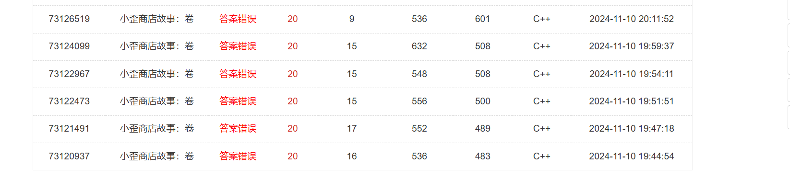
- 神奇函数：在C和 C+++中，**toupper** 函数用于将小写字母转换为其对应的大写字母。这个函数定义在<cctype.h>或<ctype.h〉头文件中。
- 当某一个数据经常更新(比如说判断max值)我们可以将：
  - `if(i > max0) max0 = i` 改为 `max0 = max(max0,i)`
  - 同理 ：`if(i < min0) min0 = i`改为 `min0 = min(min0,i)`

- 结构体在初始化`vector<int>`这类特殊特殊变量的时候，可以使用显式调用来初始化容器

- ```cpp
  struct st{
      vector<int> a = vector<int>(6,0);
  }
  ```

- 


---

## 1 printf 和 scanf 语法初识

- **printf和scanf为格式化输出输入函数**
- **基本语法为**
- `printf("输出控制符",输出参数)`
- `scanf("输入控制符"，输入参数)`

其中常用的输入(输出)控制符有：

> ​     %a(%A)     浮点数、十六进制数字和p-(P-)记数法(C99)
> ​      %c             字符
> ​      %d             有符号十进制整数
> ​      %f              浮点数(包括float和doulbe)
> ​      %e(%E)     浮点数指数输出[e-(E-)记数法]
> ​      %g(%G)     浮点数不显无意义的零"0"
> ​      %i              有符号十进制整数(与%d相同)
> ​      %u             无符号十进制整数
> ​      %o             八进制整数    e.g.     0123
> ​      %x(%X)      十六进制整数0f(0F)    e.g.   0x1234
> ​      %p             指针
> ​      %s             字符串
> ​      %%            "%"

> [!note]
>
> - printf 和 scanf 都可以支持多位输入(输出)
>
> `scanf("%1d%1d",&a,&b)`就代表输入两个1位数字(两位数)，第一个赋值到a,第二个赋值到b (&为取址符)
>
> - scanf 读取字符串的时候不用加寻址符
> - scanf不能读取 *string str*格式的字符串

- **例子**：我们可以用 `printf`&`scanf`实现数字位数的获取来简化优化程序
- 优化前

```cpp
#include<bits/stdc++.h>
using namespace std;

int main()
{
    float a = 114.5;
    cin >> a ;
    int b = a*10;
    float c = b%10 + 0.1*((b/10)%10) + 0.01*((b/100)%10) + 0.001*(b/1000);
    cout << c;

    system("pause");
    return(0);
}
```

- 优化后

```cpp
#include<bits/stdc++.h>
using namespace std;
int main()
{
    int a;int b;int c;int d;
    scanf("%1d%1d%1d.%1d",&a,&b,&c,&d);
    printf("%1d.%1d%1d%1d",d,c,b,a);
    system("pause");
    return(0);
}
```

---

## 2 取整函数

- 头文件\<cmath>

| 函数名称 |        函数说明        |
| :------: | :--------------------: |
| floor()  | 不大于自变量的最大整数 |
|  ceil()  | 不小于自变量的最小整数 |
| round()  | 四舍五入到最邻近的整数 |
|  fix()   |      朝零方向取整      |

- `floor()`朝负无穷方向取整
- `ceil()`朝正无穷方向取整
- `round()`函数，才是我们需要的四舍五入的函数，因为它会返回离自变量最近的整数，这个返回的整数可能大于也可能小于原来的数，但是一定是离它最近的那个整数。
- `fix()` 朝零方向取整，正数向下去，负数向上取

---

## 3 位运算(简单版)

- i<<1 等同于 i*2  
- i>>1等同于i/2


## 4 sort()排序函数

- `sort()`可以用一行实现数组的排序，而且可以实现从小到大，从大到小(甚至个位数从小到大之类的排序)的排序
- sort()函数的语法为 `sort(begin,end,cmp)`,其中begin指向==待sort数组的第一个元素的指针==，end指向==待sort数组的最后一个元素的下一个位置的指针==
- cmp参数为排序准则，cmp参数可以不写，如果不写的话，默认从小到大进行排序
- 如果我们想从大到小排序可以将cmp参数写为`greater<int>()`就是对int数组进行排序，当然`<>`中我们也可以写==double、long、float==等等

例：**从小到大**

```cpp
int main()
{
    int num[10] = {5,8,9,7,6,8,4,2,7,6};
    sort(num,num+10);
    for(int i=0;i<10;i++)
    {
		cout<<num[i]<<" ";
	}
}
```

例：**从大到小**

```cpp
int main()
{
    int num[10] = {5,8,9,7,6,8,4,2,7,6};
    sort(num,num+10,greater<int>());
    for(int i=0;i<10;i++)
    {
		cout<<num[i]<<" ";
	}
}
```

- ==**cmp的编写规则**==

- 1. cmp函数的返回值是bool值
  2. cmp传入的参数为(待排序的第一个类型& a，待排序的第二个类型& b)
  3. cmp里 `return a > b`指降序排序 (从大到小)
- 例给无法排序的map排序

```cpp
bool cmp(pair<int, int>& a, pair<int, int>& b){
    return a.first > b.first;
}

int main()
{
   	map<int,int> arr;
	vector<pair<int, int>> temp(arr.begin(),arr.end());
}
```

其实cmp的排序可以这么理解：

```cpp
bool cmp(const <Type T> &a , const <Type T> &b ){
    return a > b; //降序排列
    //......
}
```

> [!tip]
>
> **bool 类型的函数返回的是一个bool值，所以return回去的是一个bool值，传入的参数是 a,b 如果bool值为 1 ，则说明这个a b的顺序无需改变，如果传入的是0，则说明需要改变** 
>
> ==注意：==实际上cmp的规则并非如此，当我们不做任何判断直接返回1的话，数组会被倒序排序，而0则是没有任何改变


## 5 __gcd求最大公约数函数

**格式：**`__gcd(a,b)`返回值为a，b的最大公因数

**头文件：**`#include< algorithm>`

实现:

```cpp
int main() 
{
    int a,b,r;
    cin >>a>>b;
    //求x 和 y 的最大公约数，就是求 y 和 x % y 的最大公约数
    while (a%b!=0) //判断a能否整除b
    {
        //开始循环找数
        //判断余数能否被被除数整除
        //循环到1
        r=a%b; 
        a=b;
        b=r;    
    }
    cout << b;
    return 0;
}
```

##   6 字符与字符串

- 字符串本质是一个数组，因此我们可以用str(字符串)[下标]的方式访问字符串的子字符，而下标从"0"开始计数
- 字符串的两种表示方式中，scanf()和printf()都无法访问 `string str`[^3]形式的字符串
- 可以用`str.size();`的方式访问字符串长度(==注意字符串最后会存在一个空字符==，所以实际长度会比str.size输出的长度多一)
- 使用强转函数 `to_string`可以时整型变为字符串型

- 我们可以使用 `str.empty()`来判断一个字符串是否为空，若为空，该函数会返回一个 *True* 的bool值，否则返回 *False*
- `str.clear()`可以帮我们~~愉悦的~~删掉有效字符(**但str.clear不会改变底层空间(capacity)的大小**)
- 我们可以用 `str.capacity()`的方式查看字符串的底层空间大小
  - 其实字符串(string类型)采用动态数组作为底层实现，它会为字符串提前预留一些额外的储存空间来减少内存的分配与释放次数


## 7 vector 容器 / 动态数组

- 使用 `vector<int> vec`[^4]的方式来创建一个动态数组
- 对于 **vector**的赋值，不能直接使用cin >> vec[i] 的方式，我们可以建立一个临时变量，用 `vec.push_back(temp)`的方法输入值

> [!tip]
>
> *9.17修改* ：对于使用 `vector<int> dp(a,b)`形式的vec可以使用cin输入

- 对 **vector**容器的排序，我们必须使用迭代器来确定其数据位置，不能使用"+"确定位置

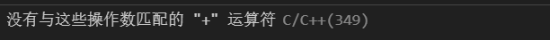

> **所以我们可以这样输入语法**
>
> **`sort(vec.begin(),vec.end())`**

- 使用 `vec[i]`来获取第 **i - 1**个元素(从零计数)

## 8 栈(stack)

- **栈是一种线性储存结构，其元素遵守==先进后出==的规则**

- 只能在栈顶进行元素的添加和删除(进栈和出栈)

- 使用`stack<int> st`创建一个栈

- 对栈常见的操作有：

- `empty()`: 判断栈是否为空栈，如果为空栈返回`true`， 否则或者`false`
- `push()`: 进栈操作，将新的元素放入到栈中，新的元素成为栈顶元素。
- `pop()`： 出栈操作，栈顶元素从栈中离开
- `top()`: 获取栈顶元素，但是不会移除它
- `size()`: 获取栈的长度，即栈中元素的数量

## 9 宏常量定义小寄巧

> ~~打勾的就是好用的~~
>
> - [x] `#define endl "\n"`
> - [ ] `#define int long long`
>
> > [!WARNING]
> >
> > 使用这个的时候 `int main()`要改为 `signed main()`
>
> - [ ] `#define double long double`

## 10 数组前导零与后导零的删除

- 有的时候我们会用vis记录某一数据的增量和变化，到最后进行增量的排序
- 但是这个时候vis里没有在数据范围里的数据就是 0 这给我们sort数组带来极大的困惑

```cpp
while(*arr.begin() == 0) arr.erase(arr.begin);
while(*(arr.end()-1) == 0) arr.erase(arr.end()-1);
```

- 我们可以使用这样的代码删除数组中的前后导零

## 11 位运算抽象版

> [!important]
>
> **位运算虽然在卡常时可以发挥一些优化作用，但其会导致代码可读性下降至一个难以理解的程度**

- 用位运算代替 `*=2` `/=2` 的操作
  - `int a = 10; (a <<= 2) == (a*=2); (a >>= 2) == (a/=2)`

> [!tip]
>
> 对位运算来说，左移右移都是改变二进制位的操作，比如我们可以这么理解
> $$
> \begin{split}
> 设某一数x\\
> x_2 &= tttttt\\
> x << s &= tttttt\underbrace{0000 \ldots 00}_{s}\\
> 则 x_{10} &= x \times 2^s
> \end{split}
> $$
> 同理，右移就是$x_{10} = \frac{x}{2^s} $

- 用位运算代替swap()

  - ```cpp
    int a = 5 , b = 2;
    a ^= b, b^=a, a^=b;
    //swap(a,b)
    ```

- > [!tip]
  >
  > `^`运算，即 **异或(XOR)**运算，比较两个值的二进制位，如果两个值相同，则结果为假，如果两个值相同，则结果为真
  >
  > **推理**：
  >
  > 1. **第一次异或运算**：`A = A ^ B`
  >    - 这一步将 `A` 和 `B` 的值进行异或运算，并将结果存储在 `A` 中。
  >    - 此时，`A` 包含了 `A` 和 `B` 的异或结果，而 `B` 仍然是原来的值。
  > 2. **第二次异或运算**：`B = A ^ B`
  >    - 由于 `A` 现在包含了 `A` 和 `B` 的异或结果，我们将这个结果与 `B` 进行异或运算，并将结果存储在 `B` 中。
  >    - 这一步实际上是将 `B` 的原始值与 `A` 和 `B` 的异或结果进行异或运算，这将导致 `B` 现在包含 `A` 的原始值。
  > 3. **第三次异或运算**：`A = A ^ B`
  >    - 现在 `B` 包含了 `A` 的原始值，我们将 `A`（包含 `A` 和 `B` 的异或结果）与 `B`（现在包含 `A` 的原始值）进行异或运算。
  >    - 这一步将导致 `A` 现在包含 `B` 的原始值。

- **取出二进制的某一位**

  - ```cpp
    int a = 15;
    for(int i = 31;i >= 0 ;--i) cout << (x >> i & 1);
    ```

    > **怎么实现的呢？**
    >
    > 从31位开始向前将a的每一个二进制位与 1 做与位操作
    >
    > 与位操作即：
    >
    > - 如果两个比较的位都是1，则结果位是1。
    > - 如果两个比较的位中至少有一个是0，则结果位是0。
    >
    > 那么与 1 做&操作的二进制位则必然会等于其本身
    
  - 优化版：
  
  - ```cpp
    vector<int> arr;
    int a = 15;
    for(int i = 31;i >= 0 ;--i) arr.push_back(a >> i & 1);
    while(!*arr.begin()) arr.erase(arr.begin());
    for(auto &&i : arr) cout << i;
    ```
  
  - 实现了前导零的删除
  
- **用异或判断两变量是否相等**

- ```cpp
  int a = 10,b = 5;
  if(a^b) cout << "不相等"；
  else cout <<"相等"；
  ```

- **使用^48实现int和char的转化**

- ```cpp
  int a = 6;
  char ch = x^48;
  cout << ch << endl;
  //同理char变int也可以用^48
  int y = ch^48;
  cout << y;
  ```

- **用`&1`判断函数奇偶性**

  - ```cpp
    int a = 7;
    if(a&1)
    {
     	cout << "奇数" <<endl;   
    }
    else
    {
        cout << "偶数" <<endl;
    }
    ```

## 12 时间函数帮你计算运算时间

```cpp
clock_t st = clock();
//代码......
clock_t ed = clock();
cout << "time: " << ed - st <<" ms"<<endl; 
```

## 13 一组数的各种数计算

- 对一组数据而言，对其分布有影响的数据类型有: $\to$ **平均数** ， **中位数**

### 平均数：

```cpp
int sum = 0;
for(int i = 0; i < arr.size() ; i++){
    sum += arr[i];
}
double tnum = (sum/n*1.0);
```

### 中位数：

```cpp
vector<int> arr(n);
double cent = 0;
sort(arr.begin(),arr.end());
if(arr.size()%2 == 1) cent = arr[n/2 + 1];
else cent = (arr[n/2 + 1] + arr[n/2]*1.0)/2; 
//数组从0开始技术的时候，要注意下标减一
if(arr.size()%2 == 1) cent = arr[n/2 + 1 - 1];
else cent = (arr[n/2 + 1 - 1] + arr[n/2 - 1]*1.0)/2; 
```


# 算法

## **算法大纲(登神长阶)**

### 1 顺序表

- [ ] 线性枚举 
- [ ] 前缀和 
- [ ] 双指针 
- [ ] 二分枚举 
- [ ] 三分枚举 
- [ ] 离散化 
- [x] 冒泡排序 
- [ ] 选择排序
- [x] 快速排序 
- [ ] 插入排序
- [ ] 希尔排序 
- [ ] 归并排序
- [ ] 堆排序 
- [ ] 基数排序 
- [ ] 计数排序 
- [ ] 模拟 
- [ ] 贪心 

### 2 链表

- [ ] 单向链表 
- [ ] 双向链表 

### 3 栈

- [x] LIFO栈（后进先出）
- [ ] 单调栈

###  4 队列

- [ ] FLFO队列（先进先出） 
- [ ] 双端队列 
- [ ] 单调队列 

### 5 字符串

- [ ] KMP 
- [ ] 字典树 
- [ ] 马拉车 
- [ ] AC自动机 
- [ ] 后缀数组 
- [ ] BM 

### 6 树

- [ ] 二叉树 
- [ ] 二叉搜索树 
- [ ] AVL树 
- [ ] 线段树 
- [ ] 霍夫曼树 
- [ ] 堆 
- [ ] 红黑树 
- [ ] 伸展树 
- [ ] 左偏树 
- [ ] Treap B+树 
- [ ] 树链剖分 

### 7 图 

- [ ] 二分图 
- [ ] 最短路 
- [ ] 最小生成树 
- [ ] 最近公共祖先 
- [ ] 深度优先搜索 
- [ ] 强连通分量 
- [ ] 双连通分量 
- [ ] 2-sat 
- [ ] 欧拉回路 
- [ ] 哈密尔顿回路 
- [ ] 迭代加深 
- [ ] 广度优先搜索 
- [ ] 拓扑排序 
- [ ] A* 
- [ ] 稳定婚姻 
- [ ] 双向广搜 
- [ ] 查分约束 
- [ ] 并查集 
- [ ] 哈希表 
- [ ] 跳跃表 
- [ ] 树状数组 
- [ ] 最大流

### 8 动态规划 

- [x] 递推 
- [ ] 线性DP 
- [ ] 记忆化搜索 
- [ ] 背包问题 
- [ ] 树形DP 
- [ ] 区间DP 
- [ ] 数位DP 
- [ ] 状压DP

## 1 递归

递归的定义：**函数的自我调用**

**例**：

- **利用递归实现阶乘**

```cpp
#include<bits/stdc++.h>
using namespace std;

int out(int n)
{
	int res;
	if (n == 1)
	{
		res = 1;
	}
	else
	{
		res = out(n-1)*n; //在这里又调用了一次out,即out(n-1) = out(n-2)*(n-1)
	}
	
	return res;
}

int main()
{
	cout << out(5);
	return 0;
}
```

- 基于递归的算法
  - [DFS](##8 dfs 深度优先搜索)

> 学递归有感而发：
>
> - 只有上帝和出题人知道递归传参究竟是怎么传的


---

- 递归的缺陷

使用递归计算斐波那契数列数列第n项(n < 50)

```cpp
int f(int n)
{
	int res;
	if (n == 1 || n == 2)
	{
		res = 1;
	}
	else
	{
		res = f(n-1)+f(n-2);
	}
	
	return res;
}

int main()
{
	for (size_t i = 1; i <= 50; i++)
	{
		cout << i <<"	"<<f(i) <<endl;
	}
	
	return 0;
}
```

- 运行不难发现，在第46项以后，运行极为缓慢

- 由此引入 **递推算法**

## 2 递推

- 从1开始，向下求解，直到输出正确函数
- 用若干重复计算解决实际问题的方法
- 找规律构成递推式

```cpp
#include<bits/stdc++.h>
using namespace std;

int main()
{
	long arr[60] = {0};
	arr[1] = 1;
	arr[2] = 1;
	for (size_t i = 3;i <= 50; i++)
	{
		arr[i] = arr[i-1] + arr[i-2];
	}
	for (size_t i = 1; i <= 50; i++)
	{
		cout << i <<"	"<< arr[i] <<endl;
	}
	
	return 0;
}
```


- 又找到一道递推好题 [**洛谷P1044[栈]**](https://www.luogu.com.cn/problem/P1044)

- 上代码：

```cpp
/*
    P1044递推解法
    注意到待入栈数n里的第k个数: 设其方案有f[k] (k > 0)
    则再设 k 前面的数的排列方式有 f[k-1] 种
    k 后面的数的排列方式有 f[n-k]种
    根据组合数原理: f[k] = f[k-1] * f[n-k]
    则有  f[n] = sum_{k = 0}^{n-1} f[k] 即 f[n] = f[0]f[n-1] + f[1]f[n-2] ...... + f[n-1]f[0]
    简单分析不难发现f[0] = 1 , f[1] = 1, f[2] = 2;
*/

#include <bits/stdc++.h>
#define endl "\n"
using namespace std;

int main()
{
    int n;
    long long f[20] = {1,1,2};
    cin >> n;
    //在这里 i 表示上文的 n ; j 表示上文的 k;
    //因为f[0] , f[1] , f[2] 均已明确 i 从 3 开始算;
    for (size_t i = 3; i <= n; i++)
    {
        for (size_t j = 1; j <= i; j++)
        {
            f[i] += f[j-1]*f[i-j];
        }
    }
    cout << f[n];
    return 0;
}
```

> [!important]
>
> **主要在于对$N$里的任何一项$k$存在：$f(k) = f(k-1)\times f(n-k)$**
>
> $f(k)$表示第k项的情况:
>
> **则$f(N) = \sum_{k=1}^{N-1}f(k)$**
>
> 即：$f(n) = f(0)f(n-1) + f(1)f(n-2) ...... + f(n-1)f(0)$

## 3 贪心

- **每一步再选择中都选择当前状态下的最优解**
- 通过局部最优解做到全局最优解
- 例：

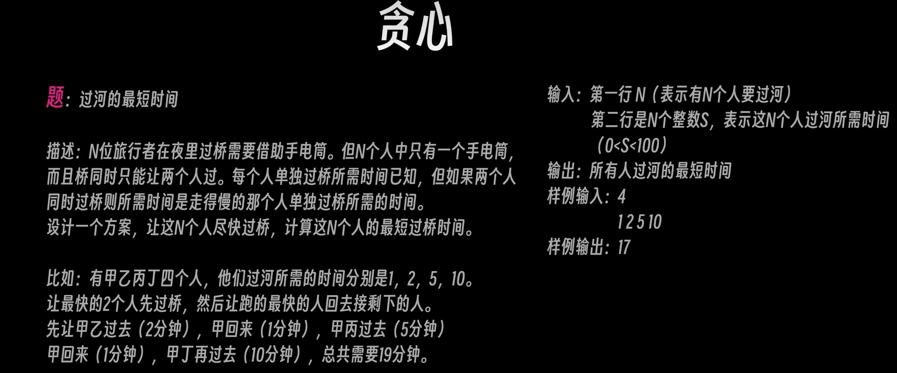

```cpp
#include <bits/stdc++.h>
using namespace std;

int main()
{
    int N ,sum = 0,p = 1,j =0,emp = 0;
    cin >> N;
    int arr[N] = {0};
    int arrp[N] = {0};
    for (size_t i = 1; i <= N; i++)
    {
        cin >> arr[i];
    }
    sort(arr+1,arr+N+1);
    
    if (N == 1)
    {
        cout << arr[1];
        return 0;
    }

    while (1)
    {
        if (N - j == 2 || N - j == 1)
        {
            sum += arr[2];
            break;
        }
        sum += arr[1] + 2*arr[2] + arr[N-j];
        j += 2;
    }
    cout << sum;
    
    return 0;

}
```

> [!note]
>
> - **这题的题解找个时间我再写**

### **分数背包问题 (Fractional Knapsack Problem)**

- > 代表题目：洛谷P2240[部分背包问题][https://www.luogu.com.cn/problem/P2240] 
  >
  > 部分背包问题，本质甚至不是动态规划，而是贪心,这个题名出的非常具有迷惑性
  >
  > - 特点：
  >
  >   1. 有一个容量为$T$ 的背包
  >   2. 有$N$组物品，每组物品分别有以下两个特性：
  >      1. 价值：这堆物品所代表的价值
  >      2. 重量：这堆物品的重量
  >   3. 与经典的0/1背包不同的是，分数背包允许将物品划分为重量为 1 的单位物品
  >
  >   ==策略：先计算每一堆物品的单位价值，再根据单位价值装填背包。==

  > 对P2240代码如下：
  >
  > ```cpp
  > //#pragma GCC optimize(3)
  > #include <bits/stdc++.h>
  > //#define int LL
  > #define endl '\n'
  > #define size_t int
  > #define all(v) v.begin(), v.end()
  > using namespace std;
  > typedef long long LL;
  > typedef vector<int> vint;
  > typedef vector<vint> vvint;
  > typedef vector<string> vstr;
  > typedef pair<int, int> pii;
  > typedef vector<pii> vpii;
  > 
  > bool cmp(pair<double, int> a, pair<double, int> b)
  > {
  >     if (a.first == b.first) return a.second > b.second;
  >     return a.first > b.first;
  > }
  > signed main()
  > {
  >     //ios::sync_with_stdio(0),cin.tie(0),cout.tie(0);
  >     int n, t;
  >     cin >> n >> t;
  >     vector<pair<double, int>> coin(n);
  >     for (auto &&[val, wei] : coin) {
  >         double m, v;
  >         cin >> m >> v;
  >         val = (v / m);
  >         wei = m;
  >     }
  >     sort(all(coin), cmp);
  >     double ans = 0;
  >     for (size_t i = 0; i < n; i++) {
  >         if (t >= coin[i].second) {
  >             ans += coin[i].second * coin[i].first;
  >             t -= coin[i].second;
  >         }
  >         else {
  >             ans += coin[i].first * t;
  >             break;
  >         }
  >     }
  >     printf("%.2f", ans);
  >     return 0;
  > }
  > ```
  >
  > > 不难发现这其实是一种贪心而非背包问题

  

  

##  4 桶排序

- 有一种排序方式可以很快的对数字进行排序

```cpp
#include<bits/stdc++.h>
using namespace std;

int main() 
{
    int arr[11];
    for (size_t i = 1; i <= 10; i++)
    {
        int a;
        cin >> a;
        arr[a]++; 
    }
    for (size_t j = 0; j <= 10; j++)
    {
        if (arr[j] != 0)
        {
            for (size_t i = 1; i <= arr[j]; i++)
            {
                cout << j <<" ";                
            }
        }
    }
    
    return 0;
}
```

> [!important]
>
> - 在使用桶排序解决实际题目的时候，一定要注意初始开始值
> - 点名表扬洛谷 **[P5729 【深基5.例7】工艺品制作]**

> [!note]
>
> - 桶排序的思想可以用在需要标记类的题目上，例如洛谷 **[P1047 [NOIP2005 普及组] 校门外的树] ** **[P5729 【深基5.例7】工艺品制作]**

## 5 高精度

- 一般而言，在long long 格式下的字符占用有8个字节，其范围是-2^63^~2^63^-1(19位数)这个区间，那么，超过这个区间的计算我们又该如何进行呢？

### 5.1 高精度加法

- 在进行超过19位数相加的大数加法的时候，我们可以模拟竖式加法的原理，对数组进行操作

**如图**

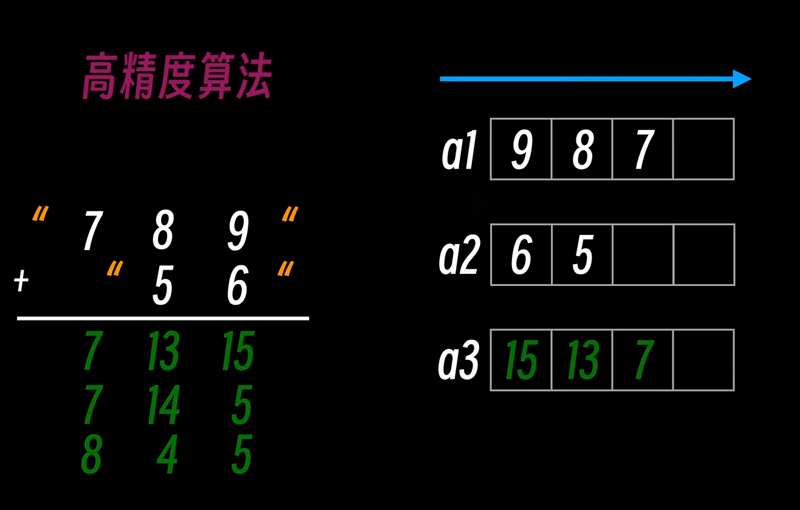

1. 使用字符串获取大数字
2. 将字符串的数字提取出来逆序储存在数组中
3. 对数组中的数组做加法并存储到另一个数组中
4. 逆序输出数组

```cpp
#include<bits/stdc++.h>
using namespace std;

int main()
{
    string s1,s2;
    int a1[210],a2[210],a3[210] = {0};
    getline(cin,s1);
    getline(cin,s2);
    for (size_t i = 0; i < s1.size(); i++)
    {
        a1[s1.size()-i-1] = s1[i] - '0';
    }
    for (size_t i = 0; i < s2.size(); i++)
    {
        a2[s2.size()-i-1] = s2[i] - '0';
    }
    int len = max(s1.size(),s2.size()); 
    for (size_t i = 0; i < len;i++)
    {
        a3[i] = a1[i] + a2[i];
    }
    for (size_t i = 0; i < len; i++)
    {
        if (a3[i] >= 10)
        {
            a3[i + 1] = a3[i]/10;
            a3[i] = a3[i]%10;
        }
    }
    if (a3[len] != 0)
    {
        len++;
    }
    for (int i = len - 1; i >= 0; i--)
    {
        cout << a3[i];
    }
    return 0;
}
```

- 更好用的字符串 **string**类型的高精度

```cpp
string largeadd(string& a, string& b)
{
    if (a.size() <= b.size()) swap(a, b);
    int p = 0;
    for (size_t i = 0; i < b.size(); i++) {
        int ai = a[a.size() - i - 1] - '0';
        int bi = b[b.size() - i - 1] - '0';
        int sum = ai + bi + p;
        if (sum >= 10) {
            p = 1;
            sum -= 10;
        } else p = 0;
        a[a.size() - 1 - i] = sum + '0';
    }
    for (size_t i = b.size(); i < a.size(); i++) {
        int ai = a[a.size() - i - 1] - '0';
        if (ai == '9' && p == 1) {
            a[a.size() - i - 1] = '0';
        } else {
            a[a.size() - i - 1] = ai + p + '0';
            p = 0;
        }
    }
    if (p == 1) a.insert(a.begin(), '1');
    return a;
}
```

### 5.2 高精度减法

- 与加法类似，主要是注意借位与进位的不同
- 负数的处理

```cpp
string largemin(string a, string b)
{
    int flag = 0;
    if (b.size() >= a.size()&& b >= a) {
        swap(a, b);
        flag = 1;
    }
    int p = 0;
    for (size_t i = 0; i < b.size(); i++) {
        int ai = a[a.size() - 1 - i] - '0';
        int bi = b[b.size() - 1 - i] - '0';
        int diff = ai - bi - p;
        if (diff < 0) {
            p = 1;
            diff += 10;
        } else p = 0;
        a[a.size() - i - 1] = diff + '0';
    }
    for (size_t i = b.size(); i < a.size(); i++) {
        int ai = a[a.size() - i - 1] - '0';
        if (ai == 0 && p == 1) {
            a[a.size() - i - 1] = '9';
        } else {
            a[a.size() - i - 1] = ai - p + '0';
            p = 0;
        }
    }
    while (*a.begin() == '0' && a.size() > 1)
        a.erase(a.begin());
    if (flag) a.insert(a.begin(), '-');
    return a;
}
```

### 5.3 高精度乘法

> [!tip]
>
> 对于乘法来说，高精度的最佳计算思维就是将两个数拆分，用一个数的个十百位依次去乘以另一个数
>
> 拿我们常用的，主要的步骤有以下几点：
>
> 1. **字符串化数字，倒置字符串**
> 2. **两位相乘，计算结果与储存位数**
> 3. **数组变字符串**

```cpp
//#pragma GCC optimize(2)
#include <bits/stdc++.h>
#define endl '\n'
using namespace std;

string largemuiti(string a, string b)
{
    if (a == "0" || b == "0") return "0";
    int len1 = a.size();
    int len2 = b.size();
    vector<int> result(len1 + len2, 0);
    for (int i = len1 - 1; i >= 0; i--) {
        for (int j = len2 - 1; j >= 0; j--) {
            int mult = (a[i] - '0') * (b[j] - '0');
            int sum = result[i + j + 1] + mult;
            result[i + j + 1] = sum % 10;
            result[i + j] += sum / 10;
        }
    } 
    string res = "";
    for (size_t i = 0; i < result.size(); i++) {
        if (!(result[i] == 0 && res.empty())) {
            res += to_string(result[i]);
        }
    }
    return res;
}

/* 
    1 5  --> a
  * 2 1  --> b
-------
    1 5  --> i == 0
  3 0 |  --> i == 1
  | | |
  v v v
-------
  3 1 5 --> result --> res
*/

int main()
{
    ios::sync_with_stdio(0), cin.tie(0), cout.tie(0);
    cout << largemuiti("123", "234");
    return 0;
}
```


## 6 STL

- **优点：更加简短的代码语句，调试方便**
- **缺点：有些时候用更复杂的方式进行算法实现 **

### 6.1 容器

#### 6.1.1 [vector](https://zh.cppreference.com/w/cpp/container/vector)

**构造**

**一维数组：** `vector<类别> dp(长度，初值)` [^5]

**二维数组：**`vector<vector<int>> dp(行数,vector<int> (列数,初值)); `

**三维数组：**

```cpp
 vector<vector<vector<int>>> dp3(3层,vector<vector<int>>(行数,vector<int> (列数,0)));
```

*等价于 `int mat[][][]`*

> [!note]
>
> 我们也可以使用 `vector<vector<int>> dp(100,vector<int>())`来构建不指定列数的二维数组

##### 6.1.1.1 尾接与尾删

- 尾接： `dp.push_back(x)`[解释：在dp数组末尾添加数字x]
- 尾删：`dp.pop_back(x)`[解释：在dp数组末尾删除数字x]

##### 6.1.1.2 size函数

- `dp.size()`[解释：获取dp数组的长度(数组内有多少个数)]

##### 6.1.1.3清空数组

- `dp.clear()`[清空数组内数据]

##### 6.1.1.4 empty函数

 使用`dp.empty()`判断数组是否为空，空返回true(1)，非空返回false(0)

 一般这个函数会放在if语句中

 ```cpp
 if(dp.empty()) //如果数组为空，则执行语句
 {
     //....
 }
 ```

##### [!!!] 6.1.1.5  resize函数

- `dp.resize(m,n)`[m表示新大小，n表示：如果增加长度，多出来的位置的默认数字]
- 注意resize函数改小的话，会将多出来的数据删除

##### 6.1.1.6 访问vector的数据

- 使用dp[x],访问dp数组内x-1的数据

##### 6.1.1.7 vector的赋值与读取

1. 一维数组的赋值

- 方法一(推荐)

```cpp
vector<int> dp(10,0);
for(int i = 0;i < k; i++)
{
    int temp;
    cin >> temp;
    dp.pish_back(temp);
}
```

- 方法二(不推荐)

```cpp
vector<int> dp(10,0);
for(int i = 0;i < k; i++)//k不能大于10(k > 10 也可以读入dp,但是会有诡异的bug)
{
    cin >> dp[i];
}
```

> [!note]
>
> **所以动态读写一套下来为：**
>
> ```cpp
> vector<int> dp(0,0);
> for (size_t i = 0; i < 15; i++)
> {
>     int temp;
>     cin >> temp;
>     dp.push_back(temp);
> }
> 
> for (size_t i = 0; i < dp.size(); i++)
> {
>     cout << dp[i] <<" ";
> }
> ```

2. 二维数组动态读写

> [!note]
>
> ```cpp
> vector <vector<int>> dp;
> vector<int> dp1;
> for (int i = 0; i <k; i++)    
> {
>     for (int j = 0; j <p; j++) //内部数组保存
>     {
>         int value;
>         cin >> value;
>         v.push_back(dp1); 
>     }
>     dp.push_back(dp1); //保存dp1的每个元素到dp[i]中
>     dp1.clear(); //清空dp1内元素
> }
> 
> for (int i = 0; i <array.size(); i++)
> {
>     for (int j = 0; j < p; j++)
>     {
>         cout <<array[i][j];
>     }
>     cout<<endl;
> }
> return 0;
> ```
>
> - 思路：先建立动态二维数组dp和动态临时一维数组dp1
> - dp1负责保存单行数据
> - dp负责保存dp1保存下来的行数据从而形成多数据
> - 记得clear dp1的元素

##### 6.1.1.8 vector的使用情况

- 例：$n\times m$ 的矩阵，$1\leq n,m\leq 10^6$ 且 $n\times m \leq 10^6$

- 普通数组就是 `int arr[100010][100010]`，直接炸内存(MLE)
- 动态数组就可以 `vector<vector<int>> dp(n+10,vector<int> (m+10,0))`
- 在读取了m,n后再设立数组，解决了炸内存的尴尬

-  ~~虽然有时候我也会用 int arr\[m+10][n+10] 来写数组~~(好孩子不要学)
- vector储存在堆空间，不会炸栈

##### 6.1.1.9 注意事项

- **提前规定长度**
- vector的push_back逻辑是，当超过长度时会消耗时间进行重分配

```cpp
// 优化前: 522ms
vector<int> a;
for (int i = 0; i < 1e8; i++)
{
    a.push_back(i);
}
// 优化后: 259ms
vector<int> a(1e8);
for (int i = 0; i < a.size(); i++)
{
	a[i] = i;
}
```

2. **小心size_t溢出**

ector 获取长度的方法 `.size()` 返回值类型为 `size_t`，通常 OJ 平台使用的是 32 位编译器（有些平台例如 cf 可选 64 位），那么该类型范围为 $[0,2^{32})$.

```cpp
vector<int> a(65536);
long long a = a.size() * a.size(); // 直接溢出变成0了
```

##### 6.1.1.10 和其他容器的组合技

- 和pair二元组

```cpp
vector<pair<int,int>> dp1(10);
pair<int,int> p1;
for (size_t i = 0; i < 5; i++)
{
    cin >> p1.first >> p1.second;
    dp1[i] = p1;
}
int k;
cin >> k;
for (size_t i = 0; i < dp1.size(); i++)
{
    if (k == dp1[i].first)
    {
        cout << dp1[i].second;
    }
}
```

> [!tip]
>
> **dp[i]**可以作为一个二元组绑死.first和.second
>
> dp容器可以起到结构体的作用

---

#### 6.1.2 栈 **[stack](https://zh.cppreference.com/w/cpp/container/stack)**

**头文件：**\<stark>

##### 6.1.2.1 构造方式

`stack<double> stk`[stk是栈名]；

##### 6.1.2.2 进栈与出栈及取栈顶部

- 进栈：`stk.push(x);`[将x放入栈中]
- 出栈：`stk.pop();`[栈顶出栈]
- 取栈顶：`stk.top()`[获取栈顶

##### 6.1.1.3 用vector模拟stack

使用`dp.back()`取栈(容器)顶

##### 6.1.1.4 写栈的注意事项

- 不能访问栈的内部元素
- **下面都是错误用法**

```cpp
stack<int> stk;
for(int i = 1;i < stk.size();i++)
{
    cout << stk[i]<<endl;
}
for(auto ele : stk)
{
    cout << stk <<endl;
}
```

##### 6.1.2.5 与 *vector* 相比 *stack*的优势是什么？

- stack效率是高于vector的

- stack的内存占用更低
- 在某些算法实现下(如深度优先搜索)，stack可能是更自然的选择

#### 6.1.3 队列 [queue](https://zh.cppreference.com/w/cpp/container/queue)

- `incloud <queue>`

通过二次封装双端队列，实现==先进先出==(双端获取)的数据结构

##### 6.1.3.1常用方法

| 作用     | 用法              | 示例                  |
| -------- | ----------------- | --------------------- |
| 构造     | `queue<类型> que` | `queue<int> que`      |
| 进队     | `que.push(元素)`  | `que.push(1)`         |
| 出队     | `.pop()`          | `que.pop()`           |
| 取队首   | `.front()`        | `int a = que.front()` |
| 取队尾   | `.banc()`         | `int a = que.back()`  |
| 查看大小 | `.size()`         | `int a = que.size()`  |
| 清空     | `.clear()`        | `que.clear()`         |
| 判空     | `.empty()`        | `que.empty()`         |

##### 6.1.3.2 注意事项

**不能访问内部元素!**示例同6.1.2.3

#### 6.1.4 优先队列(堆) [priority_queue](https://zh.cppreference.com/w/cpp/container/priority_queue)

`include <queue>`

##### 6.1.4.1 构造

`priority_queue<类型,容器,比较器>`

- 类型:要储存的数据类型
- 容器:储存数据的底层容器,默认为 `vector<T>`,竞赛时保存默认即可
- 比较器: 比较大小使用的比较器,默认为 `less<T>`,可以自定义

```cpp
priority_queue<int> pque1;
priority_queue<int,vector<int>,greater<int>> pque2;//变小顶堆
```

> 自定义比较器尽量不用,容易犯迷糊

##### 6.1.4.2 常用语法

| 作用                  | 用法          | 示例                 |
| --------------------- | ------------- | -------------------- |
| 进堆                  | `.push(元素)` | `que.push(1);`       |
| 出堆                  | `.pop()`      | `que.pop();`         |
| 取堆顶(最大值/最小值) | `.top()`      | `int a = que.top();` |
| 查看大小/判空         | 和vector一致  | 略                   |

> [!note]
>
> 进出堆复杂度$O(\log n)$,取堆顶$O(1)$

##### 适用场景

- 保持数据的有序性,每次向队列中插入大小不定的元素,或每次从队列取出最大/最小的元素,元素数量为$n$,插入操作数量为$k$
  - 使用快排:$k\cdot n \log n$
  - 使用优先队列:$k\cdot \log n$

##### 6.1.4.3 注意事项

- **仅堆顶可读**

```cpp
cout << qpue[1] <<endl; //错误
```

- **所有元素不可写**

```cpp
qpue[1] = 2;
pque.top() = 1;
//均为错误
```

但如果要修改堆顶元素

```cpp
int tp = pque.top(); //保存堆顶
pque.pop(); //弹出堆顶
qpue.push(tp + 1); //通过保存的堆顶修改堆顶
```

#### 6.1.5 集合[set](https://zh.cppreference.com/w/cpp/container/set)

提供对数时间的插入、删除、查找的集合数据结构。底层原理是红黑树。

| 集合三要素 | 解释                           | set           | multiset      | unordered_set |
| ---------- | ------------------------------ | ------------- | ------------- | ------------- |
| 确定性     | 一个元素要么在集合中，要么不在 | ✔             | ✔             | ✔             |
| 互异性     | 一个元素仅可以在集合中出现一次 | ✔             | ❌（任意次）   | ✔             |
| 无序性     | 集合中的元素是没有顺序的       | ❌（从小到大） | ❌（从小到大） | ✔             |

##### 6.1.5.1 常用操作

- 函数构造 `set<类型,比较器>`
- 插入元素 `st.insert(元素)`
- 删除元素 `st.erase(元素)`

- 查找元素 `st.find(元素)`
- 查找元素个数 `st.count`

##### 6.1.5.2 遍历

可以使用遍历器来遍历set数据:

```cpp
set<int> st;
for (set<int>::iterator it = st.begin() ; it != st.end();++it )
{
    cout << *it <<endl;
}
```

基于范围的循环:

```cpp
for(auto &ele : st)
{
    cout << ele << endl;
}
```

##### 6.1.5.3适用范围

- 元素的去重 [1,1,2,3,3,5,7] $\to$ [1,2,3,5,7]
- 元素顺序的维护 [1,6,8,4,1] $\to$ [1,4,6,8]
- 元素大小很大但数量很少的情况(大小:[$-$10^18^,10^18^],数量10^6^)

##### 6.1.5.4 注意事项

- set数据不存在下标的说法,但可以用遍历器找数据: 

```cpp
set<int>::iterator it = st.begin();
advance(it,2); //迭代器后面会讲
cout << *it <<endl;
```

- 元素都是只读的,set迭代器提取的元素都是只读的(因为是const迭代器),不能够修改它的值,需要先erase再inset

```cpp
cout << *st.begin() <<endl; //正确
*st.begin() = 1; //错误,不可写
```

- 不可用迭代器计算下标

set 的迭代器不能像 vector 一样相减得到下标。**下面是错误用法：**

```cpp
auto it = st.find(2);      // 正确，返回2所在位置的迭代器。
int idx = it - st.begin(); // 错误！不可相减得到下标。
```

#### 6.1.6 映射 [map](https://zh.cppreference.com/w/cpp/container/map)

**`include <map>`**

- 提供==对数==时间的有序键值对结构[任意类型的映射];

```cpp
map<string,int> a;
a["qaq"] = 1;
a["abc"] = 2;
a["mmp"] = 3;
```

- *key*[键]:的概念

```cpp
a[key] = value;
```

*key* 在映射中处于中括号内,表示提示*map*的元素

- **性质**

| 性质   | 解释                         | map           | multimap      | unordered_map |
| ------ | ---------------------------- | ------------- | ------------- | ------------- |
| 互异性 | 一个键仅可以在映射中出现一次 | ✔             | ❌（任意次）   | ✔             |
| 无序性 | 键是没有顺序的               | ❌（从小到大） | ❌（从小到大） | ✔             |

##### 6.1.6.1 构造及常用操作

`map<key,value> mp;`

- 增/改:`map[0] = 1`

- > 倘若没有定义就直接访问map,就会返回一个初值(默认为0)

- 查找元素[找的是 *key*]:`mp.find()`$\to$返回这个元素的迭代器,若找不到,返回mp.end(尾迭代器)
- 删除: `mp.erase(元素)`
- 查找[找的是 *key*]:`mp.count()`$\to$ 返回的是元素数量

- 清空判空同上

##### 6.1.6.2 遍历

1. 萌新式遍历[适合\<int int>型]

```cpp
map<int , int> mp;
mp[6] = 3;
mp[5] = 1;
mp[7] = 3;
mp[9] = 666;
for (size_t i = 0; i < mp.size(); i++)
{
    cout << mp[i] <<endl;
}
```

> 缺点很明显,给个图就明白了

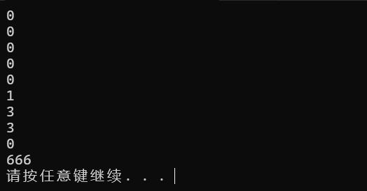

2. 迭代器式遍历

```cpp
string a;
map<string , int> mp;
mp["aaa"] = 1;
mp["bbb"] = 5;
mp["tsts"] = 3;
for (map<string , int>::iterator it = mp.begin() ;it != mp.end() ; it++)
{
    cout << it->second <<endl;
}
```

> 这个遍历器指向一个键对,所以得用 `it->first`或 `it->second`来判断指向的哪一个

3. auto范围遍历

```cpp
string a;
map<string , int> mp;
mp["aaa"] = 1;
mp["bbb"] = 5;
mp["tsts"] = 3;
for(auto &el:mp)
{
    cout << el.first << " " <<el.second<<endl;
}
```

##### 6.1.6.3 适用范围

- **维护特殊的映射**[string $\to$ int]

> 统计输入的字符串组中每个字符串出现的次数

```cpp
map<string ,int> mp;
vector<string> vec;
vec.push_back("aqa");
vec.push_back("aqa");
vec.push_back("qaq");
vec.push_back("qaq");
vec.push_back("wqw");
vec.push_back("aqa");
vec.push_back("qaq");

for (size_t i = 0; i < vec.size(); i++)
{
    mp[vec[i]]++;
}
for (auto &el : mp)
{
    cout << el.first << " " <<el.second<<endl;
}
```

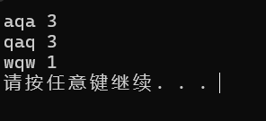

> 效果如此

##### 6.1.6.4 注意事项

- 空map会返回一个默认值
- 不能使用遍历器找下标

> unordered_map无序map 也称哈希表，我们可以随意的建立映射关系，时间复杂度是O(1)

#### 6.1.7 字符串[string](https://zh.cppreference.com/w/cpp/string)

##### 6.1.7.1 常用方法

- 构造: `string str;`
- 输入: `cin >> str;`
- 输出:`cout << str;`

- string 的初值构造 `string str(100,'0')`

- 赋值 `str = "awa";`

- 判断相等 `str1 == str2`
- 修改字符 `str[0] = "a"`
- 连接字符串 `str1 + str2;`
- 字符串尾接 `str1 += "awa";`

- 取子串:

```cpp
string s1 = "123123123";
cout << s1.substr(3) <<endl; //从第三位开始输出到末尾
cout << s1.substr(3,4) <<endl; //从第三位输出,输出4位 
```

- 查找函数 : `find(字串)`  $\to$ 返回字串起始点的下标[若找不到,则会返回一个 `string::npos`]
- 对上面一条：==返回的是下标，是size_t类型的数字!==

##### 6.1.7.2 string 转化

- str $\to$ int : `int x = stoi(str)`
- str $\to$ long long : `long long x =stoll(str)`
- str $\to$ float : `stof()`
- str $\to$ double : `stod()`
- str $\to$ long double : `stold()`

- int $\to$ str : `string str = to_string(x)`

##### 6.1.7.3 注意事项

- 尾接要用 += [使用 `str = str + "awa"`很慢]
- `.substr()`方法下,第一个参数传的是字串起点下标,第二个是字串长度
- `.find()`的实现是暴力枚举,复杂度是$O(n^2)$

#### 6.1.8 二元组 [pair](https://zh.cppreference.com/w/cpp/utility/pair)

**构造**

`pair<int, int> pr;`

##### 6.1.8.1 常用方法

- 赋初值: `pair<int , int> pr = {1,2}`
- 老式: `pair<int , int> pr2 = make_pair(1,2)`
- 判同 : `pr == pr2`

- 三元组~~曲线救国~~法:`pair<pair<int,char>,char> p3;`
- 访问第一个值 `.first`
- 访问第二个值 `.second`

##### 6.1.8.2 适用范围

**适用于所有需要二元组的场景,效率和自己定义结构体差不多**

#### 6.1.9 列表[list](https://blog.csdn.net/weixin_45031801/article/details/139361653)

**构造**
`list<类型> lt`

##### 6.1.9.1 优势与适用范围

list容器插入和删除元素的效率较高，时间复杂度为==常数级别==,其底层为**带头双向循环链表**

##### 6.1.9.2 常用方法

- 定义:
  - 构造空`list()` / 含有n个元素的类型容器`list` / 拷贝某个类型容器的复制品
  
  ```cpp
  list<int> lt1; //构造int类型的空容器
  list<int> lt2(10,2); //构造含有10个2的int类型容器
  list<int> lt3(lt2); //拷贝构造int类型的lt2容器的复制品
  list<int> lt4{ 1,2,3,4,5 };  // 直接使用花括号进行构造---C++11允许
  ```
  
  - 迭代器复制字符内容
  
  ```cpp
  string s("hello world");
  list<char> lt5(s.begin(),s.end()); //构造string对象某段迭代器区间的内容
  ```

##### 6.1.9.3 list的遍历及迭代器的操作

- **迭代器**
- 正向迭代器

```cpp
int arr[] = {1,1,4,5,1,4}; //构造数组
list<int> lt(arr,arr+sizeof(arr)/sizeof(arr[0])); //copy数组到list
for(list<int>::iterator it = lt.begin();it != lt.end();++it)
{
    cout << *it <<endl;
}
```

- 反向遍历器(抽象)[防止你不知道]

```cpp
int arr[] = {1,1,4,5,1,4};
list<int> lt(arr,arr+sizeof(arr)/sizeof(arr[0]));
for(list<int>::reverse_iterator it = lt.rbegin();it != lt.rend();++it)
{
    cout << *it <<endl;
}
```

- **范围for**(好用)

```cpp
int arr[] = {1,1,4,5,1,4};
list<int> lt(arr,arr+sizeof(arr)/sizeof(arr[0]));
for (auto &i : lt)
{
    cout << i <<endl;
}
```

---

- 常见容器操作

  - `.size()`:返回容器中有效元素的个数

  - `.resize()`:调整容器的有效元素大小(size)
  - `.empty()`:判断容器是否为空
  - `.clear()`:用于清空容器,清空后容器的size为0, 但是头结点(哨兵位)不会被清除

> - **`.resize(a,b)`**有两个参数:
>
>   - a:将list大小变为(a)
>   - b:若list新大小大于原大小,则新增的大小用b填充
>

##### 6.1.9.4 list容器的常见访问操作

- `.front()`:访问list头元素[返回list的第一个元素]
- `.back()`:访问list尾元素[返回list的最后一个元素]

##### 6.1.9.5 list 容器的常见修改操作

| 函数(接口)名称  | 函数(接口)说明                        |
| --------------- | ------------------------------------- |
| `.push_front()` | 在list首元素前插入元素                |
| `.pop_front()`  | 删除list首元素                        |
| `.push_back()`  | 在list尾部插入元素                    |
| `.pop_back()`   | 删除list最后一个元素                  |
| `.insert()`     | 在`list<int>::iterator it` 前插入元素 |
| `.erase()`      | 在`list<int>::iterator it` 前删除元素 |
| `.swap()`       | 交换两个元素                          |

> [!important]
>
> - 有关**insert()**的操作:[^7]
>
> - insert共有三种形式：
>
>   - insert(iterator, value);
>   - insert(iterator, num, value);
>   - insert(iterator, iterator1, iterator2); 
>
> - > instert的所有操作都由迭代器位置确定,不存在lt[2]这类的中括号表操作
>
> - 对`insert(iterator, value);`(会返回一个新迭代器指向插入的元素)
>
> ```cpp
> //创立一个数组
> int arr[] = {1,1,4,5,1,4};
> list<int> lt(arr,arr+sizeof(arr)/sizeof(arr[0]));
> cout << "befor" << endl;
> for (auto &i : lt)
> {
>     cout << i <<endl;
> }
> //创立一个迭代器指向lt的头元素
> list<int>::iterator it = lt.begin();
> //迭代器向后移动2位,指向4
> advance(it,2);
> //在4的迭代器前,插入元素3
> auto itnew = lt.insert(it,3);
> cout << "after" << endl;
> for (auto &i : lt)
> {
>     cout << i <<endl;
> }
> cout << "new iterator = " << *itnew <<endl;
> return 0;
> ```
>
> 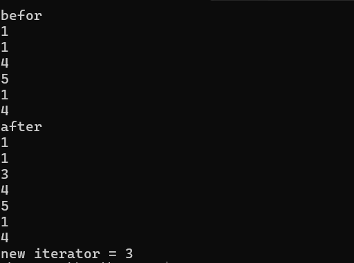
>
> - 对 `insert(iterator, num, value);`(会返回一个新迭代器指向插入的第一个元素)
>
> ```cpp
> //创立一个数组
> int arr[] = {1,1,4,5,1,4};
> list<int> lt(arr,arr+sizeof(arr)/sizeof(arr[0]));
> cout << "befor" << endl;
> for (auto &i : lt)
> {
>     cout << i <<endl;
> }
> //创立一个迭代器指向lt的头元素
> list<int>::iterator it = lt.begin();
> //迭代器向后移动2位,指向4
> advance(it,2);
> //在4的迭代器前,插入元素3个3
> auto itnew = lt.insert(it,3,3);
> cout << "after" << endl;
> for (auto &i : lt)
> {
>     cout << i <<endl;
> }
> //新迭代器的位置在第一个3
> cout << "new iterator = " << *itnew <<endl;
> return 0;
> ```
>
> 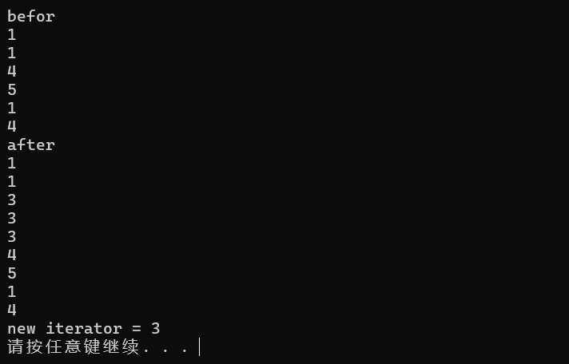
>
> - 对 `insert(iterator, iterator1, iterator2); `
>
> ```cpp
> //创立一个数组
> int arr[] = {1,1,4,5,1,4};
> list<int> lt(arr,arr+sizeof(arr)/sizeof(arr[0]));
> cout << "befor" << endl;
> for (auto &i : lt)
> {
>     cout << i <<endl;
> }
> //创立一个迭代器指向lt的头元素
> list<int>::iterator it = lt.begin();
> //迭代器向后移动2位,指向4
> advance(it,2);
> //建立新的list或(vector);
> vector<int> lt2 = {1,9,1,9,8,1,0};
> //确定迭代器位置
> auto it1 = lt2.begin();
> auto it2 = lt2.end();
> //在4的迭代器前,插入迭代器it1 - it2 这之间的数
> //会返回插入的数的第一个元素的迭代器
> auto itnew  = lt.insert(it,it1,it2);
> cout << "after" << endl;
> for (auto &i : lt)
> {
>     cout << i <<endl;
> }
> cout << "new iterator = " << *itnew;
> return 0;
> ```
>
> 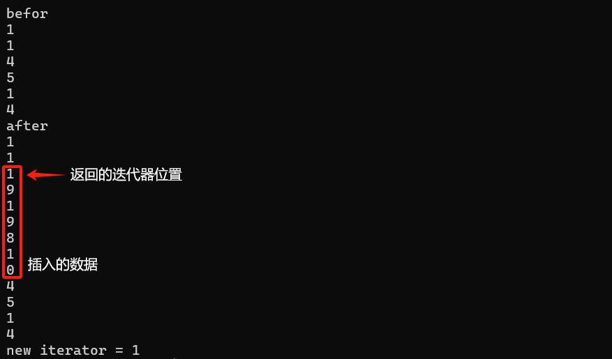
>
> - **`.erase()`**用法和 **`.insert()`**差不多,只是从添加元素变为删除元素==删除的为迭代器==指向的元素或==两个迭代器之间(包括本身)==的元素

##### 6.1.9.6 ==list容器常用的操作==

| **函数声明**    | **接口说明**                   |
| --------------- | ------------------------------ |
| ***splice***    | **将元素从列表转移到其它列表** |
| ***remove***    | **删除具有特定值的元素**       |
| ***remove_if*** | **删除满足条件的元素**         |
| ***unique***    | **删除重复值**                 |
| ***sort***(慢)  | **容器中的元素排序**           |
| ***merge***     | **合并排序列表**               |
| ***reverse***   | **反转元素的顺序**             |

- `.splice()`一共有四种形式
  - ***splice(iterator_pos, otherList) :*** 将otherList中的所有元素移动到iterator_pos指向元素之前

```cpp
list<int> ls1 ={1,2,3,4,5};
list<int> ls2 ={10,20,30,40,50};
ls2.splice(ls1.begin(),ls2); //和ls1.splice(ls1.begin(),ls2); 等价

for(auto &p : ls1)
{
    cout << p << " ";
}
//输出 10 20 30 40 50 1 2 3 4 5
//此时ls2的情况: 空
```

- ***splice(iterator_pos, otherList, iter1):*** 从 otherList转移 iter1 指向的元素到当前list。元素被插入到 iterator_pos指向的元素之前。

```cpp
list<int> ls3 ={10,20,30};
list<int> ls4 ={3,5,7,8};
auto it = ls3.begin();
advance(it,1);
ls3.splice(it,ls4,ls4.begin());
for(auto &p : ls3)
{
    cout << p << " ";
}    
cout <<endl;
//ls4
for(auto &p : ls4)
{
    cout << p << " ";
}
//输出:
//10 3 20 30
//5 7 8
```

- ***splice(iterator_pos, otherList, iter_start, iter_end) :*** 从 otherList转移范围 [iter_start, iter_end) 中的元素到 当前列表。元素被插入到 iterator_pos指向的元素之前。

```cpp
list<int> ls5 ={1,2,3,4,5};
list<int> ls6 ={10,20,30,40,50};
auto it2 = ls6.begin();
advance(it2,2); 
auto it3 = ls5.begin();
auto it4 = ls5.end();
advance(it3,1); 
advance(it4,-2); 
ls6.splice(it2,ls5,it3,it4);
for(auto &p : ls6)
{
    cout << p << " ";
}
cout << endl;
//ls5
for(auto &p : ls5)
{
    cout << p << " ";
}
cout << endl;
//输出: 
// 10 20 2 3 30 40 50 
// 1 4 5
```

##### deque [双向队列](https://blog.csdn.net/H1727548/article/details/130959610)

- **作用：**deque可以作为一个双向队列，在队首队尾以及任意位置实现元素的插入和删除
- **定义：** 和*vector*一致

**成员函数：**

```cpp
push_back()//在队列的尾部插入元素。
emplace_front()//与push_front()的作用一样 
push_front()//在队列的头部插入元素。
emplace_back()//与push_back()的作用一样 
pop_back()//删除队列尾部的元素。
pop_front()//删除队列头部的元素。
back()//返回队列尾部元素的引用。
front()//返回队列头部元素的引用。
clear()//清空队列中的所有元素。
empty()//判断队列是否为空。
size()//返回队列中元素的个数。
begin()//返回头位置的迭代器
end()//返回尾+1位置的迭代器
rbegin()//返回逆头位置的迭代器 
rend()//返回逆尾-1位置的迭代器 
insert()//在指定位置插入元素 
erase()//在指定位置删除元素 
```

- **deque可以通过forrage / iterator / 下标 遍历**


### 6.2 迭代器(遍历器)

- 概念：迭代器是一种检查容器内元素并==遍历元素==的数据类型，通常**用于对C++中各种容器内元素的访问**，但不同的容器有不同的迭代器，初学者可以将迭代器理解为**指针**。
- **迭代器可以干嘛？**

```cpp
int main()
{
    vector<int> arr;
    for (size_t i = 0; i < 10; i++)
    {
        arr.push_back(i);
    }
    for(vector<int>::iterator it = arr.begin(); it != arr.end();it++)
    {
        cout << *it <<endl;
    }

    return 0;
}
```

> 我们观察上面这个程序，这是它的输出结果

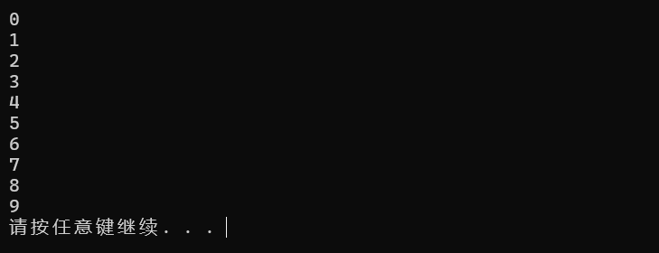

> 不难发现，这个数组被遍历输出了
>
> - `for(vector<int>::iterator it = arr.begin(); it != arr.end();it++)`这一行
> - `vector<int>::iterator it = arr.begin();` $\to$ 创立了一个迭代器，`vector<int>::iterator`表明创立了一个vector迭代器 `it`是迭代器名称 `arr.begin()`是数组的头迭代器
> - 迭代器之间也可以用比较运算符 `==`or `!=`
> - 迭代器也可以使用自增运算 $\to$ `it++`

#### 常用容器的迭代器

- ==**vector ——随机访问迭代器**==
- **deque——随机访问迭代器**
- ==**list —— 双向迭代器**==
- **set / multiset——双向迭代器**
- **map / multimap——双向迭代器**
- **stack——不支持迭代器**
- **queue——不支持迭代器**

**下面主要讲解随机访问迭代器 双向迭代器**

- **双向迭代器**

```cpp
void text()
{
	list<int> lst;
	for (int i = 0; i < 10; ++i)
	{
		lst.push_back(i);
	}
	list<int>::iterator it;//创建list的迭代器
	cout << "遍历lst并打印: ";
	for (it = lst.begin(); it != lst.end(); ++it)//用 != 比较两个迭代器
	{
		cout << *it << " ";
	}
	//此时it=lst.end(),这个位置是最后一个元素的下一个位置，没有存储数据
	--it;//等价于it--，回到上一个位置
	//it -= 1; //报错,虽然都是-1，但这种方式是随机迭代器才有的功能
	cout << "\nlst的最后一个元素为：" << *it << endl;
}
```

- **随机迭代器**

```cpp
void text()
{
    vector<int> v;
    for (int i = 0; i < 10; ++i)
    {
        v.push_back(i);
    }
    vector<int>::iterator it;
    for (it = v.begin(); it != v.end(); ++it) //用 != 比较两个迭代器
    {
        cout << *it << " ";
    }
    cout << endl;
    for (it = v.begin(); it < v.end(); ++it) //用 < 比较两个迭代器
    {
        cout << *it << " ";
    }
    cout << endl;
    it = v.begin();//让迭代器重新指向首个元素的位置
    while (it < v.end())//间隔一个输出
    { 
        cout << *it << " ";
        it += 2; // 用 += 移动迭代器
    }
    cout << endl;

    it = v.begin();
    cout << it[5] << endl; //用[]访问
}
```

> [!important]
>
> - 对vector数组迭代器来说，

#### 迭代器的辅助函数

STL 中有用于操作迭代器的三个函数模板，它们是：

- `advance(it, n)；`使迭代器 it 向前或向后移动 n 个元素。
- distance(it1, it2)；计算两个迭代器之间的距离，即迭代器 it1 经过多少次 + + 操作后和迭代器 it2相等。如果调用时 it1 已经指向 it2 的后面，则这个函数会陷入死循环。

- `iter_swap(it1, it2)；`用于交换两个迭代器 it1、it2 指向的值。
  要使用上述模板，需要包含头文件

```cpp
#include<algorithm>
```

### 6.3 STL函数

#### 对容器操作类

- `sort(iterator_begin,iterator_end,cmp)` 快速排序

- `find`：顺序查找。`find(iterator_begin, iterator_end, value)`，其中 `value` 为需要查找的值。

- `reverse`：翻转数组、字符串。`reverse(iterator_begin, iterator_end())` 或 `reverse(a + begin, a + end)`。

- `unique`：去除容器中相邻的重复元素。`unique(ForwardIterator first, ForwardIterator last)`，返回值为指向 **去重后** 容器结尾的迭代器，原容器大小不变。与 `sort` 结合使用可以实现完整容器去重。

- `move`:  可以高效赋值容器，当你确定某一个容器在后面不需要被使用时可以使用 `move`来降低时间复杂度，尤其是对`vector<pair<int,int>>` 这类复杂容器而言

  - ```cpp
    for(auto &&i : f){
        set<int> temp = dp;
        for(auto &&j : dp){
            temp.emplace(i+j);
        }
        dp = move(temp);
    }
    ```

  > **这是一个求一个数组取任意个数个数字相加的板子，其中使用到 move(temp) 就起到了降低时间复杂度的作用**

#### 对容器改动类

- `().emplace() ` ` ().emplace_back()` 

  - `emplace` 是 C++11 引入的标准容器函数，用于直接在容器中**构造对象**，而不是先创建对象再插入。它适用于几乎所有 STL 容器（如 `vector`, `set`, `map`, `deque` 等），提供了比 `insert` 更高效的方式。

  - 例子：我们可以直接在 `set<pair<int,int>>` 后插入 (x,y)

  - ```cpp
    set<pair<int,int>> st;
    //传统办法
    st.insert(make_pair(x,y));
    //emplace办法
    st.emplace(x,y);
    ```

  - 对 `vector`而言，`emplace_back()` 几乎可以完全代替 `push_back()`  而`emplace` 则能代替 `insert`

  - ```cpp
    vector<pair<int,int>> v
    v.push_back(make_pair(x,y)) == v.emplace_back(x,y);
    v.insert(v.begin(), make_paie(x,y)) == v.emplace(v.begin(),x,y)
    ```


## 7 快速幂

- 不多说，先上算法

```cpp
#include <bits/stdc++.h>
using namespace std;

long long fastpower(long long a , long long b)
{
    long long ans = 1;
    while (b > 0)
    {
        if (b&1)
        {
            ans *= a;
        }
        a *= a;
        b >>= 1;
    }
    return ans;
}

int main()
{
    cout << fastpower(2,8);
}
```

**快速幂的核心思路在下面这串代码里**

```cpp
while (b > 0)
{
    if (b&1)
    {
        ans *= a;
    }
    a *= a;
    b >>= 1;
}
```

> [!important]
>
> - b是我们的指数，只要大于零，我们便把这个循环继续下去
>
> - 对任何一个数，都可以拆解为2进制的数，快速幂的核心思想在于，**在幂次b二进制转化为十进制的时候$0\times2^k$是可以不用乘进结果的而 $1\times2^k$是需要被乘进结果的**
>
> - **示例：**
>
> - 假设我们要计算 $a^{13}$：
>
>   - $13$ 的二进制表示是 $1101_2$。
>   - 从最低位开始：
>     - 第一位（1）：需要 $a^{2^0}$。
>     - 第二位（0）：不需要 $a^{2^1}$。
>     - 第三位（1）：需要 $a^{2^2}$。
>     - 第四位（1）：需要 $a^{2^3}$。
>
>   因此，我们可以计算：
>   $$
>   \begin{split}
>   a^{13} &= a^{1\times2^0} + a^{0\times2^1} + a^{1\times2^2} +a^{1\times2^3} \\
>   	   &= a^{1+0+4+8}\\
>    	   &= a^{13}\\
>   \end{split}
>   $$
>
> - 只要b大于零，我们就把他的二进制右移(除二)，这样我们就能获取下一位二进制数字
> - 如果b的二进制位为1，我们就把该位置的幂次方乘进ans中，待b移位完成后ans也完成了幂运算

- **快速幂的时间复杂度为$O(\log{N})$**

---

## 8 dfs 深度优先搜索

- **题目来源：[P1036 [NOIP2002 普及组] 选数](https://www.luogu.com.cn/problem/P1036)**

- 题目核心:

> **[NOIP2002 普及组] 选数**
>
> **题目描述**
>
> 已知 $n$ 个整数 $x_1,x_2,\cdots,x_n$，以及 $1$ 个整数 $k$（$k<n$）。从 $n$ 个整数中任选 $k$ 个整数相加，可分别得到一系列的和。例如当 $n=4$，$k=3$，$4$ 个整数分别为 $3,7,12,19$ 时，可得全部的组合与它们的和为：
>
> $3+7+12=22$
>
> $3+7+19=29$
>
> $7+12+19=38$
>
> $3+12+19=34$
>

> [!tip]
>
> - 有别于传统模拟，这种在$N$个数里找$k$个数的操作，正常人应该都不会想到使用 *循环* 或 *枚举* 但受限于知识则停滞不前
> - 其实思路很简单，选多少个数就建立多少个标记，然后从某一标记开始移动，将所有标记过的数加和即可
> - 问题是，怎么使用代码实现？

> **DFS**:深度优先搜索
>
> 这时候就需要用到递归搜索了。
>
> 该类搜索算法的特点在于，将要搜索的目标分成若干「层」，每层基于前几层的状态进行决策，直到达到目标状态。

先看核心代码

```cpp
void dfs(int m, int sum, int startx){
    if(m == k){
        if(isprime(sum))
            ans++;
        return ;
    }
    for(int i = startx; i < n; i++)
        dfs(m + 1, sum + a[i], i + 1);
    return ;
}
```

> **前置知识**：每次递归调用`dfs`时，都会创建一个新的栈帧，并将`m + 1`、`sum + a[i]`和`i + 1`作为参数传递给`dfs`函数。当`dfs`函数执行到`return`语句时，它会返回到上一个栈帧，也就是上一次调用`dfs`的地方

- 例子

> - 让我们用一个简化的例子来说明DFS算法的运行原理。假设我们有一个数组 `a = [1, 3, 5, 7]` 和 `k = 2`，我们要找出所有长度为2的子数组，其和为素数
>
> ```
> 开始
>  |
>  v
> dfs(0, 0, 0)  <- 初始化，m=0（子数组长度），sum=0（子数组和），startx=0（起始索引）
>  |
>  |
>  |--> dfs(1, 1, 1)  <- 选择a[0]，m=1，sum=1，startx=1
>  |   |
>  |   |--> dfs(2, 4, 2)  <- 选择a[1]，m=2，sum=4，startx=2
>  |   |   |
>  |   |   |--> 检查sum=4（不是素数），结束这个分支
>  |   |
>  |   |<-- 返回到 dfs(1, 1, 1) [返回到这个栈帧的时候for循环内的参数不会变化] //保留了这个栈帧的数据
>  |
>  |   |--> dfs(2, 8, 2)  <- 选择a[2]，m=2，sum=8，startx=2
>  |   |   |
>  |   |   |--> 检查sum=8（不是素数），结束这个分支
>  |   |
>  |   |<-- 返回到 dfs(1, 1, 1)
>  |   |
>  |<----- 返回到 dfs(0, 0, 0)
>  |
>  |--> dfs(1, 3, 1)  <- 选择a[1]，m=1，sum=3，startx=1
>  |   |
>  |   |--> dfs(2, 6, 2)  <- 选择a[2]，m=2，sum=6，startx=2
>  |   |   |
>  |   |   |--> 检查sum=6（不是素数），结束这个分支
>  |   |
>  |   |<-- 返回到 dfs(1, 3, 1)
>  |
>  |   |<-- 返回到 dfs(0, 0, 0)
>  |
>  |--> dfs(1, 5, 1)  <- 选择a[2]，m=1，sum=5，startx=1
>  |   |
>  |   |--> dfs(2, 10, 2)  <- 选择a[3]，m=2，sum=10，startx=2
>  |   |   |
>  |   |   |--> 检查sum=10（不是素数），结束这个分支
>  |   |
>  |   |<-- 返回到 dfs(1, 5, 1)
>  |
>  |   |<-- 返回到 dfs(0, 0, 0)
>  |
>  |<-- 返回到开始
> 结束
> ```
>

### 使用DFS实现全排列

- DFS的核心思路是一路往下寻找，不撞南墙不回头==说明当DFS到达边界情况时，就完成了一次搜索==
- 使用DFS时就要考虑完成一次**“搜索”**所需要的条件和边界情况

> **使用DFS实现全排列**
>
> - 思考第一步：全排列的一次情况的边界条件
>   - 我们不妨对DFS传入一个参数 `step` 表示完成一次全排列的步骤
>   - 当`step` 到 n 的时候，一次全排列的一种情况便结束了：
>   - 在当前情况下，我们需要做的事情是：
>     -  输出全排列的一次情况
> - Q1：如何输出一次全排列情况？
>   - A:用result数组存
> - 思考第二步：全排列的实现
>   - 我们可以使用一 个 path 来保留加入到result数组
>   - path 数组在一次查找过程中先将其标记，再进入下一个DFS函数查找，再取消标记，即一次回溯操作

```cpp
vector<bool> path;
vint result;
int t = 1;

void quan(int step)
{
    if (step == t + 1) {
        for (size_t i = 1; i <= t; i++) {
            cout << result[i] << " ";
        }
        cout << endl;
    }
    for (size_t i = 1; i <= t; i++) {
        if (path[i] == 0) {
            path[i] = 1;
            result[step] = i;
            quan(step + 1);
            path[i] = 0;
        }
    }
    return;
}

signed main()
{
    //ios::sync_with_stdio(0),cin.tie(0),cout.tie(0);
    cin >> t;
    path = vector<bool>(t + 10);
    result = vint(t + 10);
    quan(1);
    return 0;
}
```

### [板子] 一组数据取任意个数据进行操作

**例1：在数组[1,2,3,4,5] 中取任意个数，求这些取出来的数相加的结果**

#### 方法一：DFS爆搜

```cpp
//#pragma GCC optimize(3)
#include <bits/stdc++.h>
//#define int LL
#define endl '\n'
#define size_t int
#define all(v) v.begin(), v.end()
using namespace std;
typedef long long LL;
typedef vector<int> vint;
typedef vector<vint> vvint;
typedef vector<string> vstr;
typedef pair<int, int> pii;
typedef vector<pii> vpii;

vint res;
void dfs(int n, int sum, int T, vint k)
{
    if (n >= T) return;
    sum += k[n];
    res.emplace_back(sum);
    for (size_t i = n + 1; i < T; i++) {
        dfs(i, sum, T, k);
    }
}

signed main()
{
    //ios::sync_with_stdio(0),cin.tie(0),cout.tie(0);
    int T = 1;
    cin >> T;
    vint k(T);
    for (auto &&i : k) {
        cin >> i;
    }
    for (size_t i = 0; i < T; i++) {
        dfs(i, 0, T, k);
    }
    cout << 0 << " ";
    for (auto &&i : res) {
        cout << i << " ";
    }
    return 0;
}
```

> 其结果表现为：
>
> - 0 1 3 6 10 15 11 7 12 8 4 8 13 9 5 10 6 2 5 9 14 10 6 11 7 3 7 12 8 4 9 5 
> - 充分体现了人类看不懂栈帧的特点

#### 法二：DP

```cpp
//#pragma GCC optimize(3)
#include <bits/stdc++.h>
//#define int LL
#define endl '\n'
#define size_t int
#define all(v) v.begin(), v.end()
using namespace std;
typedef long long LL;
typedef vector<int> vint;
typedef vector<vint> vvint;
typedef vector<string> vstr;
typedef pair<int, int> pii;
typedef vector<pii> vpii;

signed main()
{
    //ios::sync_with_stdio(0),cin.tie(0),cout.tie(0);
    int T;
    cin >> T;
    vint food(T);
    for(auto && i : food){
        cin >> i;
    }
    vint dp;
    dp.emplace_back(0); // 初始状态
    for (auto &&i : food) {
        vint temp = dp;
        for (auto &&j : dp) {
            temp.emplace_back(i + j);
        }
        dp = move(temp);
    }
    for (auto &&i : dp)
    {
        cout << i << " ";
    }
    return 0;
}
```

> 输出如下：
>
> 0 1 2 3 3 4 5 6 4 5 6 7 7 8 9 10 5 6 7 8 8 9 10 11 9 10 11 12 12 13 14 15
>
> - 已验证，两个程序的结果除了顺序完全一致


**例2: [P2036](https://www.luogu.com.cn/problem/P2036) [COCI2008-2009 #2] PERKET**

#### 例二 法一：DFS

```cpp
//#pragma GCC optimize(3)
#include <bits/stdc++.h>
#define int LL
#define endl '\n'
#define size_t int
#define all(v) v.begin(), v.end()
using namespace std;
typedef long long LL;
typedef vector<int> vint;
typedef vector<vint> vvint;
typedef vector<string> vstr;
typedef pair<int, int> pii;
typedef vector<pii> vpii;

int T;
vpii food;
// vint result;
int ans = 1e6;

void dfs(int n, int sum_s, int sum_k)
{
    if (n == T) {
        sum_s *= food[n - 1].first;
        sum_k += food[n - 1].second;
        ans = min(ans, abs(sum_s - sum_k));
        return;
    }
    sum_s *= food[n].first;
    sum_k += food[n].second;
    ans = min(ans, abs(sum_s - sum_k));
    for (size_t k = 0; k < T; k++) {
        for (size_t i = n; i < T; i++) {
            dfs(i + 1, sum_s, sum_k);
        }
        sum_s = 1;
        sum_k = 0;
    }
}

signed main()
{
    //ios::sync_with_stdio(0),cin.tie(0),cout.tie(0);
    cin >> T;
    food = vpii(T);
    // result = vint(T, 0);
    for (auto &&[s, k] : food) {
        cin >> s >> k;
    }
    dfs(0, 1, 0);
    cout << ans;
    return 0;
}
// 比我命还暴力这个算法
// 这题绝对能用DP写，待我研究一下
```

#### 例二 法二 ： DP

```cpp
#include <bits/stdc++.h>
using namespace std;

typedef long long ll;
typedef pair<ll, ll> pii;

signed main()
{
    int T = 1;
    cin >> T;
    vector<pii> food(T);
    for (auto &&[s, k] : food) {
        cin >> s >> k;
    }
    // 使用集合记录所有可能的 (酸度, 苦度) 组合
    set<pii> dp;
    dp.emplace(1, 0); // 初始状态
    for(auto &[s, b] : food){
        set<pii> temp = dp;
        for(auto &[acid, bitter] : dp){
            temp.emplace(acid * s, bitter + b);
        }
        dp = move(temp);
    }
    // gtp写的，确实很精巧，用set记录了每个可能的情况
    // 因为初始状况是(1,0),就相当于每一次内层循环的第一次都是只选当前组的食物
    // 每一次都会把dp数组过完一遍，相当于在之前的所有情况下加一个 选择当前食物的情况
    ll result = LLONG_MAX;
    for(auto &[acid, bitter] : dp){
        if(acid != 1 || bitter != 0){
            result = min(result, abs(acid - bitter));
        }
    }
    cout << result;
    return 0;
}
```


## 9 素数筛

### 9.1 一般双重筛

- 通过不断试除来判断某一数字$k$有无因数
- 时间复杂度为$O(N^2)$

> ```cpp
> bool prime(long long i)
> {
>     if (i == 2) return 1;
>     else if (i == 1) return 0;
>     for (size_t k = 2; k * k <= i ; k++)
>     {
>         if (i%k == 0)
>         {
>             return 0;
>         }
>     }
>     return 1;
> }
> 
> int main()
> {
>     long long n;
>     cin >> n;
>     for (size_t i = 2; i <= n; i++)
>     {
>         if (prime(i))
>         {
>             cout << i <<endl;
>         }
>     }
>     
>     return 0;
> }
> ```

### 9.2 埃拉托斯特尼筛法

- **核心思路是先标记素数，然后把素数的所有倍数全标记为非素数**

- **时间复杂度是$O(n\log{\log{n}})$**

- 对于任意一个大于$1$的正整数n,那么它的$x$倍就是合数($x > 1$)。利用这个结论，我们可以避免很多次不必要的检测。

  如果我们从小到大考虑每个数，然后同时把当前这个数的所有（比自己大的）倍数记为合数，那么运行结束的时候没有被标记的数就是素数了。

```cpp
vector<int> prime;
vector<bool> IsPrime(1e7);

void Eratosthenes(long long n)
{
    IsPrime[0] = IsPrime[1] = 0; //前两项不为素数，记作0
    for (size_t i = 2; i <= n; i++) //先全部记作1
    {
        IsPrime[i] = 1;
    }
    //memset(IsPrime,1,sizeof(IsPrime)); //似乎使用memset的时间复杂度也是O(N)
    for (size_t i = 2; i <= n; i++)
    {
        //素数筛选
        //从第三项开始，如果这个数被标记为1，就把它记作素数，放入数组 
        //同时从 i*i 项开始，每次将 i 的倍数标记为非素数
        if (IsPrime[i])
        {
            prime.push_back(i);
            if ((long long)i * i > n) continue; //超过n的不计
            for (size_t j = i*i ; j <= n; j += i)
            {
                IsPrime[j] = 0;
            }
        }
    }
}

int main()
{
    long long n;
    cin >> n;
    Eratosthenes(n);
    for (auto &&i : prime) cout << i <<endl;
    return 0;
}
```

- 我们可以只筛选到$\sqrt{N}$来降低操作次数

```cpp
#include <bits/stdc++.h>
#define endl "\n"
using namespace std;

vector<int> prime;
vector<bool> IsPrime(1e7);

void Eratosthenes(long long n)
{
    IsPrime[0] = IsPrime[1] = 0; //前两项不为素数，记作0
    for (size_t i = 2; i <= n; i++) //先全部记作1
    {
        IsPrime[i] = 1;
    }
    //memset(IsPrime,1,sizeof(IsPrime)); //似乎使用memset的时间复杂度也是O(N)
    for (size_t i = 2; i*i <= n; i++)
    {
        //素数筛选
        //从 i*i 项开始，每次将 i 的倍数标记为非素数
        if (IsPrime[i])
        {
            for (size_t j = i*i ; j <= n; j += i)
            {
                IsPrime[j] = 0;
            }
        }
    }
    //计入数组
    for (size_t i = 2; i <= n; i++)
    {
        if (IsPrime[i])
        {
            prime.push_back(i);
        }
    }
}

int main()
{
    long long n;
    cin >> n;
    Eratosthenes(n);
    for (auto &&i : prime) cout << i <<endl;
    return 0;
}
```

- 我们也可以改写0/1来实现非初始化bool数组

```cpp
#include <bits/stdc++.h>
#define endl "\n"
using namespace std;

vector<int> prime;
vector<bool> IsPrime(1e7);

void Eratosthenes(long long n)
{
    IsPrime[0] = IsPrime[1] = 0; //前两项不为素数，记作0
    for (size_t i = 2; i*i <= n; i++)
    {
        //素数筛选
        //从 i*i 项开始，每次将 i 的倍数标记为非素数
        if (!IsPrime[i])
        {
            for (size_t j = i*i ; j <= n; j += i)
            {
                IsPrime[j] = 1;
            }
        }
    }
    //计入数组
    for (size_t i = 2; i <= n; i++)
    {
        if (!IsPrime[i])
        {
            prime.push_back(i);
        }
    }
}

int main()
{
    long long n;
    cin >> n;
    Eratosthenes(n);
    for (auto &&i : prime) cout << i <<endl;
    return 0;
}
```

### 9.3 欧拉筛法

- **时间复杂度$O(n)$**
- 埃氏筛法仍有优化空间，它会将一个合数重复多次标记。我们可以用改进的筛法欧拉筛来计算

```cpp
#include <bits/stdc++.h>
#define endl "\n"
using namespace std;

vector<int> prime;
vector<bool> not_prime(1e7);

void Euler(long long &n)
{
    for (size_t i = 2; i <= n; i++)
    {
        //如果该数标记为 0 即 非(非素数),计入素数数组
        if (!not_prime[i])
        {
            prime.push_back(i);
        }
        // 换言之，i 之前被 prime[j] 筛过了
        // 由于 prime 里面质数是从小到大的，所以 i 乘上其他的质数的结果一定会被
        // prime[j] 的倍数筛掉，就不需要在这里先筛一次，所以这里直接 break掉
        for (auto &&j : prime)
        {
            if(i*j > n) break;
            not_prime[i*j] = 1;
            if(i%j == 0) break;
        }
    }
}

int main()
{
    long long n;
    cin >> n;
    Euler(n);
    for (auto &&i : prime) cout << i << endl;
    return 0;
}
```


## 10 DP动态规划[uncompete]

### **背包DP**

- 两个特点：

1. 一个物体有 大小 + 价值
2. 有一个背包只能容纳某一个特点大小

-  要求：找最大价值

- **一般性转移方程——>** 设背包大小为 $N$,有 $Y$ 个物品 , 物品价值为 $val_i$ 物品大小为 $size_j$
- 设$dp[i][j]$ 表示任取 $0\to i$ 个物品在$j$时间下取得的$\sum a_k$的最大值
- **初始化见下**：

 ```cpp
 vector<vector<int>> dp(Y,vector<int>(N+1,0)); 
 //对[0]行的初始
 for (size_t i = size[0]; i <= N; i++) {
     dp[0][i] = val[0];
 }
 //对[0]列的初始
 //在背包初始大小为0的情况，只有 size = 0 的物品可以被装下
 for(size_t j = 0; j <= Y ; j++){
     dp[i][o] = 0;
 }
 ```

- **现在我们来推递推方程：**

- 对于一个 $dp[i][j]$ 而言表示的是在 $j$ 背包大小下取得 前$i$个$val$ 的最大值
- 从 $dp[i-1][j]$ 到 $dp[i][j]$ 有两种情况
  1. **$j < size_i$**  ===>   $dp[i][j] = dp[i-1][j]$ 即当前容量装不下 $size_i$这个物品，只能与前一个的价值相同 \= => 即增加的$val = 0$
  2.  $j > size_i$ ：
     1.  装 $size_i$ :  $dp[i][j] = dp[i][j - size[i]]+val[i]$   .*1*
     2. 不装$size_i$:   $dp[i][j] = dp[i-1][j]$

- **对 *.1*的解释：** 选择装下大小为 $size_i$ 价值为 $val_i$ 的物品，那对$dp$从$[i-1][j]$到的 $[i][j]$ 而言:
  - $i$ 表示选取的范围 那显然 $i-1 \to i$ 
  - $j$ 表示背包容量大小 ： 既然我们选取了这个物品 $i$ , 那我们就看对于没有该物品时候的背包大小所表示的价值 + 这个物品 $i$ 的价值即：$j\to j-size_i$
  - $dp[i][j]$本质是最大价值，则我们需要加上所选物品的价值 即： $dp[i][j-size[i]] + val[i]$

- 在选择$j > size_i $ 的两种情况下选择较大的一方表示最大价值
- 即完整递推表达式为：

$$
dp[i][j] =
\left\{
\begin{aligned}
&dp[i-1][j] & j < size[i] \\
&\max(dp[i-1][j],dp[i][j-size[i]]+val[i]) & j \geq size{[i]} \\
\end{aligned}
\right.
$$

**代码表示见下**

```cpp
for (size_t i = 1; i < m; i++) {
    for (size_t j = 1; j <= t; j++) {
        if (j < size[i])
            dp[i][j] = dp[i - 1][j];
        else
            dp[i][j] = max(dp[i - 1][j], dp[i - 1][j - size[i]] + val[i]);
    }
}
```

- 


## 11 状态压缩

**状态压缩指的是用较小的数据结构（如整数或位掩码）来表示一个可能的状态或组合，从而减少存储空间和计算复杂性**

- 当两个数据分析特别大的时候，我们可以考虑使用二进制来实现$0/1$的分类;
- 下面举例使一个数组的分为 a b两组,找到 max( $\sum a$ , $\sum b$ ) 中的最小值
- a 代表一个分类     b 代表一个分类

```cpp
cin >> n;
for(int i = 0; i < n; i ++) cin >> k[i];
for(LL state = 0; state < 1LL << n; state ++){           ---> A 
    a = 0, b = 0;										
    for(int i = 0; i < n; i ++){					   	 ---> B
        if(state >> i & 1) a += k[i];
    	else b += k[i];
    }
    ans = min(ans, max(a, b));                           ---> C
```

- state表示了一个被**压缩的状态** $\to$ 用long long 表示一个被分类的状态

> A： 实际上是表示了$2^{n}$种状态 1LL << n 等效于 $2^n$ 
>
> B:  二进制位一共有n位，i 从零到 n 解 state二进制位
>
> - 对于每个元素 `k[i]`，根据 `state` 的二进制位判断该元素属于组 `a` 还是组 `b`
>
> C: 刷新ans,这确保了 `ans` 始终存储的是所有分组方式中最小的最大和

> 例子解释，当 n = 3 时
>
> 每个 `state` 的二进制位表示每个元素属于哪一组。例如，对于 `n = 3`（有 3 个元素的情况）：
>
> - `state = 0`（000）：所有元素都在组 `b`
> - `state = 1`（001）：第一个元素在组 `a`，其余元素在组 `b`
> - `state = 2`（010）：第二个元素在组 `a`，其余在组 `b`
> - `state = 3`（011）：第一个和第二个元素在组 `a`，第三个在组 `b`
> - ...
> - `state = 7`（111）：所有元素都在组 `a`

## 12 哈希表

哈希表的实现可以由三种数据结构实现

> **set map unordered_map**
>
> - 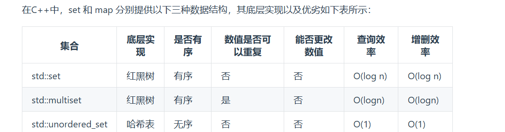
> - 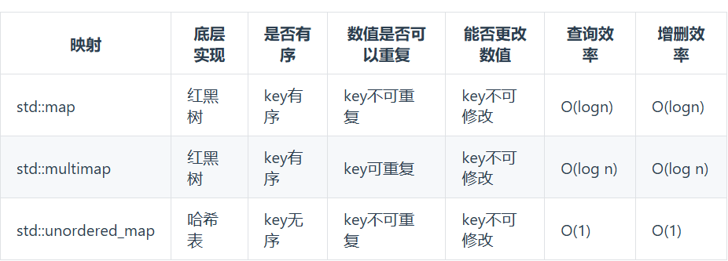

> **哈希表算法是一种以空间换时间的算法，可以在判断数据是否重复出现 or 数据去重方面有优异性能**
>
> > 例题：leetcode NO.1两数之和
>
> 给定一个整数数组 `nums` 和一个整数目标值 `target`，请你在该数组中找出 **和为目标值** *`target`* 的那 **两个** 整数，并返回它们的数组下标。
>
> 你可以假设每种输入只会对应一个答案，并且你不能使用两次相同的元素。
>
> 你可以按任意顺序返回答案。

哈希代码示例：

```cpp
class Solution {
public:
    vector<int> twoSum(vector<int>& nums, int target) {
        unordered_map<int, int> mp;
        for (int i = 1; i <= nums.size(); i++) {
            mp[nums[i - 1]] += i;
            if (mp[target - nums[i]] != 0) {
                return {i, mp[target-nums[i]]-1};
            }
        }
        return {};
    }
};

```


## 13 前缀和与差分

### 13.1 一维数组的前缀和

- 对数列 A [1,2,3,4,5] ,求数列B,使$B_i = \sum_{k=0}^{i}A_k$

> **思路：** 因为B[0] = A[0]  且有递推式 $B_i = B_{i-1}+A_i$构造递推式
>
> ```cpp
> int main()
> {
>     ios::sync_with_stdio(0), cin.tie(0), cout.tie(0);
>     vector<int> A = {1, 2, 3, 4, 5, 6};
>     vector<int> B(A.size());
>     B[0] = A[0];
>     for (size_t i = 1; i < A.size(); i++) {
>         B[i] = B[i - 1] + A[i];
>     }
>     for (auto &&i : B) cout << i << " ";
>     //输出: 1 3 6 10 15 21
>     return 0;
> }
> ```
>
> > 于传统代码相比，将时间复杂度从$O(n^2)$降低到$O(n)$且空间复杂度仍然是$O(n)$

### 13.2 二维数组的前缀和

对一个二维数组A:
$$
A=
\left[
\begin{matrix}
1 & 2 & 3 &4\\
5 & 6 & 7 &8 \\
9 & 10 &11 &12  \\
\end{matrix}
\right]
$$
二维数组前缀和定义：存在二维数组S，有：
$$
S_{i,j} = \sum_{k_1=0}^{i}\sum_{k_2=0}^{j}A_{k_1,k_2}
$$
类比一维的情形，$S_{i,j}$应该可以基于$S_{i-1,j}$或 $S_{i,j-1}$ 计算，从而避免重复计算前面若干项的和。但是，如果直接将$S_{i-1,j}$和 $S_{i,j-1}$ 相加，再加上 $A_{i,j}$，会导致重复计算 $S_{i-1,j-1}$ 这一重叠部分的前缀和，所以还需要再将这部分减掉。这就是 [容斥原理](https://oi-wiki.org/math/combinatorics/inclusion-exclusion-principle/)。由此得到如下递推关系：
$$
S_{i,j} = A_{i,j} + S_{i-1,j} + S_{i,j-1} - S_{i-1,j-1}
$$
**简单代码实现:**

```cpp
int main()
{
    ios::sync_with_stdio(0), cin.tie(0), cout.tie(0);
    //在构建A的时候可以将A整体向右下移一个单位防止负数下标的出现
    vector<vector<int>> A = {
        {0, 0, 0, 0, 0},
        {0, 1, 2, 3, 4},
        {0, 5, 6, 7, 8},
        {0, 9, 10, 11, 12},
    };
    vector<vector<int>> S(A.size(), vector<int>(A[0].size()));
    S[1][1] = A[1][1];
    for (size_t i = 1; i < A.size(); i++) {
        for (size_t j = 1; j < A[0].size(); j++) {
            if (i == j && i == 1) continue;
            S[i][j] = A[i][j] + S[i - 1][j] + S[i][j - 1] - S[i - 1][j - 1];
        }
    }
    for (auto &&i : S) {
        for (auto &&j : i) {
            cout << j << " ";
        }
        cout << endl;
    }
    /*输出：
    0 0 0 0 0
    0 1 3 6 10
    0 6 14 24 36
    0 15 33 54 78
    */
    return 0;
}
```

> 例：[洛谷 P1387 最大正方形](https://www.luogu.com.cn/problem/P1387)
>
> # 最大正方形
>
> ## 题目描述
>
> 在一个 $n\times m$ 的只包含 $0$ 和 $1$ 的矩阵里找出一个不包含 $0$ 的最大正方形，输出边长。
>
> ## 输入格式
>
> 输入文件第一行为两个整数 $n,m(1\leq n,m\leq 100)$，接下来 $n$ 行，每行 $m$ 个数字，用空格隔开，$0$ 或 $1$。
>
> ## 输出格式
>
> 一个整数，最大正方形的边长。
>
> ## 样例 #1
>
> ### 样例输入 #1
>
> ```
> 4 4
> 0 1 1 1
> 1 1 1 0
> 0 1 1 0
> 1 1 0 1
> ```
>
> ### 样例输出 #1
>
> ```
> 2
> ```

> 解决思路：
>
> 1. 先使用二维前缀和数组将输入数组$A$的$A_{1,1}\to A_{i,j}$的和表示出来
>
> 2. 设立边长$l$从1开始找最小正方形，其过程如下：
>
>    1. 设立$i,j$作为假设正方形的右下角点,找的正方形为以$l$为边长，底点为$(i,j)$的一个正方形
>
>    2. 显然$i,j$均从$l$开始，到`m,n`结束
>
>    3. `b[i][j] - b[i - l][j] - b[i][j - l] + b[i - l][j - l] == l * l`作为判断标准(why)
>
>       - `b[i][j]`是从$(1,1) \to (i,j)$的前项和，我们需要求 $(i-l,j-l) \to (i,j)$ 的和
>
>       - 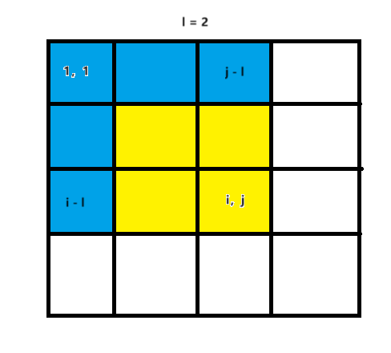
>
>          										 											**图一**
>
>       - 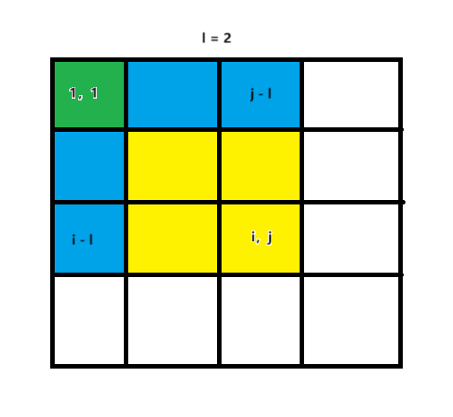
>
>         ​												**图二**
>
>       - 不难发现：我们想求的是黄色部分的前缀和并判断其是否等于$l^2$
>
>       - 我们可以发现求黄色部分就是将$b(i,j)$减去图一蓝色的部分，可以减去两矩形的面积$b(i-l,j),b(i,j-l)$,但显然会多减去图二绿色部分的区域，所以我们需要利用容斥定理加上$b(i-l,j-l)$的面积
>
>       - 所以我们便得到了黄色部分的递推表达式:
>
>       - $$
>         locans = b_{i,j} - b_{i-l,j}-b_{i,j-l}+b_{i-l，j-l}
>         $$
>
>       - 现在判断$locans$与$l^2$的关系即可
>
>       - 完成一次查找之后就可以让 $l$ 增加,显然 $l \in [1,\min(n,m)]$


**示例代码：**

```cpp
#include <algorithm>
#include <iostream>
using namespace std;
int a[103][103];
int b[103][103];  // 前缀和数组，相当于上文的 sum[]

int main() {
  int n, m;
  cin >> n >> m;

  for (int i = 1; i <= n; i++) {
    for (int j = 1; j <= m; j++) {
      cin >> a[i][j];
      b[i][j] =
          b[i][j - 1] + b[i - 1][j] - b[i - 1][j - 1] + a[i][j];  // 求前缀和
    }
  }

  int ans = 0;

  int l = 1;
  while (l <= min(n, m)) {  // 判断条件
    for (int i = l; i <= n; i++) {
      for (int j = l; j <= m; j++) {
        if (b[i][j] - b[i - l][j] - b[i][j - l] + b[i - l][j - l] == l * l) {
          ans = max(ans, l);  // 在这里统计答案
        }
      }
    }
    l++;
  }

  cout << ans << endl;
  return 0;
}
```

> [!tip]
>
> 上面进行的操作便是在前缀和中寻找某一区域的和的操作，利用这个思想，我们可以寻找任意大小的区域和，可以从容斥定理入手，进行区域和的计算

#### 树上前缀和

- **一维数组树上前缀和**

  1. 在求解一维数组之前我们要进行一次前缀和操作
  2. 对数组$A$的$[l,r]$区间，其区间和如下：

  $$
  sum[l,r]=S[r]−S[l−1]
  $$

  ==时间复杂度==：构造前缀和数组$O(n)$,查询区间和$O(1)$

  - 二维数组树上前缀和

    1. 与一维数组树上前缀和一样，二维树上前缀和也需要提前做好前缀和工作
    2. 快速求任意子矩阵的和

    $$
    \text{sum}([x_1, y_1], [x_2, y_2]) = S[x_2][y_2] - S[x_1-1][y_2] - S[x_2][y_1-1] + S[x_1-1][y_1-1]
    $$

    > 其中：
    >
    > - $S[x_1][y_2]$：从 \[1,1]到\[$x_1,y_1$]的矩形和；
    > - $S[x_2][y_2]$：从 $[1,1]$ 到 $[x_2,y_2]$ 的矩形和；
    > - $−S[x_1−1][y_2]$ ：减去上方多余的矩形；
    > - $−S[x2][y1−1]$  : 减去左侧多余的矩形；
    > - $+S[x1−1][y1−1]$：加回左上角重复减去的部分。

    > [!tip]
    >
    > 要注意的是在减去左边和上边的矩形的时候，下标都为$S[x_1 - 1][y_2]$和 $S[x_2][y_1-1]$

### 差分

- 指找数组范围内某一两项的差
- 定义：**$diff[i] = a_i - a_{i-1}$** 特别的：$i = 1$时，$diff[1] = a_1$
- 差分和原数组的关系 ==性质==：
  - **我们将差分数组做一次前项和得到的即为原数组**
  - 显然：**我们对前缀和数组做一次差分得到的就是原数组**

差分计算数组动态变化

- 对数组$A$的$[l,r]$区间同时加$k$有：

```cpp
	diff[l] += k
	fiff[r+1] -= k
```

此时再进行一次前缀和，即可完成原始数组的复原

```cpp
for(int i = 1; i <= diff.size() ; i++){
    sum[i] = sum[i-1] + d[i];
}
```


## 14 BFS 广度优先搜索

- 在前面我们介绍过DFS深度优先搜索，深搜的核心思想是一条路走到底，直到得到符合的结果或者超出边界情况结束

- 而广度优先搜索则是从起始位置出发，每一次向外增加一圈，或执行完一大个操作之后再将计数变量增加

  - 广搜一般适用于求最短路径，求最少操作次数的这些操作，因为广搜本身便是向外扩散式的一种搜索

广搜一般使用STL中的`queue`作为承接模板，通过其先进先出的特点实现广搜

例题：[洛谷P1135 奇怪的电梯](https://www.luogu.com.cn/problem/P1135)

```cpp
signed main()
{
    int n, a, b;
    cin >> n >> a >> b;
    vector<int> to,path;
    to = vector<int>(n + 1);
    path = vector<int>(n + 1, -1);
    for (size_t i = 1; i <= n; i++) {
        cin >> to[i];
    }
    // 输入数据
    queue<int> bfs; //建立一个bfs的queue队列
    int ans = 0;
    bfs.push(a); //将第一个元素存入队列中
    path[a] = 0; //第一个路径初始
    while (!bfs.empty()) { //如果队列非空，就说明仍然有可以进行下去的操作
        int up = bfs.front() + to[bfs.front()]; //第一种可能，往上坐电梯
        int down = bfs.front() - to[bfs.front()]; //第二种可能，往下坐电梯
        if (up > 0 && up <= n && path[up] == -1) { //如果往上做的电梯能到达(即存在这个楼层)，且这个楼层没有被达到过
            path[up] = path[bfs.front()] + 1; // 这个楼层的标识数 = 过来的楼层的标识数 + 1
            bfs.push(up); //把这个楼层加入到队列里，表示接下来会对这个楼层操作
        }
        if (down > 0 && down <= n && path[down] == -1) { //同上
            path[down] = path[bfs.front()] + 1;
            bfs.push(down);
        }
        bfs.pop(); //原始楼层操作完毕，弹出队列
    }
    cout << path[b]; //输出目标楼层的情况
    return 0;
}
```

> 显然，BFS对这种求最短是一个不错的解法，但有的时候还得考虑DP或其他时间复杂度更低的方法

##    15 单调栈

- 何为单调栈？顾名思义，单调栈即满足单调性的栈结构。与单调队列相比，其只在一端进行进出。

- 将一个元素插入单调栈时，为了维护栈的单调性，需要在保证将该元素插入到栈顶后整个栈满足单调性的前提下弹出最少的元素。


如上：一个 {0,11,45,81}的单调栈，如果要插入元素 14 


必须将{0,11} 弹出栈，再放入 元素 14 

```cpp
insert x;
while (!sta.empty() && sta.top() <= x) {
    sta.pop();
}
sta.push(x);
```

> [!tIP]
>
> 有的人会问，那被弹出去的元素呢？其实，在大部分单调栈问题中，我们更关注在一次弹出后的栈的状态，即在放入当前元素前栈的各个属性，比如：
>
> - 栈顶 $\to$  能告诉我们比这个元素大(小)的元素是什么
> - 栈的大小 $\to$ 能告诉我们在这个元素前有几个比当前元素大(小)的元素

例题：

> [洛谷P5788 单调栈(模板)](https://www.luogu.com.cn/problem/P5788)

```cpp
signed main()
{
    //ios::sync_with_stdio(0),cin.tie(0),cout.tie(0);
    int t = 1;
    cin >> t;
    vint n(t);
    for (size_t i = 0; i < t; i++) {
        cin >> n[i];
    }
    stack<int> sta;
    vint result(t, 0);
    for (size_t i = t - 1; i >= 0; i--) {
        while (!sta.empty() && n[sta.top()] <= n[i]) {
            sta.pop();
        }
        result[i] = sta.empty() ? 0 : sta.top() + 1;
        sta.push(i);
    }
    for (auto &&i : result) {
        cout << i << " ";
    }
    return 0;
}
```

> 思路解释：
>
> - 维护一个单调存放数字下标的单调栈，这个单调栈入栈的规则根据数字的具体大小决定
> - 当某个元素入栈时，说明至少这个元素会比当前的栈顶下标所代表的元素要大，所以我们便把栈顶弹出，直到找到某个比当前元素大的数
> - 而找到的这个正好就是我们要找的刚好大于这个数，我们就被栈顶放入 result  数组中即可
> - 那为什么栈顶就是我们要找的数字呢？
>   - 如 2 6 5 7 5
>     - 进行比较的是与元素的大小，但栈存放的是下标 $ \to $ 所以使用 `n[sta.top()] <= n[i]`进行下标栈和元素大小栈的转换
>   - 我们最先放进去的是 5 ，此时栈的状态是 { 5 } ， $\to $ 下标栈的状态 { 5 }
>   - 接着我们要放入 7  ，不难发现 7  > 5  ,弹出 5 放入 7
>   - sta : { 4 } —— num { 7 }
>   - 再看 5 ，5  <  7  ,不需要弹出，直接放入，此时比 5 大的数就是 7 ，在result 数组下 放入 `sta.top()`即可 
>   - sta : { 3 4 } ——  num {5 7}
>   - 看 6 ，6 比 5 大 ，比 7 小 ， 将 5 弹出 ，放入 7 所代表的下标作为答案
>   - 以此类推即可

**例题2**：

> [ [USACO06NOV] Bad Hair Day S](https://www.luogu.com.cn/problem/P2866)

```cpp
signed main()
{
    //ios::sync_with_stdio(0),cin.tie(0),cout.tie(0);
    int t = 1, ans = 0;
    cin >> t;
    stack<int> cowh;
    for (size_t i = 1; i <= t; i++) {
        int h;
        cin >> h;
        while (!cowh.empty() && cowh.top() <= h) {
            cowh.pop();
        }
        ans += cowh.size();
        cowh.push(h);
    }
    cout << ans;
    return 0;
}
```

> **思路解释**
>
> - 与上一题相似，但这次我们要找的是前面有多少个比放入的数字大的数量
>   - 还是维护一个栈，如果当前放入的数字比栈顶大就弹出栈顶
>   - 我们 ans 加的是还放入这个数的栈的大小，代表在这之前比这个数字大的数字有多少个
>   - 我们要求的是 **这个数能看见多少个数，求所有数能看见的总和**   同样可以标识为 **这个数能被多少个数看见，每个数能被看见的总和**
>   - 那当我们弹出比这个数小的数字之后，剩下的数就一定都能看见这个数
>   - 将这些数量加到 ans 内即可


# 注释

[^1]: 除法进行整除运算的时候会将小数部分去除，相当于结果向下取整

[^2]: 这里第一个花括号表示"行"的数据，第二个表示"列"的数据

> 可以这么表示
>
> ```cpp
> int arr[2][3] = 
> {
>  {1,1,4},
>  {5,1,4}
> };
> ```

[^3]:如果没有特殊说明，本条目下所有 `str`均表示字符串名

[^4]:没有特殊说明，本条目下所有 `vec`均表示容器名
[^5]:如果无特殊说明，本条目下所有 `dp`均表示容器名
[^6]:如果函数内置了比较器(sort,优先队列),那大部分默认使用 `less<int>`

[^7]:`.insert()`成员函数对vector容器也适用,但插入元素可能倒置vector容器重新分配内存导致STL


