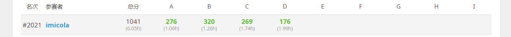

# 心得体会

**这是在学习编程，挑战ACM路程上的心得体会**

## 一.比赛感悟

### 第一次打线上赛(洛谷入门月赛)

**说实话**，感觉还是比赛还有刷题刷少了导致的，有一说一啊，这玩意*还挺看天赋的*，但是更重要的应该是对题目的拆解和数学能力的考验。

第一次打的确实十分不理想，一个小时作出了4道题，甚至还有3道题没有AC。在和我几乎同时入门学习的朋友面前显得有些菜鸡。

接下来还是要多刷题，多扩大眼界，不要停留在表面的学习上，思维能力与编程的==直觉感==我觉得才是最重要的。

还有就是一定要**细心细心**，警钟敲烂！

---

